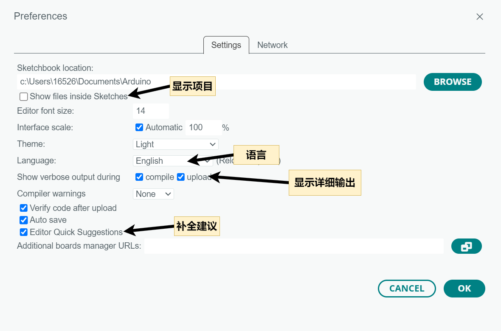

# 第一章——Arduino 和 Arduino IDE

## 1. Arduino 开发板

Arduino 至今拥有非常多的开发板，其中最为流行的就是 8 位的 AVR 单片机，当然 Arduino 也有 32 位单片机，下面是几款比较流行的开发板。

AVR 开发板：

|          Arduino Uno           |          Arduino Nano           | Arduino Mega                    |
| :----------------------------: | :-----------------------------: | :------------------------------ |
|  |  |  |

Arduino Nano 33 系列开发板：

|          Arduino Nano 33 IOT           |          Arduino Nano 33 BLE           | Arduino Nano 33 BLE Sense                    |
| :------------------------------------: | :------------------------------------: | :------------------------------------------- |
|  |  |  |

Arduino 还有一些工业级的开发板：

|           Arduino MKR Vidor 4000           |           Arduino MKR NB 1500           |           Arduino Portenta H7           |
| :----------------------------------------: | :-------------------------------------: | :-------------------------------------: |
|  |  |  |

以及一批不再生产的退休开发板:

|          Arduino Lilypad           |          Arduino ESPLORA           |           Arduino YUN Shiled           |
| :--------------------------------: | :--------------------------------: | :------------------------------------: |
|  |  |  |

## 2. Arduino Uno

Arduino Uno 可以说是 Arduino 开发板家族中最为流行的一款，可以说是每个 Arduino 初学者都会拥有的一款开发板，我们就以 Uno 板为例对 AVR 芯片硬件进行一些介绍。

下面是 Arduino Uno 的引脚图：

可以发现 Arduino Uno 有以下几个引脚分布：

- GPIO
  - **Digital(D0-D19)** X 20
  - **ADC(A0-A5)** X 6
  - **PWM(D3,D5,D6,D9,D10,D11)** X 6
  - **UART(D0,D1)** X 1
  - **I2C(SCL-A5,SDA-A4)** X 1
  - **SPI(MOSI-D11,MISO-D12,SCK-D13,CS-10)** X 1
- Power
  - **VIN**
  - **GND**
  - **5V**
  - **3.3V**
  - **AREF**

Arduino 开发板有一个板载 LED，接在**D13 引脚**上，你也可以通过**LED_BUITIN**进行访问。另外还有两个 LED，分别是 RX 和 TX 的指示灯，当进行数据传输的时候对应的 LED 会闪烁。还有一个电源指示灯，通电后会点亮。

Arduino Uno 是一个 5V 的单片机，IO 口高电平时 5V，开发板上还有一个 3.3V 的电源接口给 3.3V 的设备进行供电。

如果你没有 5V 的电源，那你还可以通过 VIN 口输入 5-12V 的电压，Arduino 开发板上有一个 5V 的降压芯片。

## 3. Arduino IDE

Arduino IDE 是一个开源的软件，它使编写代码和上传到开发板变得容易。该工具不仅可以为所有的 Arduino 开发板开发和调试代码，而且社区也为很多其他平台开发了 Arduino 支持库，如 ESP32, STM32, Raspberry Pi Pico 等。

### Arduino 2.x

截至目前 arduino IDE 已经更新到了 `2.2.1`版本，使用 electron 开发。和 1.x 相比速度更快，功能更强大，具有更现代的编辑器，它还加入了代码自动补全、代码导航、实时调试器等功能。

### 下载链接 2.2.1

- Windows: [`点击下载`](https://downloads.arduino.cc/arduino-ide/arduino-ide_2.2.1_Windows_64bit.exe)
- Linux: [`点击下载`](https://downloads.arduino.cc/arduino-ide/arduino-ide_2.2.1_Linux_64bit.AppImage)
- MacOS: [`点击下载`](https://downloads.arduino.cc/arduino-ide/arduino-ide_2.2.1_macOS_64bit.dmg)

下面是 Arduino IDE 2.2.1 的基本信息，关于该 IDE 的更多使用可以访问官方教程：[Arduino IDE Guide](https://www.arduino.cc/en/Guide)

arduino IDE在2.0版本以后就支持登录了，可以在左下角使用你的邮箱或者github登录，而且有单独的在线编辑器，如果你需要移动开发的话会方便很多。

你可以在这里打开：[arduino在线编辑器](https://create.arduino.cc/editor)

### 设置

中文显示，详细输出，代码补全：我们可以通过file->perferences 偏好设置去更改一下，这些基础的设置会优化你的开发体验。

### Arduino 1.x

由于有些开发者依然更喜欢前一代IDE的开发体验，所以本文档也保留了原来的下载链接。

### 下载链接 1.8.19

- Windows: [`点击下载`](https://downloads.arduino.cc/arduino-1.8.19-windows.exe)
- Linux: [`点击下载`](https://downloads.arduino.cc/arduino-1.8.19-linux64.tar.xz)
- MacOS: [`点击下载`](https://downloads.arduino.cc/arduino-1.8.19-macosx.zip)

下面是 Arduino IDE 1.8.19 的基本信息。

