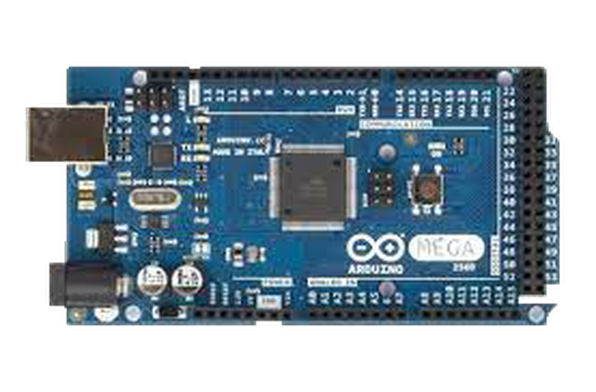
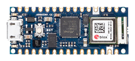
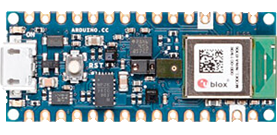
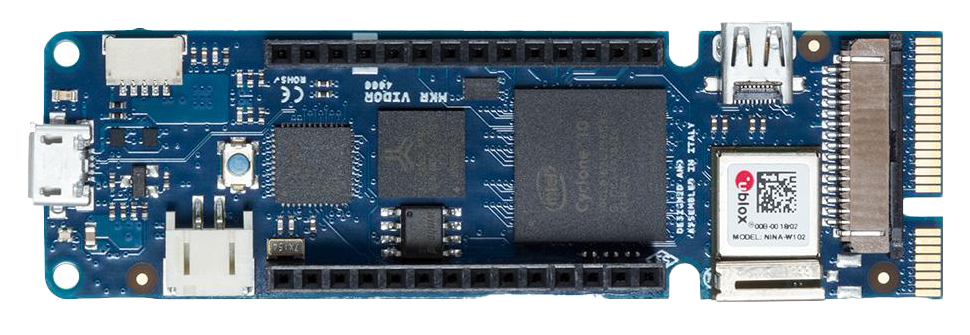
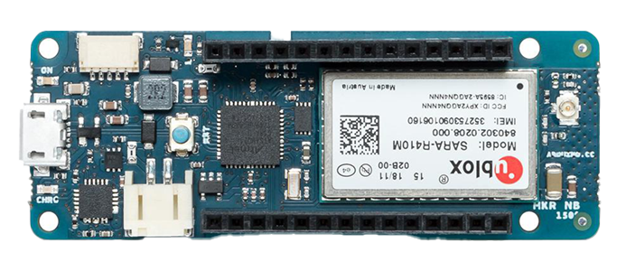
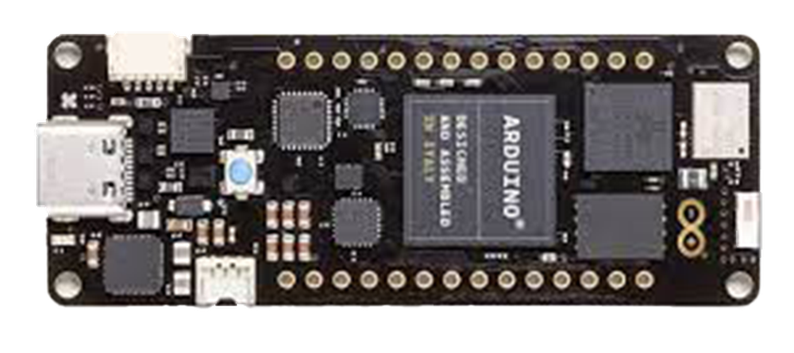
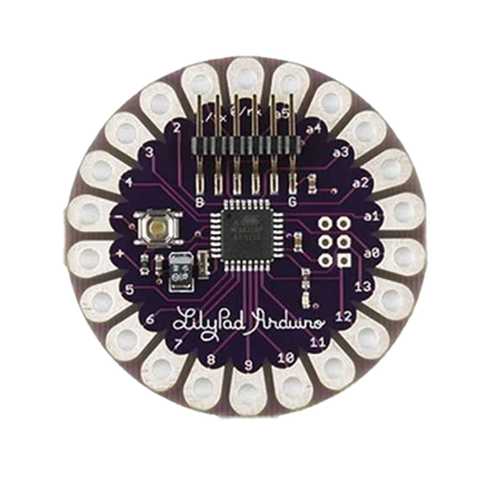
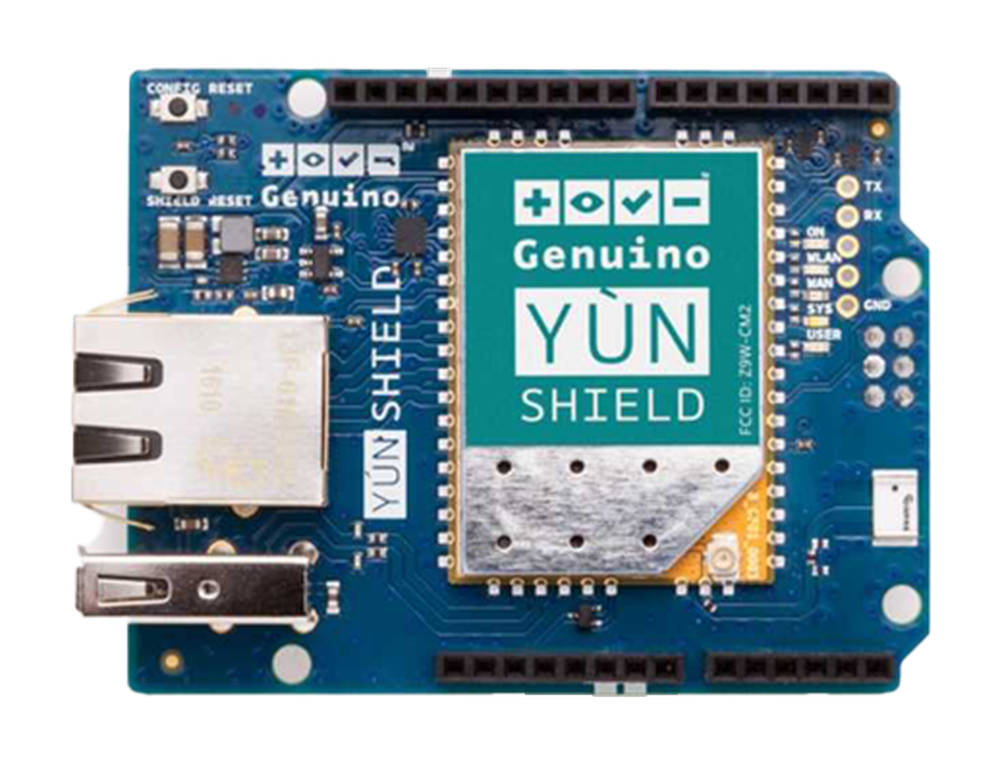

# 第一章——Arduino和Arduino IDE

## 1. Arduino开发板

Arduino至今拥有非常多的开发板，其中最为流行的就是8位的AVR单片机，当然Arduino也有32位单片机，下面是几款比较流行的开发板。

AVR开发板：

|          Arduino Uno           |          Arduino Nano           | Arduino Mega                    |
| :----------------------------: | :-----------------------------: | :------------------------------ |
|  |  |  |

Arduino Nano 33系列开发板：

|          Arduino Nano 33 IOT           |          Arduino Nano 33 BLE           | Arduino Nano 33 BLE Sense                    |
| :------------------------------------: | :------------------------------------: | :------------------------------------------- |
|  |  |  |

Arduino还有一些工业级的开发板：

|           Arduino MKR Vidor 4000           |           Arduino MKR NB 1500           |           Arduino Portenta H7           |
| :----------------------------------------: | :-------------------------------------: | :-------------------------------------: |
|  |  |  |

以及一批不再生产的退休开发板:

|          Arduino Lilypad           |          Arduino ESPLORA           |           Arduino YUN Shiled           |
| :--------------------------------: | :--------------------------------: | :------------------------------------: |
|  |  |  |

## 2. Arduino Uno

Arduino Uno可以说是Arduino开发板家族中最为流行的一款，可以说是每个Arduino初学者都会拥有的一款开发板，我们就以Uno板为例对AVR芯片硬件进行一些介绍。

下面是Arduino Uno的引脚图：

可以发现Arduino Uno有以下几个引脚分布：

- GPIO
  - **Digital(D0-D19)** X 20
  - **ADC(A0-A5)** X 6
  - **PWM(D3,D5,D6,D9,D10,D11)** X 6
  - **UART(D0,D1)** X 1
  - **I2C(SCL-A5,SDA-A4)** X 1
  - **SPI(MOSI-D11,MISO-D12,SCK-D13,CS-10)** X 1
- Power
  - **VIN**
  - **GND**
  - **5V**
  - **3.3V**
  - **AREF**

Arduino开发板有一个板载LED，接在**D13引脚**上，你也可以通过**LED_BUITIN**进行访问。另外还有两个LED，分别是RX和TX的指示灯，当进行数据传输的时候对应的LED会闪烁。还有一个电源指示灯，通电后会点亮。

Arduino Uno是一个5V的单片机，IO口高电平时5V，开发板上还有一个3.3V的电源接口给3.3V的设备进行供电。

如果你没有5V的电源，那你还可以通过VIN口输入5-12V的电压，Arduino开发板上有一个5V的降压芯片。

## 3. Arduino IDE

Arduino IDE 是一个开源的软件，它使编写代码和上传到开发板变得容易。该工具不仅可以为所有的 Arduino 开发板开发和调试代码，而且社区也为很多其他平台开发了 Arduino 支持库，如 ESP32, STM32, Raspberry Pi Pico 等。

### 下载链接

- Windows: [`点击下载`](https://downloads.arduino.cc/arduino-1.8.19-windows.exe)
- Linux: [`点击下载`](https://downloads.arduino.cc/arduino-1.8.19-linux64.tar.xz)
- MacOS: [`点击下载`](https://downloads.arduino.cc/arduino-1.8.19-macosx.zip)

下面是Arduino IDE的基本信息，关于该IDE的更多使用可以访问官方教程：[Arduino IDE Guide](https://www.arduino.cc/en/Guide)

### Arduino 2.x

Arduino 2.x 是 Arduino IDE 的最新版本，使用 electron 开发。和 1.x 相比速度更快，功能更强大，具有更现代的编辑器，它还加入了代码自动补全、代码导航、实时调试器等功能。

Arduino 2.x 的正式版还在开发中，但是如果想抢先体验，可以访问 [`Github releases 页面`](https://github.com/arduino/arduino-ide/releases) 下载最新的 RC(Release Candidate) 版本。
