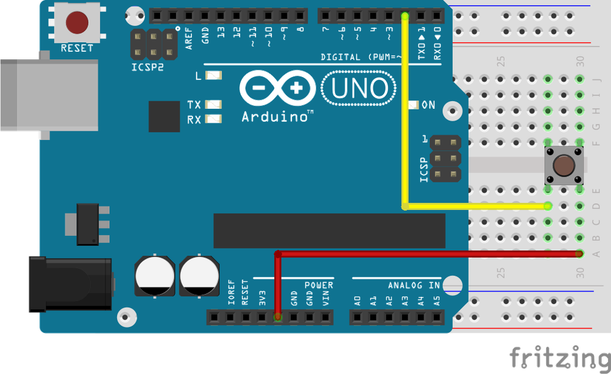
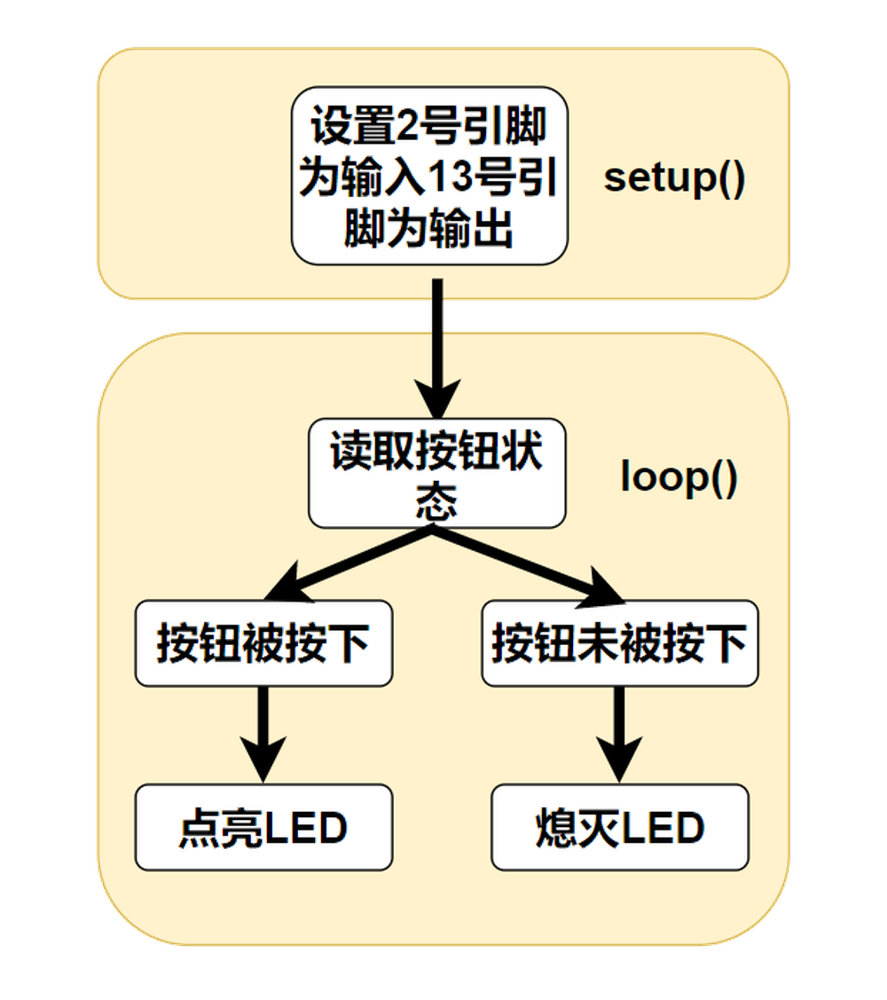
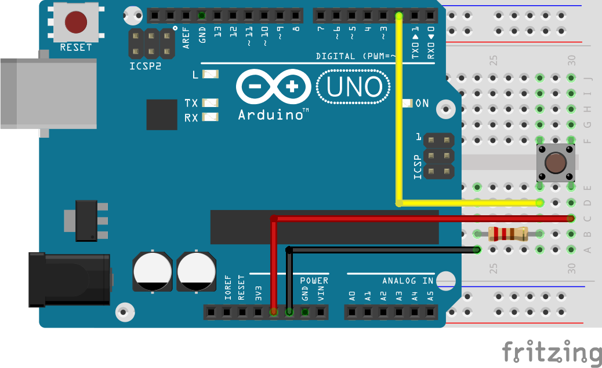
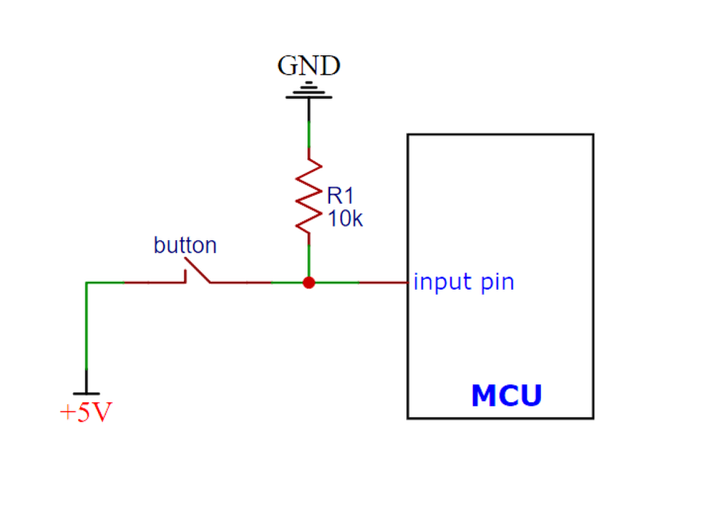
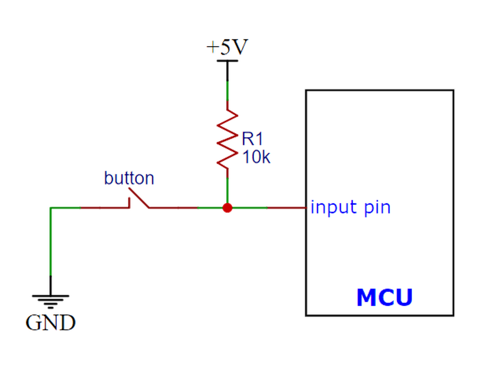

# 第三章——使用按钮

## 1. 按钮

按钮是一种非常常用的交互元器件，学会使用按钮很有必要。

下面是一个按钮接线图和使用按钮的一个程序，大家可以先看一下。



```cpp
int button = 2;
int led = 13;

void setup() {
  pinMode(button, INPUT);
  pinMode(led, OUTPUT);
}

void loop() {
  bool buttonStatus = digitalRead(button);
  if (buttonStatus == HIGH) {
    digitalWrite(led, HIGH);
  }
  else {
    digitalWrite(led, LOW);
  }
}
```

在这个程序中，我们使用了一个板载LED和一个按钮。可以观察到，当我们按下按钮时，LED会被点亮，松开后就会熄灭。

在这里我们使用了`pinMode()`mode参数的第二个可选值**INPUT**，即输入模式。

## 2. digitalRead()函数

语法：

```cpp
digitalRead(pin);
```

该函数用来读取某个引脚的引脚状态。

参数pin：Arduino的引脚号。

在5V的单片机中，如果输入电压**高于3V**则认为输入的是高电平，返回1，否则认为是低电平，返回0。

所以在loop循环中，我们通过`bool buttonStatus = digitalRead(button)`来读取按钮的状态。当按钮按下时，5V的电压会通过按钮输入到2号引脚，单片机读取引脚状态，存储到`buttonStatus`中。如果是高电平，就点亮板载LED，低电平就熄灭LED。



## 3. 按钮进阶

加入我们需要按一下按钮，灯点亮，再按一下按钮，灯熄灭，这样我们应该如何编写呢。

其实最简单的方法就是在函数末尾增加一个延时，同时对代码进行稍加修改：

```cpp
int button = 2;
int led = 13;
bool ledStatus = false;

void setup() {
  pinMode(button, INPUT);
  pinMode(led, OUTPUT);
}

void loop() {
  bool buttonStatus = digitalRead(button);
  if (buttonStatus) {
    ledStatus = !ledStatus;
    digitalWrite(led, ledStatus);
  }
  delay(200);
}

```

大家上传代码后可以试一下是不是可以初步达到目的。

可能有人会发现，有时候按钮按下去，灯没有反应，这是为什么？

那是由于delay这样的延时只是保证了每次运行之间多出200ms的延时，在这期间，单片机不能做任何事情，当然肯能会漏掉一次检测按钮的可能。

关键问题就是如何让这200ms期间，程序不被block，能够不断检测按钮状态。

下面是一个很好的方法，大家可以参考一下：

```cpp
int button = 2;
int led = 13;
bool ledStatus = false;
unsigned long lastTime;

void setup() {
  pinMode(button, INPUT);
  pinMode(led, OUTPUT);
}

void loop() {
  bool buttonStatus = digitalRead(button);
  // 按钮检测到被按下，且上一次按下和这次间隔超过200ms
  if (buttonStatus && millis() - lastTime > 200) {
    ledStatus = !ledStatus;
    digitalWrite(led, ledStatus);
    // 记录这次按下的时间
    lastTime = millis();
  }
}
```

在这里我们通过对比两次按钮按下的时间间隔，如果两次间隔超过200ms就认为这是两次不同按键动作，否则我们就忽略认为是一次动作，不进行操作。

大家可以发现，这个程序运行起来明显准确得多，每一次按钮按下都能检测到。

在这个程序中，我们使用了一个新的函数`millis()`，这也是Arduino内置的函数。

语法：

```cpp
time = millis();
```

millis()记录了自程序启动后经过的时间，单位是ms，返回的数据类型也是`unsigned long`。这个函数最多可以记录**50天**的值，之后就会溢出变为0。

Arduino同时还有另一个记录时间的函数`micros()`，它的单位是us，返回的数据类型同样也是`unsigned long`。大约**70分钟**后，此数字将溢出变为0。

在Arduino Portenta系列的开发板上，此功能在所有内核上的分辨率为**1微秒**。在16MHz的Arduino开发板（如Uno和Nano上，此函数的分辨率为**4微秒**，即返回的值始终是4的倍数）。在8MHz的Arduino开发板（例如LilyPad）上，此函数的分辨率为**8微秒**。

## 5. 按钮硬件消抖

其实按钮在按下和松开的过程中，按钮中的两个金属片并不是直接接触和松开的，在这过程中其实着抖动，也就是按钮在0和1之间抖动。

下面是按钮抖动的示意图：


那我们如何解决这个问题呢，比较常用的方法就是加入**上拉电阻**或者**下拉电阻**帮助消抖。也就是让按钮在没有被完全按下的时候**保持高电平**或者**低电平**。

下面是我们的按钮加入下拉电阻的接线图：



原理图如下：



由于下拉电阻的存在，当按钮还在波动的期间，IO口都会被下拉电阻拉低，直到完全按下时，下拉电阻被短路，IO口输入高电平。

同理有上拉电阻：



在大部分应用中，上拉电阻的使用更多一些。同时，现在的单片机大多都有内部上拉电阻，有的也有内部下拉电阻，这就是`pinMode()`mode参数的第三个可选值`INPUT_PULLUP`。

因此上面的代码可以改成如下代码，同时使用软件和硬件消抖：

```cpp
int button = 2;
int led = 13;
bool ledStatus = false;
unsigned long lastTime;

void setup() {
  // 上拉电阻——硬件消抖
  pinMode(button, INPUT_PULLUP);
  pinMode(led, OUTPUT);
}

void loop() {
  bool buttonStatus = digitalRead(button);
  // 软件消抖——按钮检测到被按下，且上一次按下和这次间隔超过200ms
  if (buttonStatus && millis() - lastTime > 200) {
    ledStatus = !ledStatus;
    digitalWrite(led, ledStatus);
    // 记录这次按下的时间
    lastTime = millis();
  }
}
```