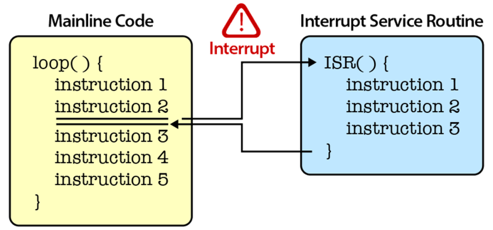

# 第四章——中断Interrupt

## 1. 什么是中断

当单片机正在执行某程序时，如果突然出现意外情况，它就需要停止当前正在执行的程序，转而去处理意外情况，处理完后又接着执行原来的程序。这就是中断的作用。

下面是一个中断示意图：



在单片机中有**硬件中断**和**软件中断**：

- 硬件中断：当外部事件发生时发生，例如**外部中断引脚**将其状态从LOW变为HIGH或HIGH变为LOW。
- 软件中断：根据软件的指令发生。例如**定时器中断**是软件中断。

下面我们介绍一下Arduino的硬件中断。

## 2. attachInterrupt()函数

在Arduino中使用中断非常简单，直接使用`attachInterrupt()`进行中断配置就可以了。

语法：

```cpp
attachInterrupt(digitalPinToInterrupt(pin), ISR, mode);
```

pin参数：在这里还不能直接使用中断引脚，你必须使用`digitalPinToInterrupt()`，将对应的引脚映射到对应的中断序号上，在某些单片机芯片上，引脚号就是中断号，但是还是比较建议使用此函数进行映射。

ISR参数：ISR(Interrupt Service Routine)是中断发生时需要调用的函数名，该函数必须无返回值，无参数。

mode参数：mode是指能够触发中断的模式，有以下三种模式可供选择：

下面是Arduino部分开发板支持的外部中断引脚分布：

|          Aduino Board          |      Pins       |
| :----------------------------: | :-------------: |
| Uno,Nano,other 328-based board |       2,3       |
|    Mega, Mega2560, MegaADK     | 2,3,18,19,20,21 |

- **LOW**，引脚为低电平触发中断
- **CHANGE**，引脚电平改变时触发中断
- **FALLING**，引脚电平出现上升沿时触发中断
- **RISING**，引脚中断出现下降沿时触发中断

下面是一个在按钮中使用中断的例子，可以帮助大家理解中断的使用：

```cpp
uint8_t led = 13;
uint8_t button = 2;
bool LEDStatus;

// 中断回调的任务函数
void buttonTask() {
  LEDStatus = !LEDStatus;
  if (LEDStatus)digitalWrite(led, HIGH);
  else digitalWrite(led, LOW);
}

void setup() {
  pinMode(led, OUTPUT);
  pinMode(button, INPUT_PULLUP);
  // 中断初始化
  attachInterrupt(digitalPinToInterrupt(button), buttonTask, FALLING);
}

void loop() {
}
```

你可以通过`detachInterrupt(pin)`结束单片机对某个中断引脚的监视。

上面的代码中加入结束中断后如下：

```cpp
uint8_t led = 13;
uint8_t button = 2;
bool LEDStatus;
unsigned long lastTime;

// 中断回调的任务函数
void buttonTask() {
  LEDStatus = !LEDStatus;
  if (LEDStatus)digitalWrite(led, HIGH);
  else digitalWrite(led, LOW);
}

void setup() {
  pinMode(led, OUTPUT);
  pinMode(button, INPUT_PULLUP);
  // 中断初始化
  attachInterrupt(digitalPinToInterrupt(button), buttonTask, FALLING);
}

void loop() {
  // 20s后结束对中断引脚buttons的监视
  if (millis() - lastTime > 20000) {
    detachInterrupt(digitalPinToInterrupt(button));
  }
}
```