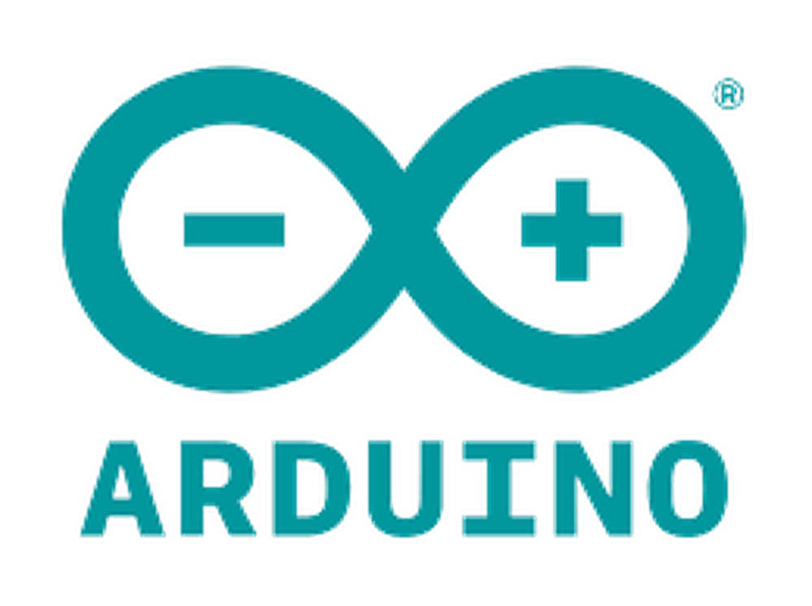

# Arduino 基础

## 1. Arduino 简介

Arduino 是一个**开源的嵌入式硬件平台**，用来供用户制作可交互式的嵌入式项目。此外 Arduino 作为一个**开源硬件**和**开源软件**的公司，同时兼有项目和用户社区。

Arduino 项目始于**2003**年，作为**意大利**伊夫雷亚地区伊夫雷亚交互设计研究所的学生项目，目的是为新手和专业人员提供一种低成本且简单的方法，以创建使用传感器与环境相互作用的设备执行器。适用于初学者爱好者的此类设备的常见示例包括传感器、简单机器人、恒温器和运动检测器。

Arduino 这个名字来自意大利伊夫雷亚的一家**酒吧**，该项目的一些创始人过去常常会去这家酒吧。

## 2. 为什么选择 Arduino

- Arduino 是全球非常流行的，基于**AVR**芯片，开源的，拥有庞大社区的一款单片机，通过 Arduino，你可以简化开发过程，DIY 各式各样的作品。
- Arduino 的拥有良好的生态，在软件方面拥有一款集写代码，烧录，调试于一体的**Arduino IDE**。剩去了各种配置，同时支持很多的**第三方芯片**和**第三方库**。
- Arduino uno 开发板廉价且功能齐全，适合做各种项目。
- 开发语言基于**C++**，具有很高的灵活性。

在这里我们也只对 Arduino 这个硬件和软件平台作简单的介绍，嵌入式学习肯定不是学习 Arduino，只是 arduino 很适合入门，不需要配置环境，使用非常之简便，很适合教学，也很适合做项目。

同时本专题内容进队 Arduino 的基础硬件做简单介绍，有关 Arduino 硬件的通信内容可以学习后面的章节([通信专题](../MCU-Communication/Intro.md))
