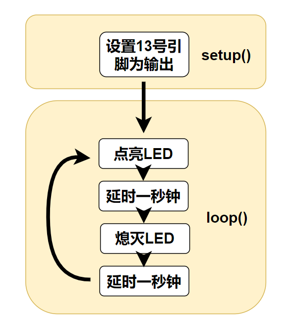

# 第二章——第一个程序Blink

## 1. Blink

几乎每一个学习单片机都要做的程序——点灯，下面是一个经典的点亮一个LED的Arduino程序：

```cpp
int led = 13;

// the setup routine runs once when you press reset:
void setup() {
  // initialize the digital pin as an output.
  pinMode(led, OUTPUT);
}

// the loop routine runs over and over again forever:
void loop() {
  digitalWrite(led, HIGH);   // turn the LED on (HIGH is the voltage level)
  delay(1000);               // wait for a second
  digitalWrite(led, LOW);    // turn the LED off by making the voltage LOW
  delay(1000);               // wait for a second
}
```

学过C/C++的应该对其中大部分都可以理解，这里值得一提的是，setup函数中的代码仅会执行一次，而loop函数中的内容会不断地反复执行其中的代码。

同时，每一个Ardino程序都必须setup和loop这两个函数，Arduino文件的后缀名是`.ino`。

里面还有三个大家没有见过的函数，这是Arduino内置的函数，更多的函数后面会介绍，我们先看这三个函数。

## 2. pinMode()函数

语法：

```cpp
pinMode(pin,mode);
```

pin参数：这个函数用来配置某个引脚的功能模式，在AVR单片机中可以设置0-13，A0-A5。

mode参数：AVR单片机中有以下三种引脚模式模式：

- **OUTPUT**
- **INPUT**
- **INPUT_PULLUP**

在上面的例子中就是使用了OUTPUT模式，也就是输出模式，让该引脚可以输出0V或者5V。

另外两种模式，我们下面章节再讲。

## 3. digitalWrite()函数

语法：

```cpp
digitalWrite(pin,value);
```

在将引脚设置为输出模式后，我们就可以通过digitalWrite()函数决定引脚的输出状态。

pin参数：需要输出的引脚号。

value参数：需要对应引脚输出的状态，value只能是一个布尔值，也就是0，和非0。当value为0时，输出为0V，当value值为非0时，输出5V。

所以`digitalWrite(led, HIGH);`就是输出5V，点亮LED，`digitalWrite(led, LOW);`就是输出0V，熄灭LED。在Arduino中，`HIGH=1，LOW=0`。

## 4. delay()函数

语法：

```cpp
delay(ms);
```

ms参数：delay()是一个延时函数，它会使得程序在该处延时一定的时间，参数就是延时时间，单位时毫秒，数据类型为`unsigned long`。在Arduino中，你还可以使用`delayMicroseconds(us);`达到微秒级的延时，数据类型依然为`unsigned long`。

所以在上面的代码中`delay(1000);`就是延时一秒钟。

因此上面的代码整个看下来就是先对13号引脚进行配置，然后再循环中，先点亮LED，延时一秒钟，再熄灭LED，再延时一秒钟，然后循环往复。

这就是整个程序。

