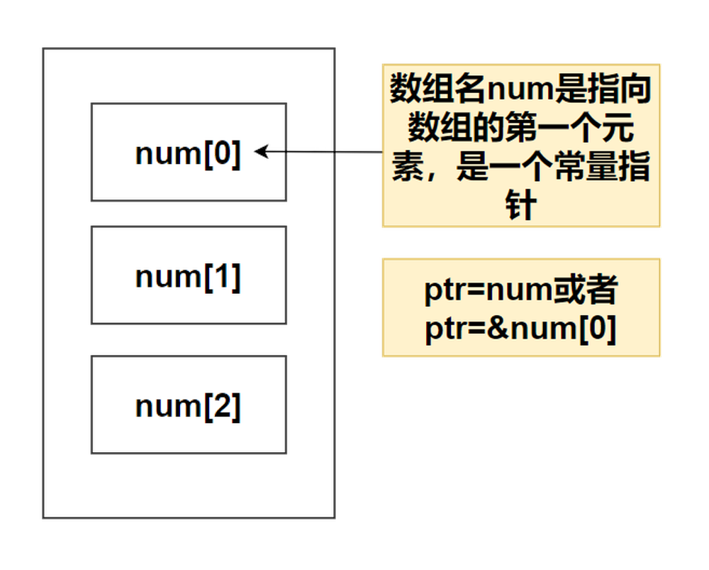

# 第十五章——指针和数组、函数

## 1. 数组中的指针

在前面通过指针自增求数组和例子中，我们通过`ptr = num`来为指针 ptr 初始化，而在自减的例子中，我们是用`ptr = &num[2]`。

这是因为，在数组中，数组名相当于一个指针，指向整个数组第一个元素的指针，是一个常量指针。因此我们在自增的例子中也可以通过`ptr = &num[0]`来为指针 ptr 初始化，只是前一种方式更加简约。



观察下面的例子：

```c
#include <stdio.h>

#define LENGTH 10

int main() {
    int num[LENGTH] = {25, 20, 12, 36, 89, 65, 35, 45, 67, 34};
    int* ptr = num;
    // 输出结果
    for (int i = 0; i < LENGTH; i++) {
        printf("%d ", num[i]);
    }
    putchar('\n');
    for (int i = 0; i < LENGTH; i++) {
        printf("%d ", ptr[i]);
    }
    return 0;
}
```

其输出的结果是一样的：

```plaintext
25 20 12 36 89 65 35 45 67 34
25 20 12 36 89 65 35 45 67 34
```

可见，我们通过 **ptr[i]** 和通过 **num[i]** 来对数组进行访问是一样的，也就是说，我们对数组的操作其实就是对指针的操作，**指针同样支持下标进行访问**，这点在下面将数组作为参数传递给函数的例子中体现得更为明显。

# 2. 将数组传递给函数

如果你想要在函数中传递一个一维数组作为参数，你可以通过以下三种方式来声明函数形式参数，这三种声明方式的结果是一样的，因为每种方式都会告诉编译器将要接收一个整型指针。同样地，你也可以传递一个多维数组作为形式参数。

第一种，形式参数是一个已定义大小的数组：

```c
void myFunction(int param[10])
{
    // Your code.
}
```

第二种，形式参数是一个未定义大小的数组：

```c
void myFunction(int param[])
{
    // Your code.
}
```

第三种，形式参数是一个指针：

```c
void myFunction(int *param)
{
    // Your code.
}
```

其实不论哪一种，我们将实参传递的时候，都是将数组的首地址传递过去，所以从理论上来讲，传递数组就是传递一个指向数组首地址的指针变量，通过地址直接访问数组罢了。

下面我们将前面的冒泡排序，通过传递数组的，包装成函数的方式重新编写，参考代码如下：

```c
#include <stdio.h>

#define LENGTH 10

void bubbleSort(int num[], int length) {
    int temp;
    // 外层循环为排序的趟数，次数为数组长度-1
    for (int i = 0; i < length - 1; i++) {
        //内层循环为比较相邻元素的次数，次数为需要比较元素个数-1
        for (int j = 0; j < length - i - 1; j++) {
            // 相邻元素比较，若逆序则交换（升序为左大于右，降序反之）
            if (num[j] > num[j + 1]) {
                temp = num[j];
                num[j] = num[j + 1];
                num[j + 1] = temp;
            }
        }
    }
}

int main() {
    int num[LENGTH] = {25, 20, 12, 36, 89, 65, 35, 45, 67, 34};
    bubbleSort(num, LENGTH);
    // 输出结果
    for (int i = 0; i < LENGTH; i++) {
        printf("%d ", num[i]);
    }
    return 0;
}
```

在这个例子中，`bubbleSort(int num[], int length)`也可以改成`bubbleSort(int* num, int length)`。

可以发现，如果不通过指针的方式，我们就无法通过包装函数的方式来对数组进行操作。

同理，我们可以将某一个数组当作返回值进行返回，返回的依然是一个指向数组第一个元素的指针变量，同时，由于 C 语言不支持在函数外返回局部变量的地址，除非定义局部变量为 static 变量，更多细节这里不做介绍，大家日常也用的少，有兴趣的可以自行学习。

# 3. 指向函数的指针

通常我们说的指针变量是指向一个整型、字符型或数组等变量，而函数指针是指向函数。

函数指针可以像一般函数一样，用于调用函数、传递参数。

函数指针变量的声明：

```c
int (*fun_ptr)(int,int); // 声明一个指向同样参数、返回值的函数指针类型
```

下面是一个具有函数指针的实例：

```c
#include <stdio.h>

int MAX(int x, int y) {
    return x > y ? x : y;
}

int main(void) {
    /* p 是函数指针 */
    int (*p)(int, int) = &MAX;  // &可以省略
    int a, b, c, max;

    printf("Input three numbers:");
    scanf("%d %d %d", &a, &b, &c);

    /* 与直接调用函数等价，max = MAX(MAX(a, b), c) */
    max = p(p(a, b), c);

    printf("The biggest one is: %d\n", max);

    return 0;
}
```

同理我们可以将函数当作参数进行传递，这称之为`回调函数`，通过回调函数，我们让用户传入自定义的函数，这在中断中使用比较多，日常中使用的比较少，这里也不做介绍了，感兴趣的同学可以自行查阅相关资料进行学习。

可见，指针在 C 语言中的功能真的非常多，有了指针可以实现很多更高级的功能，这里只对指针做简单介绍，更多内容可自行学习。
