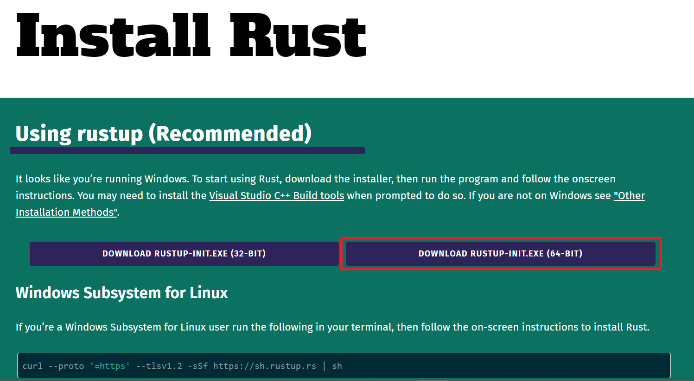
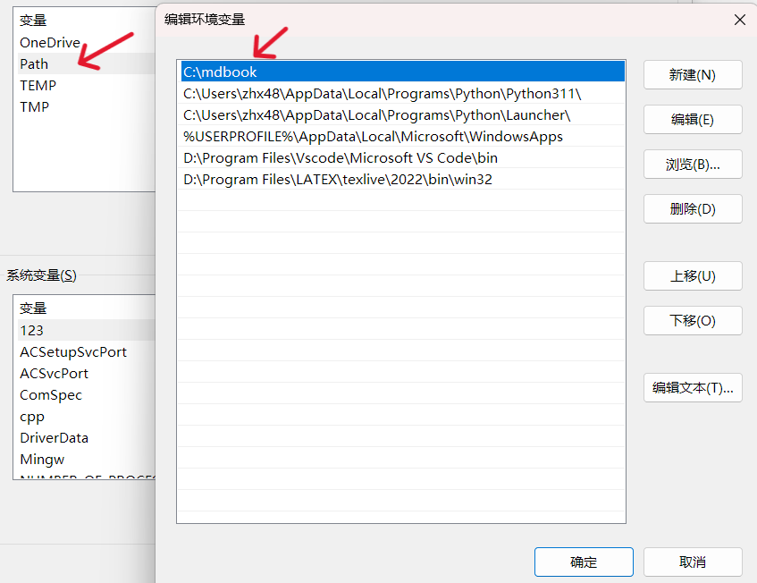
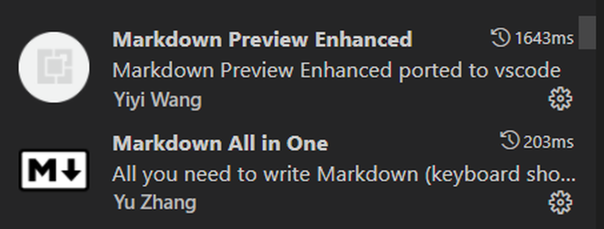
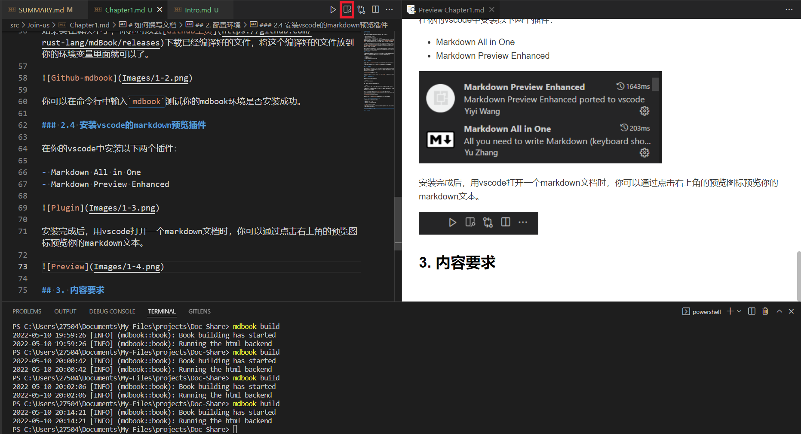

# 第一章——配置环境

在撰写文档时，你需要配置一下相关环境，以便你能在本地预览你写的内容，我默认你是使用的 Windows 系统，同时是使用 vscode 作为你的编辑器。

- 安装 Git
- 安装 mdbook 及插件
- 安装 vscode 的 markdown 预览插件

## 1. 安装 Git

直接前往[Gitforwindows 官网](https://gitforwindows.org/)下载安装 Git 即可。

安装完成后，你可以在命令行中输入`git`测试你的 Git 是否安装成功。

## 2. 安装 mdbook 及插件

首先我们要先安装 mdbook 插件。前往 [Github 主页](https://github.com/rust-lang/mdBook/releases)下载已经编译好的文件，选择你的系统对应的文件下载。建议下载和项目相同的版本，这样可以避免一些兼容性问题。

然后将下载的文件放到你的环境变量里面。如果你是 windows，那么需要放到 PATH 地址当中：

你可以在命令行中输入`mdbook`测试你的 mdbook 环境是否安装成功。

同理，我们还需要安装下面的插件，也是下载完成后放到环境变量中：

- [mdbook-repl](https://github.com/MR-Addict/mdbook-repl) 一个用于插入实时运行代码的插件
- [mdbook-embedify](https://github.com/MR-Addict/mdbook-embedify) 一个用于方便插入一些外部资源的插件

## 3. 安装 vscode 的 markdown 预览插件

在你的 vscode 中安装以下两个插件：

- Markdown All in One
- Markdown Preview Enhanced

安装完成后，用 vscode 打开一个 markdown 文档时，你可以通过点击右上角的预览图标预览你的 markdown 文本。

