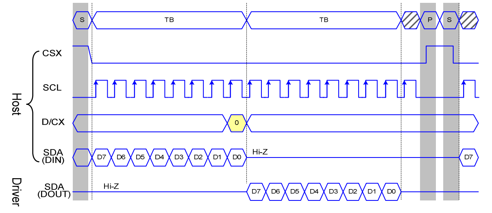

# 第一章——并行通信原理

## 1. 并行通信机制

一般情况下，并行通信的机制和串行通信非常相似，尤其是和SPI通信相似。有些SPI通信的设备也支持并行通信，主要是为了提高数据传输的速度。比如，TFT显示屏，支持SPI也支持并行通信，OLED支持I2C，SPI和并行通信。

下面是ST7735的**SPI通信**时域图：

下面是ST7735的**并行通信**时域图：

由于并行通信没有统一的标准，关键还是需要阅读数据手册。我们后面具体问题具体分析。

## 2. 适用于哪些设备

常见的使用并行通信的设备有以下几个：

|          LCD1602           |          TFT Display           |          电脑显示屏           |
| :------------------------: | :----------------------------: | :---------------------------: |
|  |  |  |

后面我们将具体学习如何通过并行通信驱动LCD1602显示屏。