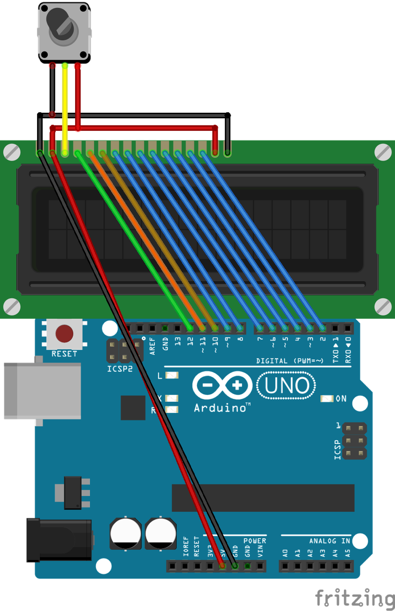
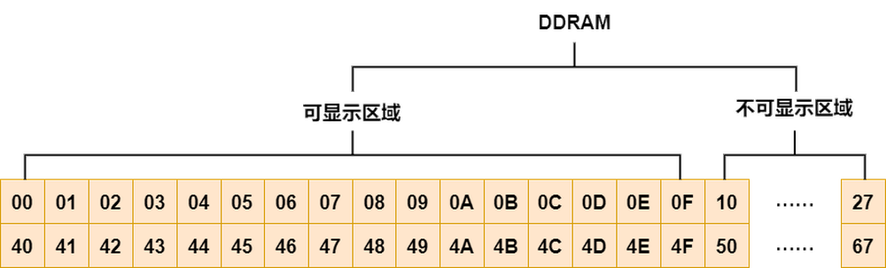
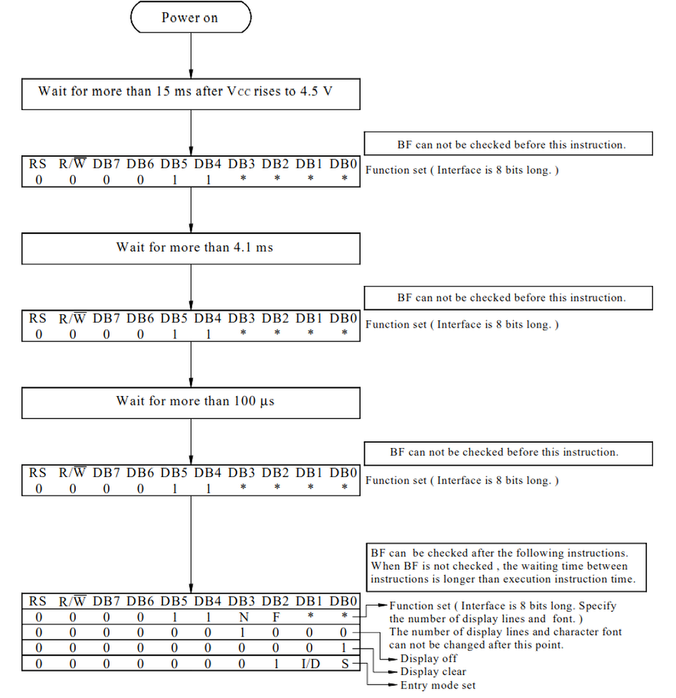

# 第二章——LCD1602 数据手册速览

## 1. LCD1602 基本参数

|    参数    |                   参数值                    |
| :--------: | :-----------------------------------------: |
|  供电电压  |                  4.5V-5.5V                  |
|  通信方式  |       并行通信，支持 4 总线和 8 总线        |
| 字符分辨率 |        支持 5x8，或者 5x10 字符点阵         |
|   字符数   |      可显示字符 16x2，可存储字符 40x2       |
| 自定义字符 | 可自定义 8 个 5x8 字符，或者 4 个 5x10 字符 |
|    光标    |            支持光标以及光标闪烁             |
|  字符滚动  |              支持字符水平滚动               |

## 2. LCD 引脚介绍

下面是 LCD1602 的 16 个引脚分布：

| 引脚序号 |   引脚编号    |                     介绍                      |
| :------: | :-----------: | :-------------------------------------------: |
|    1     | \\(V\_{SS}\\) |                   供电负极                    |
|    2     | \\(V\_{DD}\\) |                   供电正极                    |
|    3     |      V0       |                对比度调节电压                 |
|    4     |      RS       | 数据/命令选择引脚，高电平：数据，低电平：命令 |
|    5     |      RW       |     读/写选择引脚，高电平：读，低电平：写     |
|    6     |      EN       |                 芯片使能引脚                  |
|    7     |      DB0      |                  数据引脚 0                   |
|    8     |      DB1      |                  数据引脚 1                   |
|    9     |      DB2      |                  数据引脚 2                   |
|    10    |      DB3      |                  数据引脚 3                   |
|    11    |      DB4      |                  数据引脚 4                   |
|    12    |      DB5      |                  数据引脚 5                   |
|    13    |      DB6      |                  数据引脚 6                   |
|    14    |      DB7      |                  数据引脚 7                   |
|    15    |       A       |                  背光灯正极                   |
|    16    |       K       |                  背光灯负极                   |

下面是 LCD1602 和 Arduino Uno 的接线图：

## 3. LCD1602 的存储器

LCD1602 主要有三个存储器，分别是 DDRAM，CGROM，CGRAM。

下面我们介绍一下这三个存储器。

### 3.1 DDRAM

**DDRAM**(Display Data RAM)是用来存储显示在屏幕上的字符的一个存储器。

该存储器一共可以存储 40x2 个字符，存储器内部结构示意图如下：

### 3.2 CGROM

**CGROM**(Character Generator ROM)预先存储了一些字符，可以方便我们使用。

下面是 LCD1602 内置的字符表：

### 3.3 CGRAM

**CGRAM**(Character Generator RAM)用于存储我们自定义的字符。

观察上面 CGROM 的第一列，我们可以发现，有八个 CGRAM 的地址。也就是说，我们通过 CGRAM 定义的字符会**指向 CGROM 的这 8 个地址**。我们可以通过 CGROM 的地址访问 CGRAM 的内容，最终会缓存到 DDRAM 中。

## 4. LCD1602 的读写操作

LCD1602 可以通过 RS，RW 选择 4 种不同的读写操作：

| RS  | RW  |             介绍             |
| :-: | :-: | :--------------------------: |
|  0  |  0  |            写命令            |
|  0  |  1  |  读取 BUSY Flag 及 AC 地址   |
|  1  |  0  | 向 CGRAM 或者 DDRAM 写入数据 |
|  1  |  1  | 向 CGRAM 或者 DDRAM 读取数据 |

通常情况下，我们都不会读取 RAM 中的数据，因此，我们使用的也就只有前三种。

有的时候为了节省 IO 口的使用而选择放弃读取 BUSY FLAG，让 RW 直接接地，RW=0，这样就省去了 5 个 IO 口。

不过在这边我们会**使用所有的引脚**，但是不去读 RAM 中的数据。

RS 和 RW 是命令/数据的读/写选择端口，但是如何让 LCD1602 知道何时接收这些数据呢，那就是 EN 引脚的作用了。

结合 EN 引脚，我们可以将上面三种读写操作总结如下：

- 读 Flag：RS=0，RW=1，EN 高电平
- 写命令：RS=0，RW=0，EN 高脉冲
- 写数据：RS=1，RW=0，EN 高脉冲

可以发现，读取 Falg 和写数据/命令的 EN 条件有点不同，EN 高电平比较好理解，**EN 高脉冲**指的是 EN 的引脚要有一个从低到高的脉冲变化，数据手册介绍这个脉冲至少持续**230 纳秒**。

其实我们如果从数据手册上的时序图来看，LCD1602 的读写时序图是一致的，都有一个 EN 的高峰，只是我们在写代码的时候这样可以达到最好的数据传输效果。

LCD1602 写操作：

LCD1602 读操作：

## 5. LCD1602 指令表

在 LCD1602 数据手册中，将命令(Command)称为指令(Introduction)，其实是一样的。

同时**AC**(Address Counter)在 LCD1602 中指的是指向 DDRAM 或者 CGRAM 的地址计数器，这个计数器很重要。

下面介绍一下每一条指令：

### 5.1 Clear Display

指令码：

| RS  | RW  | DB7 | DB6 | DB5 | DB4 | DB3 | DB2 | DB2 | DB1 | DB0 |
| --- | --- | --- | --- | --- | --- | --- | --- | --- | --- | --- |
| 0   | 0   | 0   | 0   | 0   | 0   | 0   | 0   | 0   | 0   | 1   |

解析时间：1.53ms

介绍：该指令会把 DDRAM 的数据全部写为 0x00，同时让 AC 指向 DDRAM 的第一个地址 0x00。

### 5.2 Return Home

指令码：

| RS  | RW  | DB7 | DB6 | DB5 | DB4 | DB3 | DB2 | DB1 | DB0 |
| --- | --- | --- | --- | --- | --- | --- | --- | --- | --- |
| 0   | 0   | 0   | 0   | 0   | 0   | 0   | 0   | 1   | \*  |

解析时间：1.53ms

介绍：该指令会让 AC 指向 DDRAM 第一个 0x00 的地址，同时让光标回到 0x00。

### 5.3 Entry Mode Set

指令码：

| RS  | RW  | DB7 | DB6 | DB5 | DB4 | DB3 | DB2 | DB1 | DB0 |
| --- | --- | --- | --- | --- | --- | --- | --- | --- | --- |
| 0   | 0   | 0   | 0   | 0   | 0   | 0   | 1   | I/D | SH  |

解析时间：39us

介绍：I/D 用于控制结束读写操作后 AC 是自动递增还是递减。**如果 I/D ＝ 1，自动递增；如果 I/D ＝ 0，自动递减**。

### 5.4 Display ON/OFF Control

指令码：

| RS  | RW  | DB7 | DB6 | DB5 | DB4 | DB3 | DB2 | DB1 | DB0 |
| --- | --- | --- | --- | --- | --- | --- | --- | --- | --- |
| 0   | 0   | 0   | 0   | 0   | 0   | 1   | D   | C   | B   |

解析时间：39us

介绍：D 用于控制是否显示屏幕。**如果 D=1，屏幕开；如果 D=0，屏幕关**。C 用于控制是否显示光标。**如果 C=1，光标开；如果 C=0，光标关**。B 用于控制是否闪烁光标，在闪烁开的情况下，将会以**409.6ms**的频率进行闪烁。**如果 B=1，闪烁开；如果 B=0，闪烁关**。

### 5.5 Cursor or Display Shift

指令码：

| RS  | RW  | DB7 | DB6 | DB5 | DB4 | DB3 | DB2 | DB1 | DB0 |
| --- | --- | --- | --- | --- | --- | --- | --- | --- | --- |
| 0   | 0   | 0   | 0   | 0   | 1   | S/C | R/L | \*  | \*  |

解析时间：39us

介绍：S/C 用于控制光标的移动。**如果 S/C=1，屏幕移动；如果 S/C=0，光标移动**。R/L 用于控制屏幕或者光标的移动反向。**如果 R/L=1，屏幕或光标向右移动一列；如果 R/L=0，屏幕或光标向左移动一列**。

将其列成表格如下：

| S/C | R/L |     结果     |
| :-: | :-: | :----------: |
|  0  |  0  | 光标向左移动 |
|  0  |  1  | 光标向右移动 |
|  1  |  0  | 屏幕向左移动 |
|  1  |  1  | 屏幕向右移动 |

### 5.6 Function Set

指令码：

| RS  | RW  | DB7 | DB6 | DB5 | DB4 | DB3 | DB2 | DB1 | DB0 |
| --- | --- | --- | --- | --- | --- | --- | --- | --- | --- |
| 0   | 0   | 0   | 0   | 1   | DL  | N   | F   | \*  | \*  |

解析时间：39us

介绍：DL 用于控制通讯总线模式。**如果 DL=1，8 总线模式；如果 DL=0，4 总线模式**。N 用于控制控制显示行数。**如果 N=1，显示两行；如果 N=0，显示 1 行**。F 用于控制显示字体。**如果 F=1，5x10 字体；如果 F=0，5x8 字体**。

### 5.7 Set CGRAM Address

指令码：

| RS  | RW  | DB7 | DB6 | DB5 | DB4 | DB3 | DB2 | DB1 | DB0 |
| --- | --- | --- | --- | --- | --- | --- | --- | --- | --- |
| 0   | 0   | 0   | 1   | AC5 | AC4 | AC3 | AC2 | AC1 | AC0 |

解析时间：39us

介绍：该指令用于设置 AC 指向 CGRAM 的地址。当我们需要自定义字体的时候需要用到。

### 5.8 Set DDRAM Addresss

指令码：

| RS  | RW  | DB7 | DB6 | DB5 | DB4 | DB3 | DB2 | DB1 | DB0 |
| --- | --- | --- | --- | --- | --- | --- | --- | --- | --- |
| 0   | 0   | 1   | AC6 | AC5 | AC4 | AC3 | AC2 | AC1 | AC0 |

解析时间：39us

介绍：该指令用于设置 AC 指向 DDRAM 的地址。当我们需要设置光标位置的时候需要用到。

### 5.9 Read Busy Flag and Address

指令码：

| RS  | RW  | DB7 | DB6 | DB5 | DB4 | DB3 | DB2 | DB1 | DB0 |
| --- | --- | --- | --- | --- | --- | --- | --- | --- | --- |
| 0   | 1   | BF  | AC6 | AC5 | AC4 | AC3 | AC2 | AC1 | AC0 |

解析时间：0us

介绍：该指令用于读取 LCD1602 的忙碌状态和 AC 地址。

### 5.10 Write Data to RAM

指令码：

| RS  | RW  | DB7 | DB6 | DB5 | DB4 | DB3 | DB2 | DB1 | DB0 |
| --- | --- | --- | --- | --- | --- | --- | --- | --- | --- |
| 1   | 0   | D7  | D6  | D5  | D4  | D3  | D2  | D1  | D0  |

解析时间：43us

介绍：该指令用于向 DDRAM 或者 CGRAM 写入数据，具体写到哪一个 RAM**取决于 AC 的指向**。

### 5.11 Read Data from RAM

指令码：

| RS  | RW  | DB7 | DB6 | DB5 | DB4 | DB3 | DB2 | DB1 | DB0 |
| --- | --- | --- | --- | --- | --- | --- | --- | --- | --- |
| 1   | 1   | D7  | D6  | D5  | D4  | D3  | D2  | D1  | D0  |

解析时间：43us

介绍：该指令用于向 DDRAM 或者 CGRAM 读取数据，具体读取哪一个 RAM**取决于 AC 的指向**。

### 6. LCD1602 的初始化

LCD 有 8 总线和 4 总线模式。

根据数据手册的介绍，8 总线的初始化如下：

相似地，4 总线的初始化如下：

下一章我们将学习如何借助 8 总线方式驱动 LCD1602。
