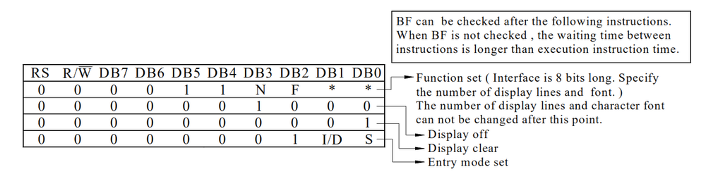

# 第三章——代码逻辑分析

## 1. 8位引脚操作

在这里，我们将以8总线的方式驱动LCD，同时使用所有引脚。

由于我们使用Arduino的框架，Arduino不像C51，对8个IO口进行操作不是很方便，所以我们要解决如何从8个IO口读取和发送8位数据。

下面是示例代码：

```cpp
const uint8_t data_pins[] = {9, 8, 7, 6, 5, 4, 3, 2};
// 发送数据到引脚
void send_pins(uint8_t dat) {
    for (int i = 0; i < 8; i++) {
        digitalWrite(data_pins[i], (dat >> i) & 0x01);
    }
}

// 读取引脚数据
uint8_t read_pins() {
    uint8_t sta = 0;
    for (uint8_t i = 0; i < 8; i++) {
        sta |= (uint8_t)digitalRead(data_pins[i]) << i;
    }
    return sta;
}
```

## 2. 读取忙碌状态

这里我们还要解决一个问题，那就是读取LCD1602的忙碌状态，因为通过读取忙碌状态，我们可以规避麻烦的LCD初始化，不需要关注解析时长短的问题。

下面是示例代码：

```cpp
// 等待LCD1602准备好
void wait_ready() {
    uint8_t sta;
    // 读取LCD状态RS=0，RW=1
    digitalWrite(RS, LOW);
    digitalWrite(RW, HIGH);
    // 将引脚设置为输入模式
    for (uint8_t i = 0; i < 8; i++) {
        pinMode(data_pins[i], INPUT);
    }
    // 读取引脚状态
    do {
        digitalWrite(EN, HIGH);
        sta = read_pins();
        digitalWrite(EN, LOW);
    } while (sta & 0x80);  // 读取Bit7的Busy Flag
    // 将引脚重新设置为输出
    for (uint8_t i = 0; i < 8; i++) {
        pinMode(data_pins[i], OUTPUT);
    }
}
```

这里我们只需要读取LCD的忙碌状态就可以了，不需要关注AC的地址。

## 3. 写命令/数据

解决了发送和读取引脚数据的问题，下面我们就要解决前面讲到的很核心也很重要的问题，数据的读写。这里我们只是数据的写，没有数据的读，唯一的读操作就是读取Flag。

下面是示例代码：

```cpp
// 写命令
void write_cmd(uint8_t cmd) {
    wait_ready();
    // 写命令RS=0，RW=0
    digitalWrite(RS, LOW);
    digitalWrite(RW, LOW);
    send_pins(cmd);
    // 发送命令需要EN高脉冲
    digitalWrite(EN, HIGH);
    digitalWrite(EN, LOW);
}

// 写数据到DDRAM
void write_data(uint8_t dat) {
    wait_ready();
    // 写数据RS=1，RW=0
    digitalWrite(RS, HIGH);
    digitalWrite(RW, LOW);
    send_pins(dat);
    // 发送数据需要EN高脉冲
    digitalWrite(EN, HIGH);
    digitalWrite(EN, LOW);
}
```

在这里，我们需要保证EN的高脉冲是在发送引脚状态之后。

## 4. LCD1602初始化

构建了这些底层函数，我们就可以写数据和命令。

首先我们要对LCD进行初始化。由于LCD1602默认使用8总线模式，因此数据手册中前面选择模式的部分我们不需要操作，我们只需要初始化最后四条指令。



```cpp
// LCD初始化
void lcd_init() {
    write_cmd(0x38);  // 8总线，2行显示区域，5x8字体
    write_cmd(0x0C);  // 显示开，光标关，闪烁关
    write_cmd(0x01);  // 清屏
    write_cmd(0x06);  // 地址自动+1，文字不动
}
```

## 5. 其他API函数函数

在完成了这些底层操作及初始后之后，我们需要完成一些API函数，方便我们使用LCD。

下面是一些重要的API函数：

```cpp
// 清空屏幕
void lcd_clear() {
    write_cmd(LCD_CLEAR);
}

// 光标以及光标指针回到初始状态
void lcd_home() {
    write_cmd(LCD_HOME);
}

// 关闭LCD
void display_off() {
    LCD_DISPLAY_CONTROL &= ~0x04;
    write_cmd(LCD_DISPLAY_CONTROL);
}

// 打开LCD
void display_on() {
    LCD_DISPLAY_CONTROL |= 0x04;
    write_cmd(LCD_DISPLAY_CONTROL);
}

// 关闭光标
void cursor_off() {
    LCD_DISPLAY_CONTROL &= ~0x02;
    write_cmd(LCD_DISPLAY_CONTROL);
}

// 打开光标
void cursor_on() {
    LCD_DISPLAY_CONTROL |= 0x02;
    write_cmd(LCD_DISPLAY_CONTROL);
}

// 关闭光标闪烁
void blink_off() {
    LCD_DISPLAY_CONTROL &= ~0x01;
    write_cmd(LCD_DISPLAY_CONTROL);
}

// 打开光标闪烁
void blink_on() {
    LCD_DISPLAY_CONTROL |= 0x01;
    write_cmd(LCD_DISPLAY_CONTROL);
}

// 向左滚动一列
void scroll_left() {
    write_cmd(LCD_SURSOR_SHIFT);
}

// 向右滚动一列
void scroll_right() {
    write_cmd(LCD_SURSOR_SHIFT | 0x04);
}

// 设置光标位置
void set_cursor(uint8_t x, uint8_t y) {
    uint8_t addr;
    if (y == 0)
        addr = 0x00 + x;  // 第一行字符地址从 0x00开始
    else
        addr = 0x40 + x;  // 第二行字符地址从 0x40开始
    write_cmd(LCD_SET_DDRAM_ADDR | addr);  // 设置DDRAM地址
}

// 打印字符
void print(const char cha) {
    write_data(cha);
}

// 打印字符串
void print(const char* str) {
    while (*str) {
        write_data(*str++);  // 先取指针的值，再将指针地址自增
    }
}

// 自定义一个新的CGRAM字符
void creat_char(uint8_t num, uint8_t* bit_map) {
    // 设置CGRAM地址
    write_cmd(LCD_SET_CGRAM_ADDR + 8 * num);
    for (uint8_t i = 0; i < 8; i++) {
        write_data(bit_map[i]);
    }
}
```

关于自定义字符，我想强调的是，字符必须是**横向取模**，一个字符的大小是**8个uint8_t**。当你完成写入CGRAM之后，你可以通过`print()`显示该字符，参数必须是0-7这8个数字。

另外，由于LCD1602使用AC指向CGRAM或者DDRAM，因此完成自定义字符后，可能不能正常显示，因为**AC指向CGRAM，而不是DDRAM**，你需要通过`set_cursor()`重新设置AC的指向。

下一章有完整代码。