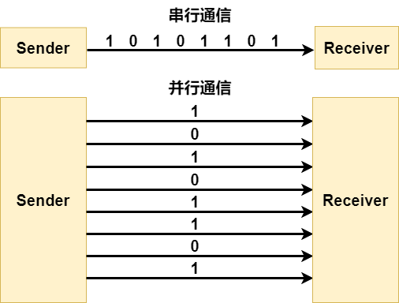

# 并行通信

## 1. 什么是并行通信

并行通信(Parallel Communication)主要区别于串行通信。在串行通信中，通常是将一个数据帧一位一位地进行传输，而并行通信则是一次性传输一个数据帧。并行通信在早期的电子设备中使用较多，现代使用的更多的还是串行通信。但是无论如何，串口数据最后还是需要转换成并口数据。

通常来说，并行通信有 8 线，16 线，32 线等，也有 4 线，9 线，12 线等特殊的总线。所以说，并行通信的效率更高，传输速度更快。举例来说，在时钟频率相同的情况下，8 总线的并行通信的速度就要是串行通信的 8 倍。并行通信的缺点就是接线更加复杂。

## 2. 并行通信的外设

相对来说，并行通信和 SPI 一样，不需要什么外设。
