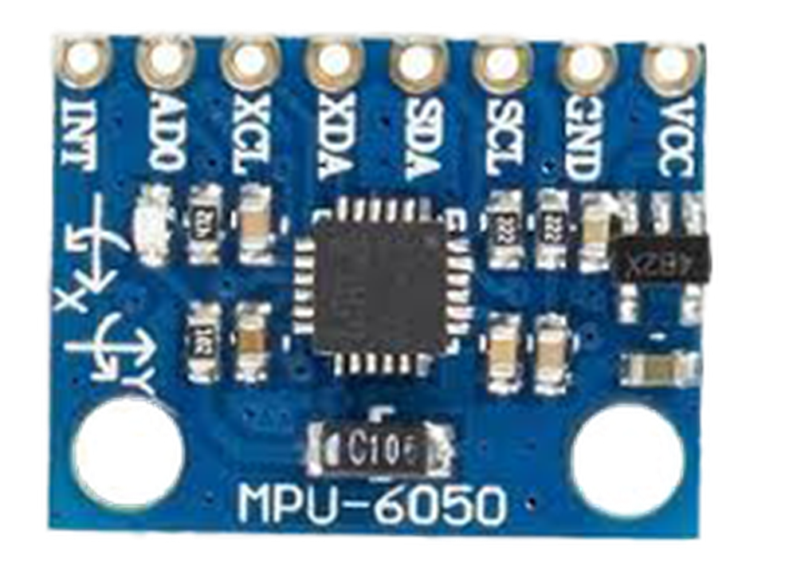
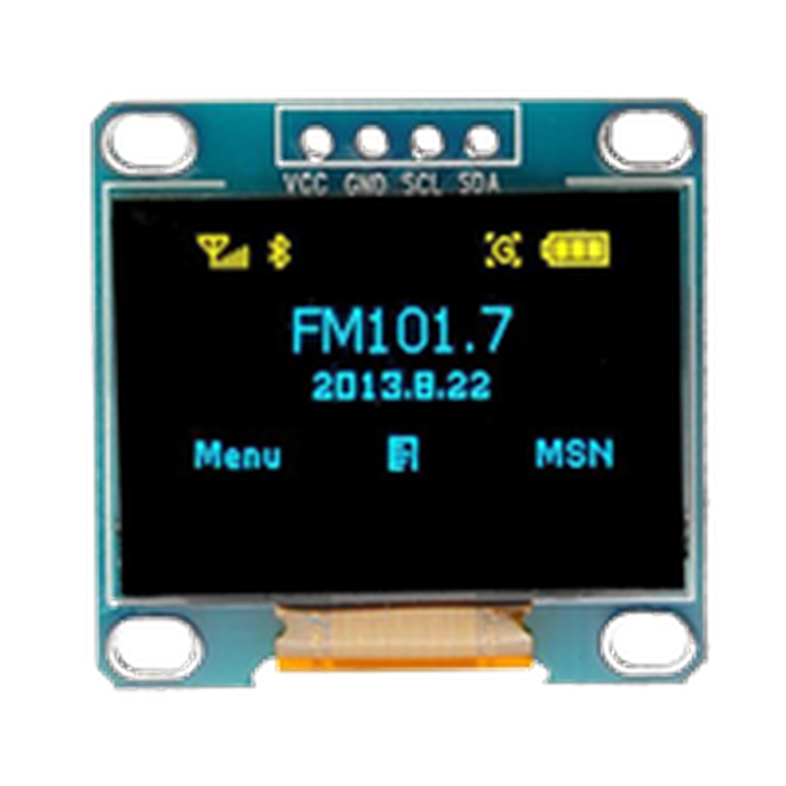

# 第一章——I2C 的通信原理

## 1. I2C 的 Clock

前面讲到，I2C 是同步通信，我们还记得 UART 是异步通信。这是因为，在 UART 中，数据的发送方只负责发送数据，接收方根据波特率进行接收数据。而 I2C 通过 Clock 同步双方的通信过程，只要 SCL 出现了上升沿，那么从机就会接收数据，这样可以有效避免双方数据采样出现误差的问题。

I2C 通常有四种时钟频率，也就是 SCL 的脉冲频率：

- **标准模式**：小于 100KHz
- **快速模式**：小于 400KHz
- **高速模式**：小于 3.4MHz
- **超快速模式**：小于 5MHz

我们可以拿 I2C 的快速模式 400KHz 和 UART 的 115200，也就是 115.2KHz 相比，可见 I2C 的通信速度要高于 UART。但是 I2C 的速度远远低于 SPI 的速度，这个到我们介绍 SPI 再做介绍。

值得注意的是，一般的设备都是**支持标准模式和快速模式**的，支持高速模式和超快速模式的设备比较少，也不建议 I2C 的通信速度高于 400KHz。

## 2. I2C 的通信过程

I2C 有严格的时序要求，当 SCL 处于低电平期间，SDA 可以改变其状态，而当 SCL 处于高电平期间，SDA 的电平必须稳定，因为这时候接收方要对数据进行采样。

标准的 I2C 通信由**START+ADDR+R/W+ACK(+DATA+ACK+DATA+ACK+...)+STOP**组成。

下面是标准的 I2C 通信时序图：


下面我们对这几个部分做一一介绍。

### 2.1 START

I2C 的开始信号是指 SCL 保持高电平的时候，SDA 由高电平变为低电平。

### 2.2 STOP

I2C 的结束信号正好和开始信号相反，在 SDA 低电平的时候，SCL 由低电平变为高电平。

### 2.3 ADDR

I2C 的地址位一般都是 7 位模式，也有 10 位模式，但是常用的还是 7 位模式。也就是说 I2C 可以由 128 个地址可以使用，但是**0-7 是保留地址**，因此有**8-127**这 120 个地址可以使用。日常项目中几乎不会用这么多，所以完全不必担心地址不够用的情况。

### 2.4 R/W

一般情况下，继地址位之后就是读/写位，这一位决定了主机是需要向从机写数据还是读数据，0 是写数据，1 是读数据。

### 2.5 ACK

无论是主机还是从机，在接收完数据后都需要发送一个应答位，应答位可以告诉对方成功接收到数据。

### 2.6 DATA

在发送完地址，收到从机的应答后，主机就可以接收或者发送数据了。每次只能发送一个 8 位的数据，和 UART 不同，数据由**高位向低位**进行发送。

## 3. Arduino 的 Wire 库

上面是 I2C 的通信原理，但是通常情况下，任何一款单片机都是有封装好的硬件驱动，Arduino 的 I2C 驱动是 Wire 库。同时，Arduino Uno 只有一个 I2C 接口，即**SCL—A5，SDA—A4**。

下面我们对 Arduino 的 Wire 库中几个重要的函数做简单介绍。

### 3.1 begin()

语法：

```cpp
Wire.begin();
Wire.begin(address);
```

用于初始化 Arduino 的 I2C，如果你想让 Arduino 作为主机，参数为空，如果想让 Arduino 作为从机，则可以填入想要的从机地址。正常情况都是作为主机，参数可以为空。

### 3.2 beginTransmission()

语法：

```cpp
Wire.beginTransmission(address);
```

向从机发出开始信号，参数为从机地址。

### 3.3 write()

语法：

```cpp
Wire.write(value);
Wire.write(string);
Wire.write(data, length);
```

向从机发送数据，可以是一个字节的数据，也可以是一个字符串，或者是一个数组。

### 3.4 requestFrom()

语法：

```cpp
Wire.requestFrom(address, quantity);
Wire.requestFrom(address, quantity, stop);
```

向从机发送读数据的请求，读取的数据会存储在缓冲中，可以通过`read()`函数读取。参数 address 是从机地址，quantity 是请求的字节数。可选参数 stop 是一个布尔值，如果是 0，接受完数据后会发送一个重新开始的信号；如果是 1，接受完数据后会发送结束通信的信号，结束通信。

Arduino 为了方便初学者使用，使用了`requestFrom()`这个函数，方便向从机读数据，虽然这样就完全掩盖了 I2C 的通信原理。

### 3.5 read()

语法：

```cpp
Wire.read();
```

向从机读取一个字节的数据。

### 3.6 endTransmission()

语法：

```cpp
Wire.endTransmission();
Wire.endTransmission(stop);
```

向从机发送一个结束通信的信号。在`Wire.endTransmission()`中，你还可以填入一个布尔值，如果是 0，Arduino 会发送一个重新开始的信号；如果是 1，Arduino 会直接发送停止信号，结束通信。

可以发现，在 Wire 库中没有提到 ACK，这是因为 Wire 库自动为我们验证和发送了 ACK。同时，由于使用了`requestFrom()`函数，导致 I2C 的通信原理也被封装了，后面的例子中我将尽力解释清楚其中的原理。

下面是一个 Arduino 官网提供的 I2C 读取数据的例子：

```cpp
#include <Wire.h>

void setup() {
    Wire.begin();        // join i2c bus (address optional for master)
    Serial.begin(9600);  // start serial for output
}

void loop() {
    Wire.requestFrom(2, 6);  // request 6 bytes from slave device #2

    while (Wire.available())  // slave may send less than requested
    {
        char c = Wire.read();  // receive a byte as character
        Serial.print(c);       // print the character
    }

    delay(500);
}
```

## 4. 适用的设备

常见的使用 I2C 的设备有以下几个：

|          DS3231           |          MPU6050           |          OLED           |
| :-----------------------: | :------------------------: | :---------------------: |
|  |  |  |

下个的章节我们将学习如何通过 I2C 向 DS3231 读写数据。
