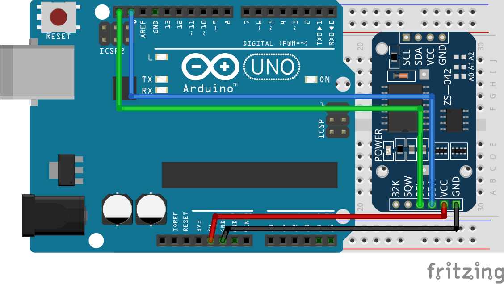
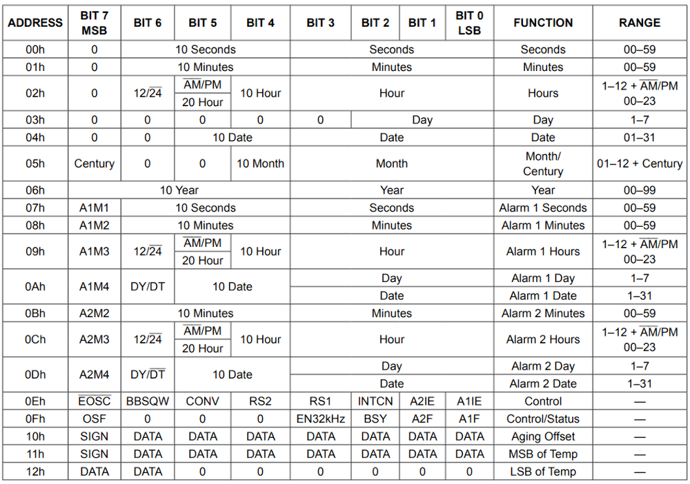
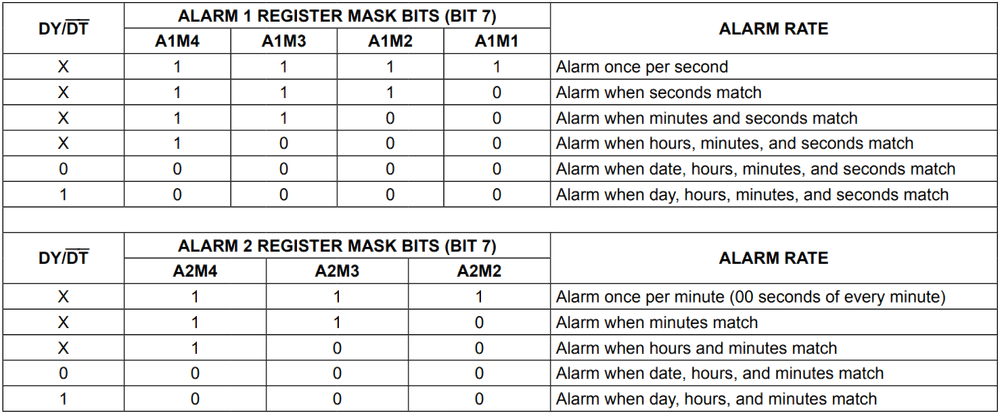
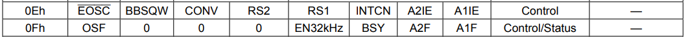
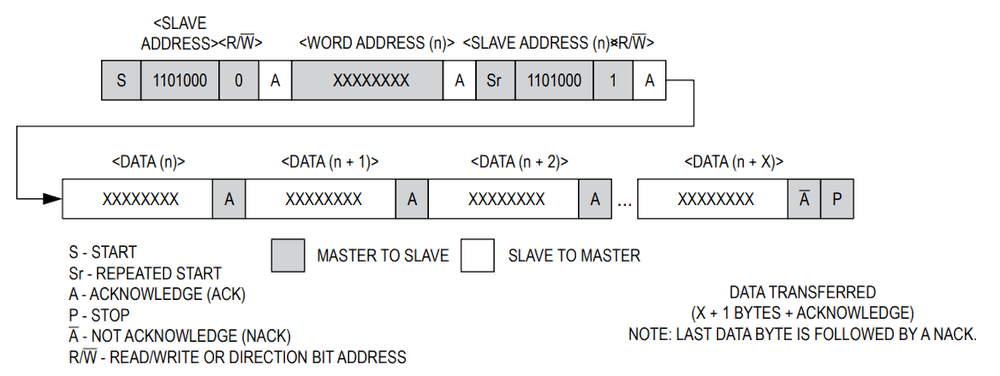

# 第二章——DS3231 数据手册速览

## 1. DS3231 基本参数

|      参数      |              参数值              |
| :------------: | :------------------------------: |
|    供电电压    |            2.3V-5.5V             |
|    通信方式    |               I2C                |
|    日期格式    |   秒,分,时,日,月,年(2000-2100)   |
|    时间精度    |             ±2 分/年             |
|    温度精度    |       ±3°，一分钟更新一次        |
|      闹钟      |             两个闹钟             |
| 支持的通信速度 | 100KHz 标准模式，400KHz 快速模式 |

## 2. DS3231 接线图

DS3231 和 Arduino Uno 接线图如下：

## 3. DS3231 的寄存器列表

DS3231 的 I2C 的 7 位地址为 0x68，下面是 DS3231 的寄存器列表，这里我们仅对其做简单讲解，更多内容请参考数据手册：

### 3.1 0x00-0x06 时间寄存器

这七个寄存器储存了 DS3231 的时间信息，我们可以通过这七个寄存器读取和写入时间的信息，在晶振使能位开启的情况下，时间寄存器中的信息会自动更新。

唯一需要注意的是，0x03 这个寄存器用于存储星期，值从 1-7 共 7 个值，这个寄存器 24H 后自动更新+1，至于哪个数字对应哪个星期，我们自己约定就好了。

可以发现，DS3231 存储时间数据的时候，采用**BCD 编码**方式而不是 DEC 编码，因此在后面我们读取和写入数据的时候，要对数据进行相应的转换。

### 3.2 0x07-0x0D 闹钟寄存器

DS3231 的闹钟寄存器和时间寄存几乎相同，只是闹钟 1 有 4 个寄存器，存储秒，分，时，天(星期)，闹钟 2 只有三个寄存器，存储分，时，天(星期)。其中 0x0A 和 0x0D 寄存器的**DY/DT**位用于设置闹钟是以天位单位闹铃，还是以星期位单位进行闹铃。如果是 0，则对应天；如果是 1，对应星期。默认值为 0。

当当前时间与设置的闹铃时间一致后，对应的闹铃状态位会被写为 1，我们可以通过这个闹铃状态位获取闹铃信息。

闹钟寄存器的最高位是闹钟响应模式掩码，你可以通过掩码设置闹铃模式，掩码信息如下：

### 3.3 0x0E-0x0F 控制/状态寄存器

下面是 DS3231 控制/状态寄存器列表，这里我们只对其中部分位做介绍，其余位在使用过程中，保持默认即可：

#### 3.3.1 EOSC#晶振使能位

该位用于控制 DS3231 的晶振是否使能，该位只在 DS3231 处于电池供电情况下有效，VCC 供电该位无效。当该位为 0 时，晶振使能；为 1 时，晶振不使能，同时寄存器数据将处于静止状态，即数据不会自动更新。

#### 3.3.2 INTCN 中断选择控制位

这一位用于控制 INT/SQW 引脚的功能，如果该位是 0，则该引脚用作输出方波（SQW）；如果该位是 1，则该引脚用于闹钟闹铃中断。默认值为 1。

#### 3.3.3 A2IE/A1IE 闹铃 2 中断使能位

该位用于决定闹钟是否在闹铃时触发 INT/SQW 引脚。当该位是 0 时，不会触发中断；为 1 时，触发中断。默认值为 0。

#### 3.3.4 OSF 晶振状态位

该位用于显示晶振是否使能，1 表示未使能，0 表示使能。

#### 3.3.5 A2F/A1F 闹钟状态为

该位用于显示 DS3231 两个闹钟是否触发，该位为 0 时，表示未触发；为 1 时表示触发。该位只能写入 0。

### 3.4 0x11-0x12 温度寄存器

该寄存器用于存储温度数据，它是一个 10 位的数据，前 8 位为有符号整数位，后一个字节的前两位是小数位，精度为 0.25。温度一分钟更新一次。

## 4. DS3231 的 I2C 通信

由数据手册可知，DS3231 支持标准的 I2C 通信，标准速度为 100KHz，快速模式为 400KHz，可以进行连续的数据读写。

DS3231 数据写：

DS3231 数据读：

DS3231 数据读/写：

因此，这里我不再对 DS3231 的 I2C 通信过程进行介绍了，下一章我们将直接学习如何使用 DS3231。
