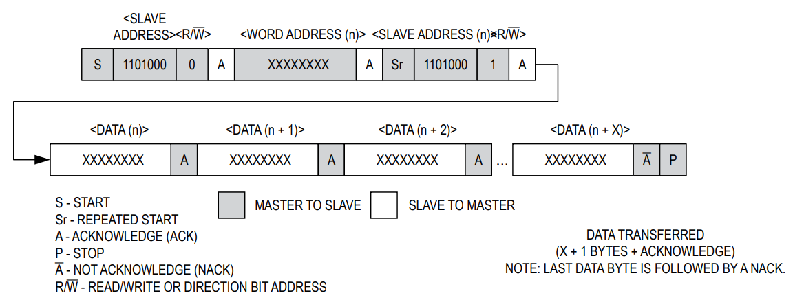

# 第三章——代码逻辑分析

## 1. BCD和DEC转换

由于DS3231的时间寄存器和闹钟寄存器使用了BCD编码格式，因此，在正式编写程序之前，我们要学会**BCD和DEC的相互转换**。比如，用户输入的肯定是十进制数，我们要将其转换成BCD格式才能写入寄存器；我们从寄存器读取的是BCD格式，需要将其转换成DEC才能进行输出。

下面是BCD和DEC相互转换的代码，这里大家看一下，不做详细讲解：

```cpp
uint8_t bcd2dec(uint8_t bcd) {
  uint8_t ones = bcd % 0x10;
  uint8_t tens = bcd / 0x10;
  uint8_t dec = ones + tens * 10;
  return dec;
}

uint8_t dec2bcd(uint8_t dec) {
  uint8_t ones = dec % 10;
  uint8_t tens = dec / 10;
  uint8_t bcd = ones + tens * 0x10;
  return bcd;
}
```

## 2. I2C基本的读写操作

根据经验，在任何通信过程中，我们需要完成以下三个函数：

```cpp
void write_cmd(uint8_t cmd);
void write_data(uint8_t data);
uint8_t read_data(uint8_t data);
```

由于在DS3231中，写入的时候没有数据和命令的区分，因此我们统一认为写入的是数据，因此我们只需要完成两个函数：

```cpp
void write_data(uint8_t data);
uint8_t read_data(uint8_t data);
```

同时，因为DS3231支持一次性写入读取多个字节的数据，因此，我们可以把上述两个函数扩展成以下四个：


```cpp
void write_data(uint8_t data);
void write_data(uint8_t* data, uint8_t length);
uint8_t read_data(uint8_t data);
void read_data(uint8_t* data, uint8_t length);
```

然后根据Arduino的Wire库的使用方法，我们可以将上述函数补全：

```cpp

void write_data(uint8_t data) {
  Wire.beginTransmission(DS3231_ADDRESS);
  Wire.write(data);
  Wire.endTransmission();
}

void write_data(uint8_t *data, uint8_t length) {
  Wire.beginTransmission(DS3231_ADDRESS);
  Wire.write(data, length);
  Wire.endTransmission();
}

uint8_t read_data() {
  Wire.requestFrom(DS3231_ADDRESS, 1);
  return Wire.read();
}

void read_data(uint8_t* data, uint8_t length) {
  Wire.requestFrom(DS3231_ADDRESS, length);
  for (uint8_t i = 0; i < length; i++) {
    data[i] = Wire.read();
  }
}
```

## 3. 读/写一个数据

在完成整个代码前，我们先完成一个小目标，读取DS3231的温度。读取数据的时候，我们**只读取温度的整数位，忽略其小数位**，也就是只从一个寄存器读取一个字节的数据。这样的话，读取温度就比较简单直接了。

### 3.1 读取温度



参照DS3231读/写数据的时序图，可以发现，完成读操作我们需要完成以下几步：

首先，向DS3231发送一个写数据的请求，写入的数据为目标地址，即温度寄存器(0x11)，代码如下：

```cpp
write_data(TEMPERATURE_ADDRESS);
```

然后我们就可以从DS3231读取返回的温度数据了，代码如下：

```cpp
int8_t temperature = read_data();
```

DS3231在只读取整数位，忽略小数位的情况下，温度的数据类型是`int8_t`。

这样我们就完成了通过寄存器，读取DS3231的温度数据。整合一下，读取温度的代码如下：

```cpp
int8_t readTemp() {
  write_data(TEMPERATURE_ADDRESS);
  int8_t temperature = read_data();
  return temperature;
}
```

### 3.2 读/写取秒数据

下面请大家尝试读取DS3231的**秒**数据。

参考代码如下：

```cpp
uint8_t readSecond() {
  write_data(SECOND_ADDRESS);
  uint8_t second = bcd2dec(read_data());
  return second;
}
```

是不是很简单，这里我们只需要将写入的数据改为秒寄存器地址(0x00)，将数据类型改为`uint8_t`，同时将读取的BCD数据转换成DEC格式就好了。

下面请大家尝试写入秒的数据。

参考代码如下：

```cpp
void setSecond(uint8_t second) {
  uint8_t data[] = {SECOND_ADDRESS, dec2bcd(second)};
  write_data(data, 2);
}
```

这里我们写数据的时候，同样可以连续写入。第一个是秒的地址，第二个是秒的数据，但是要注意把秒数据转换成BCD格式再写入。

## 4. 读/写指定长度的数据

上面我们完成了读/写秒的数据，也就是完成了读/写一个字节的数据，那我们是不是可以依葫芦画瓢完成读/写秒,分,时,日,月,年数据了呢。

这样是可以的，但是这么做显然不够高效。因为在这个过程中，我们每次读写数据都重复做了`发送开始信号，发送结束信号`这两件事，对于读写7个字节可能是比较容易，但是如果发送很多数据，这么做就会很浪费时间。

借助DS3231提供了连续读写功能，我们可以简化这个过程。

不过在完成这个连续读写的任务前，我们还需要做一件事，就是定义一个结构体。使用结构体可以大大简化操作。

需要定义的结构体如下：

```cpp
struct Time {
  uint16_t year;  //年
  uint8_t mon;    //月
  uint8_t date;   //日
  uint8_t hour;   //时
  uint8_t min;    //分
  uint8_t sec;    //秒
  uint8_t day;    //星期
};
```

然后我们就可以完成连续写的任务了：

```cpp
void setTime(Time now) {
  // 记得写入数据前先将DEC数据转换成BCD格式
  uint8_t data[] = {
    SECOND_ADDRESS,
    dec2bcd(now.sec),
    dec2bcd(now.min),
    dec2bcd(now.hour),
    dec2bcd(now.day),
    dec2bcd(now.date),
    dec2bcd(now.mon),
    dec2bcd(now.year % 100),
  };
  write_data(data, 8);
}
```

然后是连续读的任务：

```cpp
Time readTime() {
  Time now;
  uint8_t data[7];
  write_data(SECOND_ADDRESS);
  read_data(data, 7);
  // 读取后的数据需要转换格式
  now.sec = bcd2dec(data[0]);
  now.min = bcd2dec(data[1]);
  now.hour = bcd2dec(data[2]);
  now.day = bcd2dec(data[3]);
  now.date = bcd2dec(data[4]);
  now.mon = bcd2dec(data[5]);
  now.year = bcd2dec(data[6]) + 2000;
  return now;
}
```

完成了读写时间和温度，在DS3231上，我们其实还有一个功能没有使用，那就是闹钟。除了闹钟，还有输出方波，使用中断等等，我认为不需要全部都会使用。能够读取时间就可以了。

因此，这里我将不再详介绍如何设置闹钟，读取闹钟状态，以及关闭闹钟等，完整代码在下一章。