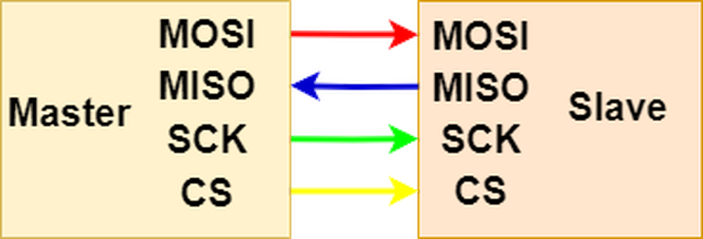
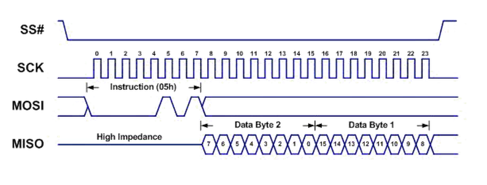
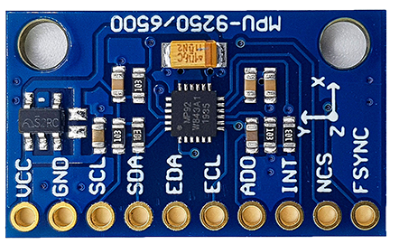
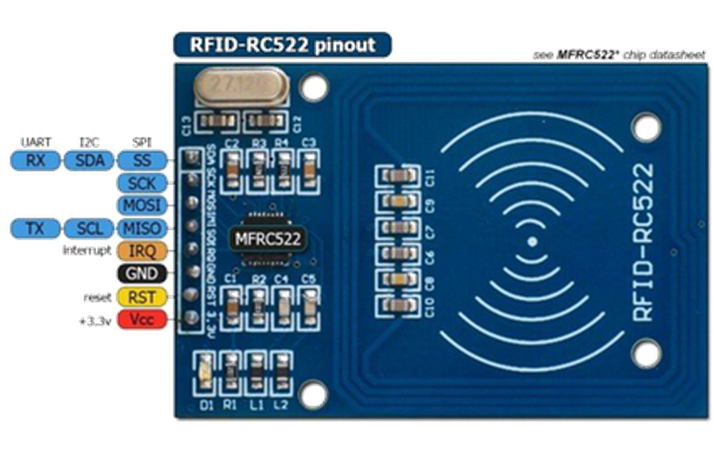

# 第一章——SPI通信原理

## 1. SPI引脚介绍

下面是典型的单主从机模式的SPI示意图：



- **MOSI(Master In Slave Out)**——用于主机向从机发送数据。
- **MISO(Master In Slave Out)**——用于从机向主机发送数据。
- **SCK(Serial Clock)**——用于同步主从机的时钟频率。
- **CS(Chip Select)**——也称SS(Slave Select)，用于主机选择需要通信的从机。

## 2. CPOL和CPHA

前面讲到，SPI的通信协议有着灵活的变种，这个变化主要是在时钟线上。即**CPOL(Clock Polarity)**和**CPHA(Clock Phase)**，也就是时钟极性和时钟相位。

CPOL简单来说，就是时钟是在高电平时空闲还是在低电平时空闲。如果CPOL＝0，则先出现上升沿，再出现下降沿；如果CPOL＝1，先出现下降沿，再出现上升沿。大部分设备CPOL＝0。

CPHA简单来说，就是数据是否在时钟信号的上升沿或下降沿移入或移出。如果CPHA=0，MOSI和MISO在时钟线的上升沿读取数据，下降沿改变数据；如果CPHA=1，MOSI和MISO在时钟线的下降沿读取数据，上升沿改变数据。大部分设备CPHA＝0。

根据CPOL和CPHA的不同，SPI通信可以分为以下四类：


通常情况下，SPI的通信模式为**模式0**。

## 3. SPI的通信过程

SPI虽然不像UART那样，没有开始位和结束位；但是和I2C相似，有开始信号和结束信号。

开始信号，主机拉低CS，表示通信开始。

结束信号，主机拉高CS，表示通信结束。

一般在通信过程中，MOSI和MISO可以不间断地传输数据，在这之间没有校验信息，通常都是**高位在前，低位在后**。

下面是模式0的SPI通信时域图：



## 4. SPI的优缺点

SPI通信的优点：

- **没有开始位和结束位，可以连续发送数据**
- **没有复杂的设备地址，取而代之的是CS**
- **MOSI和MISO可以让设备同时收发送数据**
- **传输速度快，正常都可以达到10MHz甚至更高**

SPI通信的缺点：

- **四根线，有的设备还有D/C线，RST线等，接线相对复杂**
- **无ACK验证信息是否传输成功**
- **无校验信息**
- **只能有一个主机**

## 5. Arduino的SPI库

Arduino的官方SPI库是`SPI.h`，Arduino Uno只有一个SPI接口，即**MOSI—D11，MISO—D12，SCK—D13，CS—D10**，你可以使用任何GPIO作为CS，不一定是D10。

下面我们对SPI库部分重要的函数做简单讲解。

### 5.1 begin()

语法：

```cpp
SPI.begin();
```

用于初始化SPI。默认使用SPI模式0，4MHz时钟频率，拉高CS，拉低SCK和MOSI。

### 5.2 setsetClockDivider()

语法：

```cpp
SPI.setClockDivider(divider);
```

用来配置SPI的时钟频率，可选参数有：

- **SPI_CLOCK_DIV2**
- **SPI_CLOCK_DIV4**(Default speed)
- **SPI_CLOCK_DIV6**
- **SPI_CLOCK_DIV8**
- **SPI_CLOCK_DIV16**
- **SPI_CLOCK_DIV32**
- **SPI_CLOCK_DIV64**
- **SPI_CLOCK_DIV128**

### 5.3 setBitOrder()

语法：

```cpp
SPI.setBitOrder(order);
```

用来配置SPI的数据发送顺序，可选参数有：

- **LSBFIRST**
- **MSBFIRST**

### 5.4 setDataMode()

语法：

```cpp
SPI.setDataMode(mode);
```

用来配置SPI的模式，可选参数有：

- **SPI_MODE0**
- **SPI_MODE1**
- **SPI_MODE2**
- **SPI_MODE3**

### 5.5 beginTransaction()

语法：

```cpp
SPI.beginTransaction(mySettings);
```

用于配置更加详细的SPI参数，参数为**SPISettings**，建议不要同时使用`SPI.beginTransaction(mySettings)`和`SPI.setClockDivider`等，使用一个配置即可。

### 5.6 SPISettings

语法：

```cpp
SPISettings mySettting(speedMaximum, dataOrder, dataMode);
```

参数speedMaximum：用于设置SPI时钟频率，默认为4MHz，一般这个参数要小于单片机的时钟频率，Uno板可以达到14MHz。

参数dataOrder：用于设置传输数据时，是低位在前还是高位在前，默认是高位在前。可选值有`MSBFIRST `和`LSBFIRST`。

参数dataMode：用于设置SPI的通信模式，模式为前面介绍的4种模式，默认为模式0。可选值有`SPI_MODE0`，`SPI_MODE1`，`SPI_MODE2`和`SPI_MODE3`。

一般设置为：

```cpp
SPI.beginTransaction(SPISettings(14000000, MSBFIRST, SPI_MODE0));
```

### 5.7 endTransaction()

语法：

```cpp
SPI.endTransaction();
```

放在`SPI.beginTransaction(mySettings)`，用于结束SPI通信。

### 5.8 transfer(), transfer16()

语法：

```cpp
uint8_t receivedVal = SPI.transfer(val);
uint16_t receivedVal16 = SPI.transfer16(val16);
SPI.transfer(buffer, size);
```

用于发送和接收数据。参数和返回值的数据类型可以是`uint8_t `或者`uint16_t`，也可以发送一个数据类型为`uint8_t `的数组。

下面是一个使用`SPI.setClockDivider`的示例代码：

```cpp
#include <SPI.h>
#define CS 10

void setup() {
  pinMode(CS, OUTPUT);
  SPI.begin();
  SPI.setClockDivider(SPI_CLOCK_DIV2);

  // transfer data 128
  digitalWrite(CS, LOW);
  SPI.transfer(128);
  digitalWrite(CS, HIGH);
}

void loop() {
}
```

下面是一个使用`SPISettings`的示例代码：

```cpp

#include <SPI.h>

// using two incompatible SPI devices, A and B. Incompatible means that they
// need different SPI_MODE
const int slaveAPin = 20;
const int slaveBPin = 21;
uint8_t stat, val1, val2, result;

// set up the speed, data order and data mode
SPISettings settingsA(2000000, MSBFIRST, SPI_MODE1);
SPISettings settingsB(16000000, LSBFIRST, SPI_MODE3);

void setup() {
    // set the Slave Select Pins as outputs:
    pinMode(slaveAPin, OUTPUT);
    pinMode(slaveBPin, OUTPUT);
    // initialize SPI:
    SPI.begin();
}

void loop() {
    // read three bytes from device A
    SPI.beginTransaction(settingsA);
    digitalWrite(slaveAPin, LOW);
    // reading only, so data sent does not matter
    stat = SPI.transfer(0);
    val1 = SPI.transfer(0);
    val2 = SPI.transfer(0);
    digitalWrite(slaveAPin, HIGH);
    SPI.endTransaction();
    // if stat is 1 or 2, send val1 or val2 else zero
    if (stat == 1) {
        result = val1;
    } else if (stat == 2) {
        result = val2;
    } else {
        result = 0;
    }
    // send result to device B
    SPI.beginTransaction(settingsB);
    digitalWrite(slaveBPin, LOW);
    SPI.transfer(result);
    digitalWrite(slaveBPin, HIGH);
    SPI.endTransaction();
}
```

## 6. 适用于哪些设备

常见的使用SPI的设备有以下几个：

|       SD Card Module       |       RFID Module       |    ST7735 TFT Display     |
| :------------------------: | :---------------------: | :-----------------------: |
|  |  |  |

下一个章节我们将详细学习如何通过SPI向MPU9250读写数据。