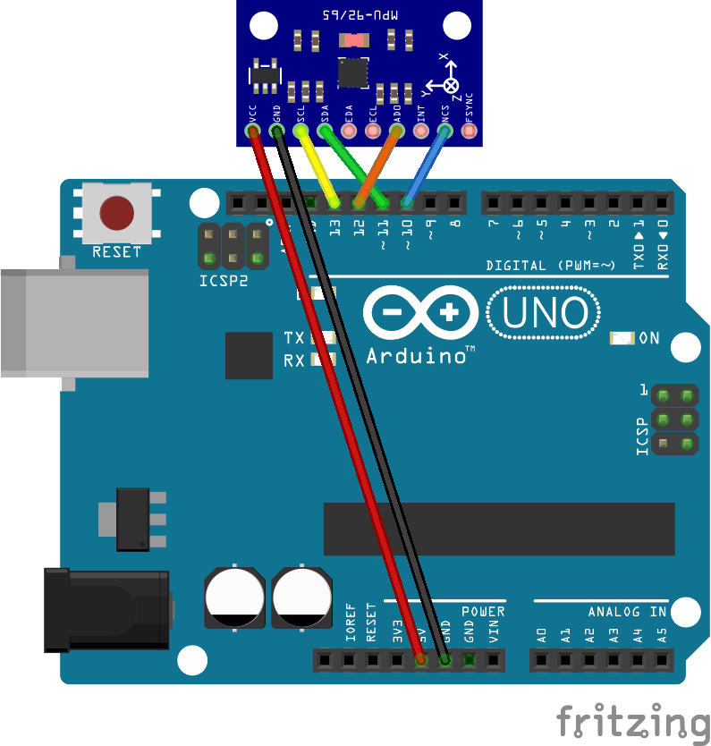
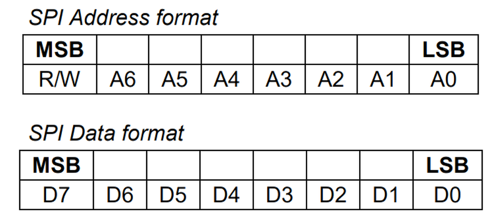

# 第二章——MPU9250 数据手册速览

## 1. MPU9250 基本参数

|     参数     |                     参数值                     |
| :----------: | :--------------------------------------------: |
|   供电电压   |                   2.4V-3.6V                    |
|   通信方式   |                  I2C 或者 SPI                  |
|   通信速度   |       I2C 不大于 400KHz，SPI 不大于 1MHz       |
|  9 轴传感器  |      3 轴陀螺仪，3 轴加速度计，3 轴磁力计      |
|  温度传感器  |                -40°C 到 +125°C                 |
|     FIFO     |                512 字节的 FIFO                 |
|     中断     |                支持多种模式中断                |
|  外部震荡源  |                  支持外部晶振                  |
| I2C 主机模式 | MPU9250 支持作为 I2C 主机，可同时连接 4 台设备 |
|     DMP      |   MPU9250 拥有一个 DMP，可以帮助处理内部数据   |

## 2. MPU9250 引脚分布

|     引脚      |                            介绍                             |
| :-----------: | :---------------------------------------------------------: |
| AUX_CL,AUX_DA |             MPU9250 作为 I2C 主机时的 I2C 总线              |
|      VDD      |                          供电正极                           |
|    AD0/SDO    | I2C 模式下作为 MPU9250 的 LSB 地址选项，SPI 模式下作为 MISO |
|     FSYNC     |                     外部震荡源输入接口                      |
|      INT      |                           中断口                            |
|      nCS      |                      SPI 模式下作为 CS                      |
|   SCL/SCLK    |                 I2C 或者 SPI 模式下的时钟线                 |
|    SDA/SDI    |              I2C 模式下数据口，SPI 模式下 MOSI              |

由于我们这一章是介绍 SPI 的通信方式，因此我们要把 MPU9250 和 Arduino 通过 SPI 的方式连接。

接线图如下：

## 3. MPU9250 的寄存器列表

虽然 MPU9250 有着很长的寄存器列表，但是如果我们不使用中断，不适使用外部震荡源，不使用 I2C 主机模式，不需要自我测试的情况下，MPU9250 使用还是非常简单的，只需要几个简单的配置就可以了。

值得注意的是，MPU9250 的寄存器默认值都为 0，除了以下两个：

- 0x6B(默认值 0x01)
- 0x75(默认值 0x71)

在下面的列表中，`*`表示这里不做介绍，具体内容可参考数据手册。下面我们介绍几个重要的寄存器。

### 3.1 寄存器 0x6B——PWR_MGMT_1

| Addr | Register Name |  Bit7   | Bit6  | Bit5  | Bit4 | Bit3 | Bit2 | Bit1 | Bit0 |
| :--: | :-----------: | :-----: | :---: | :---: | :--: | :--: | :--: | :--: | :--: |
| 0x6B |  PWR_MGMT_1   | H_RESET | SLEEP | CYCLE |  \*  |  \*  |  \*  |  \*  |  \*  |

该寄存器用于配置 MPU9250 的模式，Bit7 用于重置设备，Bit6 用于唤醒 MPU9250。

由于 MPU650 在上电时会进入睡眠模式，因此为了兼容 MPU9250，建议上电时对此寄存器写入**0x00**。

### 3.2 寄存器 0x6A——USER_CTRL

| Addr | Register Name | Bit7 |  Bit6   |    Bit5    |   Bit4    | Bit3 | Bit2 | Bit1 | Bit0 |
| :--: | :-----------: | :--: | :-----: | :--------: | :-------: | :--: | :--: | :--: | :--: |
| 0x6A |   USER_CTRL   |  \*  | FIFO_EN | I2C_MST_EN | 2C_IF_DIS |  \*  |  \*  |  \*  |  \*  |

该寄存器用于配置 MPU9250 的功能，Bit6 用于使能 FIFO，Bit5 用于使能 I2C 主机模式，**Bit4 用于使能 SPI 模式**。

由于我们适用 SPI 模式，因此需要写入 0x10，其他功能不需要使能。

### 3.3 寄存器 0x75——WHO_AM_I

| Addr | Register Name | Bit7 | Bit6 | Bit5 | Bit4 | Bit3 | Bit2 | Bit1 | Bit0 |
| :--: | :-----------: | :--: | :--: | :--: | :--: | :--: | :--: | :--: | :--: |
| 0x75 |   WHO_AM_I    |  \*  |  \*  |  \*  |  \*  |  \*  |  \*  |  \*  |  \*  |

该寄存器用于读取 MPU9250 的 ID 值，默认值为 0x71，可以用来验证通信是否成功。

### 3.4 寄存器 0x1A——CONFIG

| Addr | Register Name | Bit7 | Bit6 |     Bit5     |     Bit4     |     Bit3     | Bit2 | Bit1 | Bit0 |
| :--: | :-----------: | :--: | :--: | :----------: | :----------: | :----------: | :--: | :--: | :--: |
| 0x1A |    CONFIG     |  \*  |  \*  | FSYNC_SET[2] | FSYNC_SET[1] | FSYNC_SET[0] |  \*  |  \*  |  \*  |

该寄存器用于配置 FSYNC 模式。

由于我们不使用 FSYNC，写入 0x00 即可。

### 3.4 寄存器 0x38——INT_ENABLE

| Addr | Register Name | Bit7 | Bit6 | Bit5 | Bit4 | Bit3 | Bit2 | Bit1 | Bit0 |
| :--: | :-----------: | :--: | :--: | :--: | :--: | :--: | :--: | :--: | :--: |
| 0x38 |  INT_ENABLE   |  \*  |  \*  |  \*  |  \*  |  \*  |  \*  |  \*  |  \*  |

用于配置中断，写入 0x00，不使用中断。

### 3.5 寄存器 0x1B——GYRO_CONFIG

| Addr | Register Name | Bit7 | Bit6 | Bit5 |    Bit4    |    Bit3    | Bit2 | Bit1 | Bit0 |
| :--: | :-----------: | :--: | :--: | :--: | :--------: | :--------: | :--: | :--: | :--: |
| 0x1B |  GYRO_CONFIG  |  \*  |  \*  |  \*  | GYRO_FS[1] | GYRO_FS[0] |  \*  |  \*  |  \*  |

该寄存器可以设置陀螺仪的测量范围，下面是范围设置表：

| GYRO_FS[1] | GYRO_FS[0] | 范围     |
| :--------: | :--------: | :------- |
|     0      |     0      | ±250°/s  |
|     0      |     1      | ±500°/s  |
|     1      |     0      | ±1000°/s |
|     1      |     1      | ±2000°/s |

### 3.6 寄存器 0x1C——ACCEL_CONFIG

| Addr | Register Name | Bit7 | Bit6 | Bit5 |    Bit4     |    Bit3     | Bit2 | Bit1 | Bit0 |
| :--: | :-----------: | :--: | :--: | :--: | :---------: | :---------: | :--: | :--: | :--: |
| 0x1C | ACCEL_CONFIG  |  \*  |  \*  |  \*  | ACCEL_FS[1] | ACCEL_FS[0] |  \*  |  \*  |  \*  |

该寄存器可以设置加速度的测量范围，下面是范围设置表：

| ACCEl_FS[1] | ACCEL_FS[0] | 范围 |
| :---------: | :---------: | :--- |
|      0      |      0      | ±2g  |
|      0      |      1      | ±4g  |
|      1      |      0      | ±8g  |
|      1      |      1      | ±16g |

### 3.7 寄存器 0x3B

从 0x3B 到 0x40 这六个寄存器用于存储加速度 X 轴，Y 轴，Z 轴的信息，每轴都是**16 位的有符号 ADC 数据**，数值实际范围由 ACCEL_CONFIG 控制。

### 3.8 寄存器 0x43

从 0x43 到 0x48 这 6 个寄存器用于存储陀螺仪 X 轴，Y 轴，Z 轴的信息，每轴都是**16 位的有符号 ADC 数据**，数值实际范围由 GYRO_CONFIG 控制。

### 3.9 寄存器 0x41

从 0x41 到 0x42 这两个寄存器用于存储温度的信息，是一个**16 位的有符号数据**。

温度转换公式为：`TEMP_degC = ((TEMP_OUT –RoomTemp_Offset)/Temp_Sensitivity)+ 21degC`

简化公式为：`TEMP_degC = (TEMP_OUT-0)/321.0 +21`

### 4. MPU9250 的 SPI 通信

由 MPU9250 数据手册可知，其 SPI 通信的**CPOL=0，CPHA=0**，属于 SPI 的**模式 0**，最大通信速度时**1MHz**。

需要注意的是，MPU9250 的 SPI 通信需要在地址位的 MSB 加入读写位，1 表示读数据，0 表示写数据，示意图如下：

下一章，我们将学习如何通过 SPI 对 MPU9250 进行读写操作。
