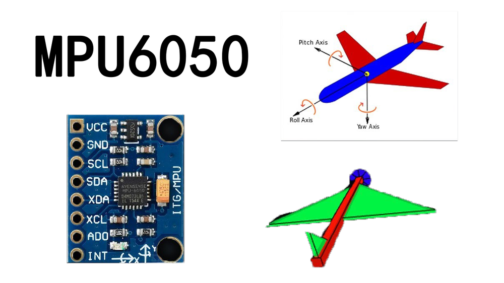

# 第五章——总结和拓展

## 1.　拓展1

我们在这一章只是读取MPU9250的原始数据，没有读取到的进行加工。原因很简单，我对如何使用MPU9250的数据还不是很了解，但是，MPU获取的数据，一般就是用来做**姿态解算**，通过陀螺仪的数据获取当前的MPU姿态，计算出`roll`，`yaw`和`pitch`。

其实在手机内部，游戏手柄，无人机等等都是通过MPU获取数据，然后进行姿态解算的。这属于算法范畴，涉及复杂的数学推理运算，在这里我就不做介绍，有能力的同学可以自行查找相关资料进行学习。

如果你想尝试MPU的姿态解算，可以使用[Jrowberg的GitHub项目](https://github.com/jrowberg/i2cdevlib.git)，里面包含了各个单片机平台的MPU库。



## 2. 拓展2

MPU9250和MPU6050在寄存器上几乎一致，只是存在些微差别，比如ID的默认值不同，计算温度的公式不同等等。MPU9250的功能也要比MPU6050强大一些。MPU9250是9轴的，支持SPI；而MPU6050是6轴的，不支持SPI。这也是我在这一章使用MPU9250的原因。

但是呢，通常情况下，我们都只使用I2C的通信模式，而不使用SPI。

下面是MPU9250的I2C示例代码，大家可以参考一下：

```cpp
#include <Wire.h>

#define MPU_ADDR 0x68

#define MPU_FSYNC_ADDR 0x1A
#define MPU_GFS_ADDR 0x1B
#define MPU_AFS_ADDR 0x1C
#define MPU_EN_INT 0x38
#define MPU_ACCEL_ADDR 0x3B
#define MPU_GYRO_ADDR 0x43
#define MPU_TEMP_ADDR 0x41
#define MPU_FIFO_EN 0x6A
#define MPU_RESET 0x6B
#define MPU_ID_ADDR 0x75

void write_data(uint8_t addr, uint8_t data);
uint8_t read_data(uint8_t addr);
void read_data(uint8_t addr, uint8_t* data, uint8_t length);
bool MPU_init();
float readTemp();
void readRawAccel(int16_t* accel);
void readRawGyro(int16_t* gyro);

void setup() {
    Serial.begin(115200);
    if (MPU_init()) {
        Serial.println("MPU init success!");
    } else {
        Serial.println("MPU init failed!");
    }
}

void loop() {
    int16_t accel[3], gyro[3];
    readRawAccel(accel);
    readRawGyro(gyro);

    Serial.print("Accel X=");
    Serial.print(accel[0]);
    Serial.print(",Y=");
    Serial.print(accel[1]);
    Serial.print(",Z=");
    Serial.println(accel[2]);

    Serial.print("Gyro X=");
    Serial.print(gyro[0]);
    Serial.print(",Y=");
    Serial.print(gyro[1]);
    Serial.print(",Z=");
    Serial.println(gyro[2]);

    Serial.print("Temp=");
    Serial.println(readTemp(), 2);
    Serial.println();
    delay(1000);
}

void write_data(uint8_t addr, uint8_t data) {
    Wire.beginTransmission(MPU_ADDR);
    Wire.write(addr);
    Wire.write(data);
    Wire.endTransmission();
}

uint8_t read_data(uint8_t addr) {
    Wire.beginTransmission(MPU_ADDR);
    Wire.write(addr);
    Wire.endTransmission();
    Wire.requestFrom(MPU_ADDR, 1);
    return Wire.read();
}

void read_data(uint8_t addr, uint8_t* dest, uint8_t length) {
    Wire.beginTransmission(MPU_ADDR);
    Wire.write(addr);
    Wire.endTransmission();
    Wire.requestFrom(MPU_ADDR, length);
    for (uint8_t i = 0; i < length; i++) {
        dest[i] = Wire.read();
    }
}

bool MPU_init() {
    // 初始化I2C
    Wire.begin();
    // 设置I2C频率为100KHz
    Wire.setClock(100 * 1000);
    // Wake up MPU from sleep mode
    write_data(MPU_RESET, 0x00);
    // Disable FIFO
    write_data(MPU_FIFO_EN, 0x00);
    // Disable FSYNC
    write_data(MPU_FSYNC_ADDR, 0x00);
    // Disable interupt
    write_data(MPU_EN_INT, 0x00);
    // Set Gyroscope full scable range to ±250°/s
    write_data(MPU_GFS_ADDR, 0x00);
    // Set Accelerometer full scable range to ±2g
    write_data(MPU_AFS_ADDR, 0x00);
    // Check ID
    if (read_data(MPU_ID_ADDR) == 0x71)
        return true;
    else
        return false;
}

void readRawAccel(int16_t* accel) {
    uint8_t buffer[6];
    read_data(MPU_ACCEL_ADDR, buffer, 6);
    for (uint8_t i = 0; i < 3; i++) {
        accel[i] = buffer[i * 2] << 8 | buffer[i * 2 + 1];  // 第一个字节是高位，第二字节是低位
    }
}

void readRawGyro(int16_t* gyro) {
    uint8_t buffer[6];
    read_data(MPU_GYRO_ADDR, buffer, 6);
    for (uint8_t i = 0; i < 3; i++) {
        gyro[i] = buffer[i * 2] << 8 | buffer[i * 2 + 1];   // 第一个字节是高位，第二字节是低位
    }
}

float readTemp() {
    int16_t temp;
    uint8_t buffer[2];
    read_data(MPU_TEMP_ADDR, buffer, 2);
    temp = buffer[0] << 8 | buffer[1];  // 第一个字节是高位，第二字节是低位
    return (temp / 321.0 + 21); // 温度计算公式：TEMP_degC = TEMP_OUT/321.0 +21
}
```
