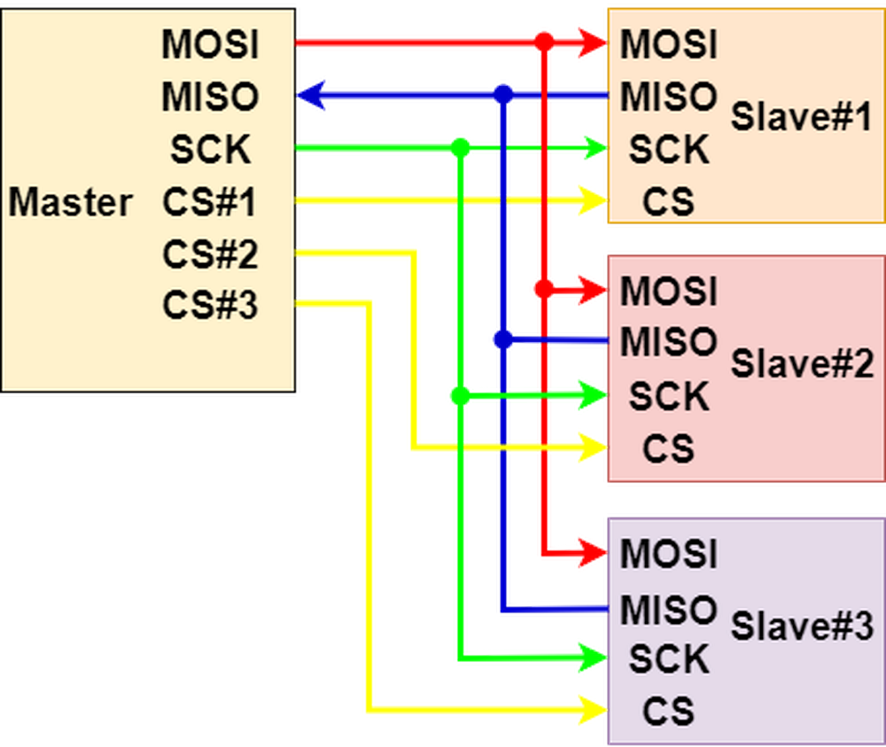

# SPI

## 1. 什么是 SPI 通信

SPI(Serial Peripheral Interface)是一种同步串行通信，由**Motorola**公司发明于 1980s，同样是单片机通信当中非常常用的通信方式之一。SPI 和 I2C 的最大的不同就在于 SPI 的**Peripheral**，为什么一个串行通信会有并行这个概念，那是因为 SPI 在通信过程中，主从机可以同时交换数据，也就是**Peripheral**的由来。

SPI 在通信协议上有着比较灵活的变种，SPI 没有字节数的限制，除了 8 位，还有 12 位，16 位等等。有的 SPI 设备是**只读**，有的是**只写**，也就是说这些设备只能被写入数据，有的只能被读取数据，这时候就由标准的 4-wire 变成了 3-wire。在时钟线上也有很多变化，后面我再详细介绍。

## 2. SPI 的外设

SPI 几乎不需要什么外设，这也降低了 SPI 通信的功耗，只是 SPI 的接线要比 I2C 复杂一些。同时 SPI 也支持同时连接多个设备，只是同时也只能有一个主机，一般是 MCU。

下面是标准的 SPI 通信示意图：

