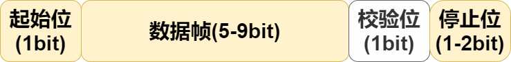
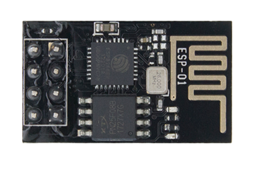

# 第一章——UART通信原理

## 1. 数据包

在串口通信中，数据包的格式是**起始位+数据帧(+校验位)+停止位**组成的。

下面是串口通信数据包的示意图：

下面我们对这四个组成部分做一一解释。

### 1.1 起始位

在串口通信中，正常情况下，TX和RX都是保持在**高电平**状态，如果需要发送数据，那么就把TX总线拉低，RX发现TX被拉低之后就知道TX这边准备发送数据了，下面就是准备接收这个数据。

### 1.2 数据帧

数据帧就是需要发送的数据，一般情况下都是**8位**，也就是一个字节，但是你也可以发送5位，6位或者7位的数据，只要双方是相同的配置就可以。在没有校验位的情况下，也可以发送9位的数据。在数据发送过程中是 **从低位(LSB)向高位(MSB)** 进行发送。

### 1.3 校验位

校验位也称**奇偶校验位**，那是因为UART中，为了验证数据传输无误，通过计算‘1’的个数来校验数据，在使用`偶校验`的情况下，如果这一数据帧中**有偶数个‘1’，则这一位为0，有奇数个‘1’，则这一位为1**；反之同理。所以称之为奇偶校验位。大多数情况下都不使用校验位。

### 1.4 停止位

当数据传输结束后，TX总线会拉高1-2位的时间，正常情况都是**1位**时间，停止位结束后才会进行下一轮的数据发送或者一直保持在高电平，结束通信。

## 2. 波特率

前面说到，UART是异步通信，所谓异步，也就是说在UART中没有Clock线，不能在通信双方之间保持同步的数据收发，而是通过间隔一定时间对数据进行采样。这个`一定的时间`也就是**波特率**，也称之为**比特率**，即发送一位所需要的时间。

常用的波特率有300，600，1200，2400，4800，9600，14400，19200，28800，38400，57600，115200等。在没有校验位，数据帧为8位，停止位为1位的情况下，我们发送一个数据包就是10位，如果使用的是9600波特率，所需要的时间就是\\(\frac{1}{9600}*10\approx1.0416ms \\)。

下面是串口通信的时域图：

由于是异步通信，数据采样就难免会有误差，为了减小这个误差，实际采样检测到开始位之后，等待半个位时间(0.5*1/Baudrate)后，以此为基准进行采样，这样可以保证采样点可以在每一位的中间。

波特率设置得越高，采样出错的可能性越大。

## 3. Arduino的Serial库

再Arduino中，`Serial.begin()`的第一个参数用来设置波特率，它还有第二个可选参数，可以用来设置发送的数据格式，可以选择几位数据帧，是否需要校验位（以及是奇数校验还是偶数校验），几位停止位等等。

有关Arduino的Serial库的更多详细内容，可以参考前面的章节([Arduino基础/第八章——串口通信UART](../../../Arduino基础/第八章.md))

## 4. 适用于那些设备

常见的使用串口通信的设备有以下几个：

|          HC-05           |          ESP-01           | 电脑                    |
| :----------------------: | :-----------------------: | :---------------------- |
|  |  |  |

我们会在下面的章节详细介绍HC-05蓝牙模块的使用。