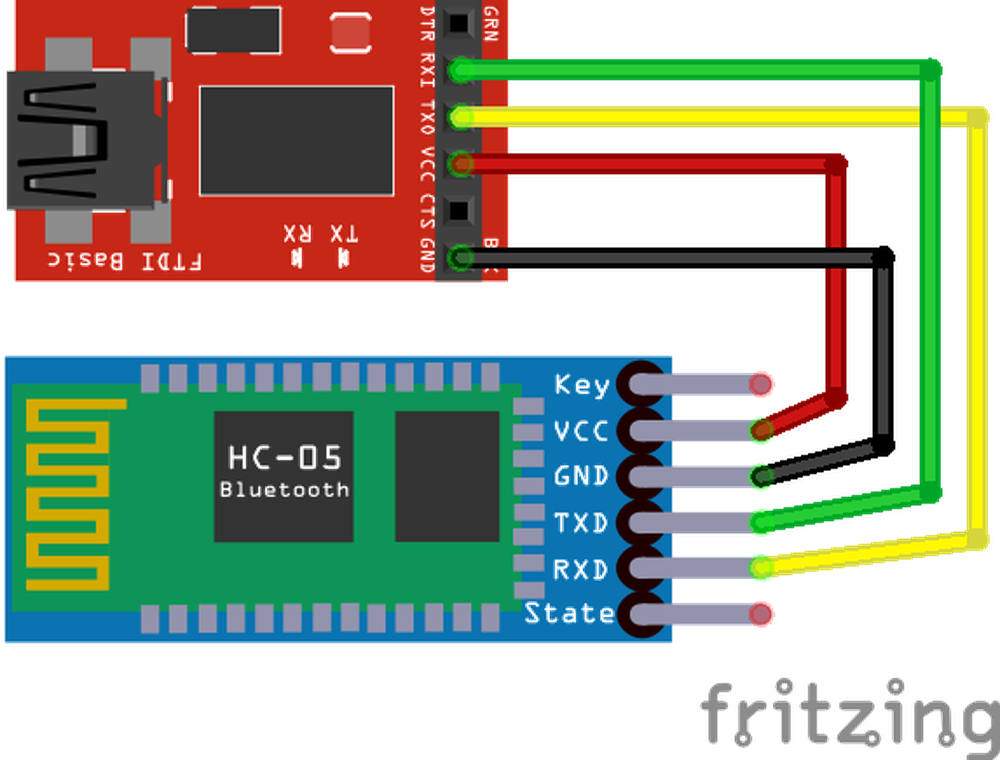
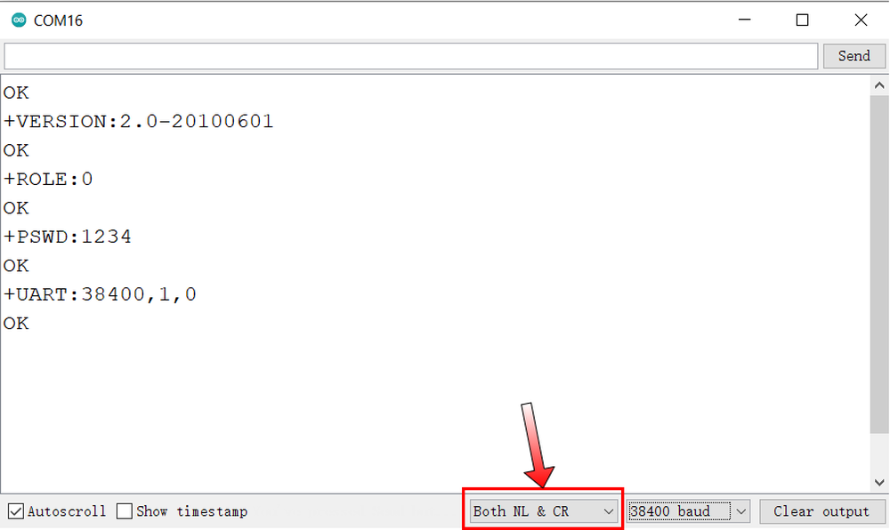

# 第二章——HC-05 数据手册速览

## 1. HC-05 基本参数

|     参数     |     参数值     |
| :----------: | :------------: |
|   供电电压   |   1.8V-3.6V    |
|   通信方式   |      UART      |
|  默认波特率  |     38400      |
| 默认配对密码 |      1234      |
|  默认设备名  | H-C-2010-06-01 |
|   默认模式   |    从机模式    |

## 2. HC-05 接线图

在使用蓝牙前，我们需要通过 USB 转串口模块对 HC-05 做一些配置。注意`RX-TX`的接线方式。同时我们使用的是模块，模块上有降压芯片，因此可以直接 5V 供电。

接线图如下：

## 3. HC-05 的 AT 设置

HC-05 使用**AT 命令集**，也称**贺氏命令集**，是一种用于**本地命令控制**的命令集。

HC-05 如果要进入 AT 模式，需要在断电的情况下，按住模块上的按钮，通电后松开就可以了。

HC-05 使用的默认波特率为 38400，8N1 数据包。在向 HC-05 发送命令时，需要在每个命令结尾加上`\r\n`。如果你使用的是 Arduino 的串口助手，则可以在右下方选择`Both NL & CR`。

下面是几个 HC-05 常用的的 AT 命令表，更多命令可以参考数据手册：

|               AT 命令               |               解释               |
| :---------------------------------: | :------------------------------: |
|                 AT                  |      用于测试，HC05 回复 OK      |
|              AT+RESET               | 软重启，重启后会自动推出 AT 模式 |
|             AT+VERSION?             |       检查 HC-05 固件版本        |
|               AT+ORGL               |   重置设备，参数均重置为默认值   |
|              AT+ADDR?               |        查看 HC-05MAC 地址        |
|          AT+NAME=**name**           |         用于设置设备名称         |
|              AT+NAME?               |           查看设备名称           |
|          AT+ROLE=**role**           | 设置模块主从模式，0=从机，1=主机 |
|              AT+ROLE?               |         查看模块主从模式         |
|        AT+PSWD=**password**         | 设置设备连接密码，密码为四位数字 |
|              AT+PSWD?               |         查看设备连接密码         |
| AT+UART=**baudrate,stopbit,parity** |      设置模块 UART 配置参数      |
|              AT+UART?               |        查看模块 UART 参数        |

总的来说，HC-05 的使用非常简单，UART 通讯也非常简单，是五种通讯当中最为简单的一个。

下一章节我们学习以下如何通过 HC-05 蓝牙模块控制板载 LED。
