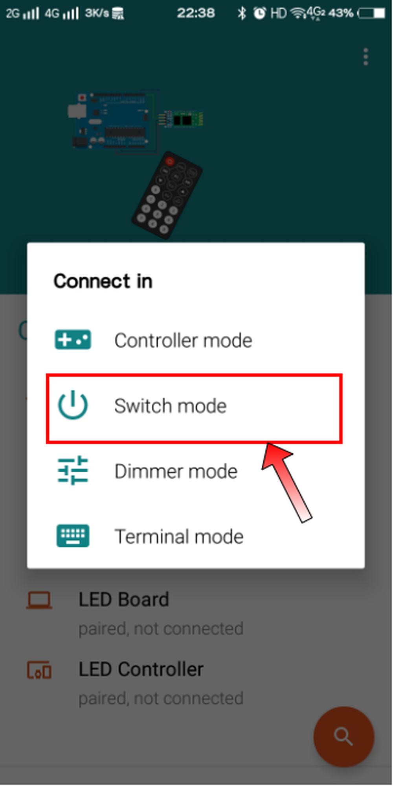
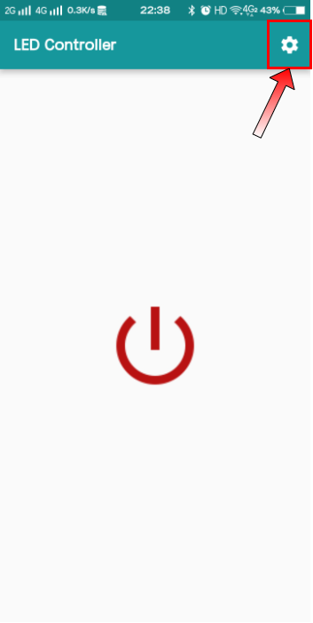
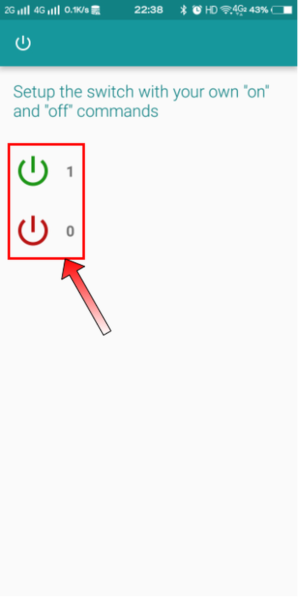

# 第三章——HC-05 蓝牙的使用

## 1. 配置 HC-05

在使用前，我们先对 HC-05 做简单的配置。

首先更改设备名，我将其改为**LED Controller**，设备名大家随意就好，不一定需要一样。

其次是 UART 参数，我将其改为**38400,1,0**，这样主要是方便进入 AT 模式。

其他参数也可以根据自己需要更改，这边我只更改这两个。

## 2. HC-05 接线图

下面是 HC-05 和 Arduino Uno 的接线图，接线方式与前面相似，注意 RX-TX。


## 3. 编写代码

对于这个项目来说，我们最终的目标是，手机连接蓝牙后，我们发送`字符1`或者`字符0`的命令给 HC-05，HC-05 接收到后就相应地打开或者关闭板载 LED。

### 3.1 代码

由于这个项目的代码比较简单，因此在这里，我不做特别讲解，下面是示例代码：

```cpp
const uint8_t LED = 13;

void setup() {
  pinMode(LED, OUTPUT);
  Serial.begin(38400);
}

void loop() {
  // 串口有缓存的数据
  if (Serial.available()) {
    // 读取数据，记住是字符类型，不是数字类型
    char message = Serial.read();
    // 字符'1'，打开LED；字符'0'，关闭LED
    if (message == '1') {
      digitalWrite(LED, HIGH);
    }
    else if (message == '0') {
      digitalWrite(LED, LOW);
    }
  }
}
```

上传代码前，记得要先拔掉 HC-05，不然串口被占用，无法上传代码。

### 3.2 软件

一般呢，我们不直接自己制作相应的软件，下面是一个我认为比较简单实用的软件，大家可以点击连接下载安装。

<ul>
  <li><a href="../../software/Bluetooth-Android.apk" target="_blank">安卓用户点击直接下载</a></li>
  <li><a href="https://apps.apple.com/us/app/bluetooth-for-arduino/id1505096526" target="_blank">苹果用户请前往此网页下载</a></li>
</ul>

下面我教大家如何使用这个软件。

第一步，连接蓝牙后，打开软件，选择`Switch Mode`：



第二步，点击右上角`小齿轮`，进入设置：



第三步，`设置相应的参数`：



最后点击左上角的开关返回就可以使用了，大家尝试点击一下，观察 LED 是不是可以被点亮和关闭。

该软件还有其他非常实用的功能，大家可以自行探索使用。
