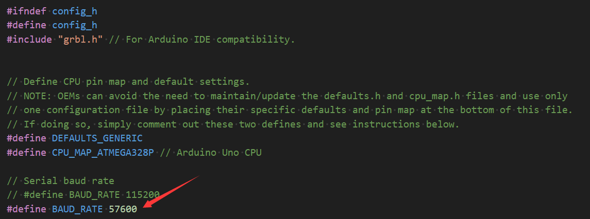

# 第二章——编译和配置 Grbl

## 1. 下载 Grbl 源码

下面是 Grbl 的 Github 仓库地址 [Grbl](https://github.com/gnea/grbl)。

下载解压后将 grbl 文件夹复制到 Arduino 的库文件夹中。


Windows 的路径应该是`C:\Users\MrAddict\Documents\Arduino\libraries`。

然后打开 Arduino IDE，点击`文件`->`示例`->`grbl`->`grblUpload`准备编译和烧录 Grbl。

## 2. 编译和烧录 Grbl

选择对应的开发板和端口，然后点击上传按钮，等待编译和烧录完成。

> 注意：
>
> 由于 Grbl 默认的波特率是 `115200`，在使用过程中我发现通信不是很稳定，所以我将波特率改为了 `57600`，这个配置在复制的 grbl 库的`config.h`中修改波特率，然后重新编译和烧录。



## 3. 配置 Grbl

在编译和烧录完成后，打开串口监视器，输入`$$`，回车，就可以看到 Grbl 的配置信息。

下面是我们办公室的激光雕刻机的配置信息：

```
$0=10
$1=25
$2=0
$3=0
$4=0
$5=0
$6=0
$10=0
$11=0.010
$12=0.002
$13=0
$20=0
$21=0
$22=1
$23=0
$24=400.000
$25=3000.000
$26=250
$27=2.000
$30=100
$31=0
$32=1
$100=80.000
$101=80.000
$102=80.000
$110=3000.000
$111=3000.000
$112=3000.000
$120=1000.000
$121=1000.000
$122=1000.000
$130=300.000
$131=330.000
$132=300.000
```

Grbl 支持设置存储两条开机自启命令，如果设置了 Home，那么机器就会在 Home 之后自动执行存储的这两条命令。我们可以用`$N`读取配置信息，`$Nx`设置配置信息。

比如，我们希望机器 Home 之后自动回到工作原点(-200,-240)，并将其设为工作原点，那么我们进行如下设置：

回到工作原点位置：

```
$N0=G53X-200Y-240
```

将该位置设置为机器的工作原点：

```
$N1=G92X0Y0
```
