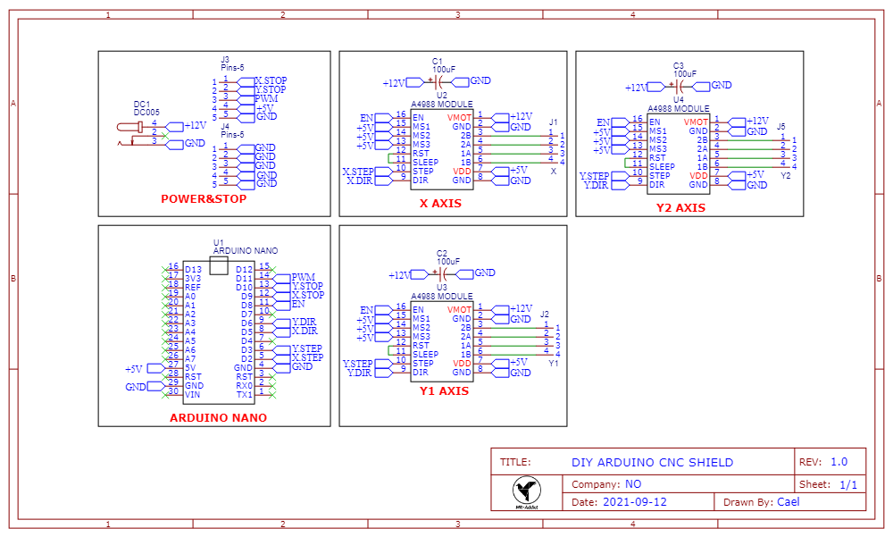

# 第三章——雕刻机硬件搭建

本项目主要是 DIY 为主，因此大部分零件都尽量做到高性价比，稳定实用的同时保证不会花费太多。

## 1. 材料清单

该项目需要购买的材料有：

|       零件       |        规格         |  数目  |
| :--------------: | :-----------------: | :----: |
| NEMA17 步进电机  |     42 步进电机     |   3    |
| 2020 铝型材 V 轮 |      内孔 5mm       |   12   |
|   GT2 同步带轮   | 20 齿高 16 内孔 5mm |   3    |
|     钢套轴套     |   内孔 5mm 高 8mm   |   16   |
|    GT2 同步带    |       宽 6mm        |  2 米  |
|     M5 螺丝      |       长 45mm       |   12   |
|     M5 螺母      |      304 材质       |   12   |
|   2020 铝型材    |   长度按需求而定    | 同规格 |

同时你还可能需要购买一些电子元器件：

|           零件            | 数目 |
| :-----------------------: | :--: |
|           A4988           |  3   |
|       XH2.54 电机线       |  3   |
|         限位开关          |  2   |
|       限位开关导线        |  2   |
| 1.6W 或者更高功率的激光头 |  1   |
|     12V3A 电源适配器      |  1   |
|   Aruino 的 CNC 扩展板    |  1   |

除了以上需要购买的零件之外，你还需要 3D 打印或者机床铣出一些定制的部件，即下图中的绿色零件：

|      零件      | 数目 |
| :------------: | :--: |
|  X 轴电机支座  |  1   |
| X 轴激光头支座 |  1   |
|  Y 轴电机支座  |  2   |
|  限位开关支座  |  2   |
| 雕刻机支架支座 |  4   |
| CNC 扩展板支座 |  1   |

大家可以前往我的[Github 仓库](https://github.com/MR-Addict/CNC-Laser-Engraver.git)下载相关文件，同时我设计了一块适用于 Arduino Nano 的 CNC 扩展板，大家也可以前往下载使用，如果你不想使用购买的 CNC 扩展版的话。

扩展原理图及 PCB 图如下：

|            原理图            |          PCB           |
| :--------------------------: | :--------------------: |
|  |  |

## 2. 搭建硬件

因为我没有视频，我制作的时候也没有拍照片，大家准备好所有的元器件之后，根据感觉安装吧，没啥难度。你们可以参考下面的实物图进行安装。

另外扩展版的使用和焊接可以参考上面的原理图，或者多找一些 DIY 的 CNC 机器看一看，加深对 CNC 机制的了解，这里我也不做介绍了。
