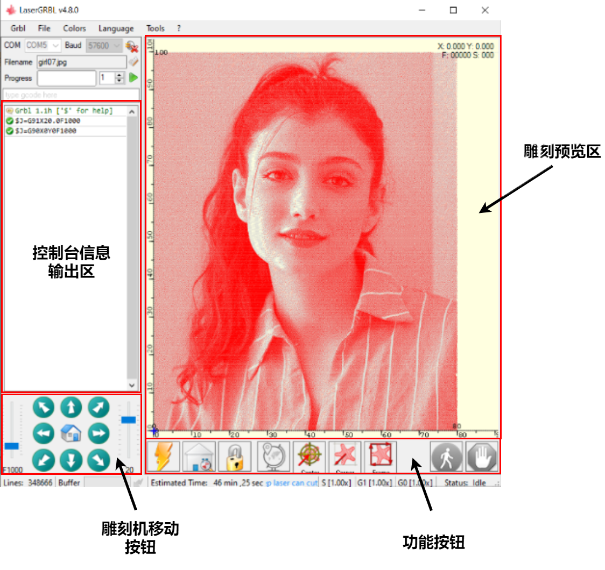
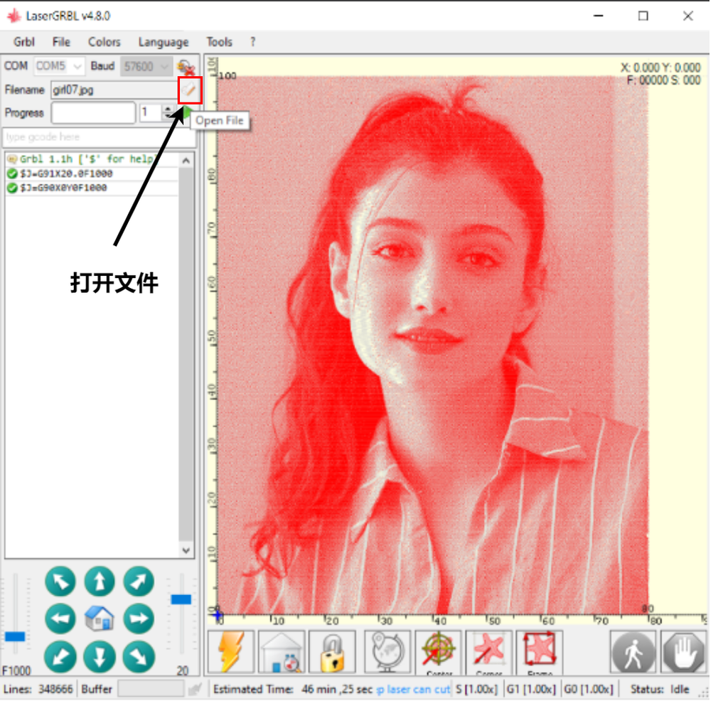
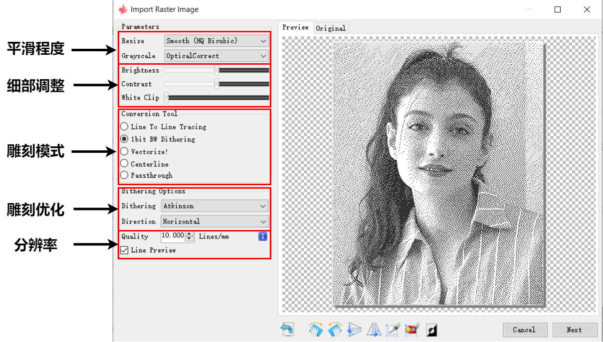
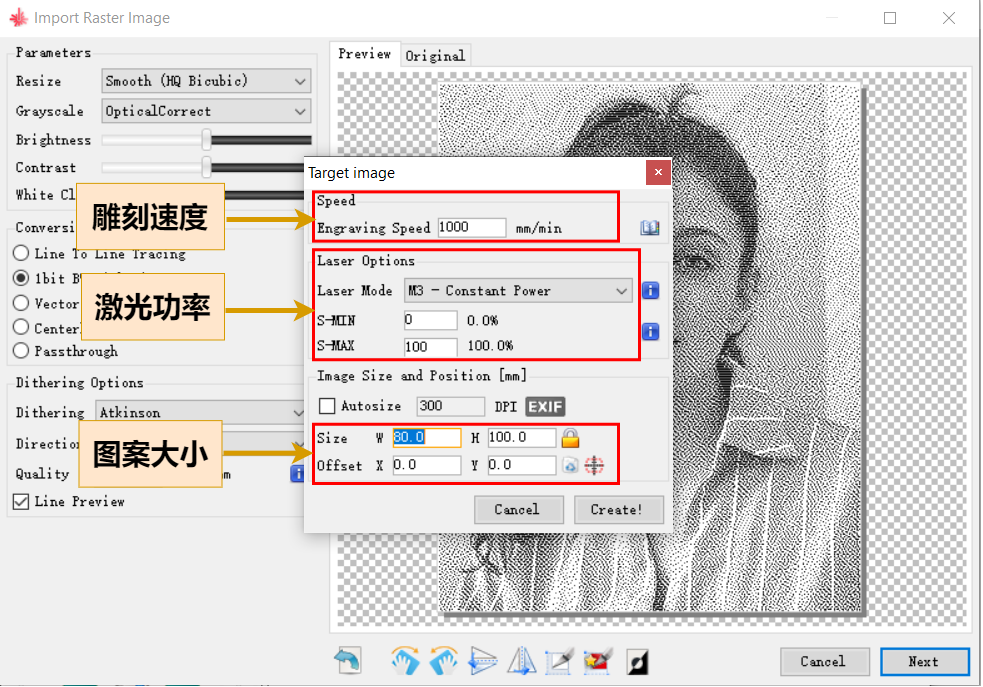
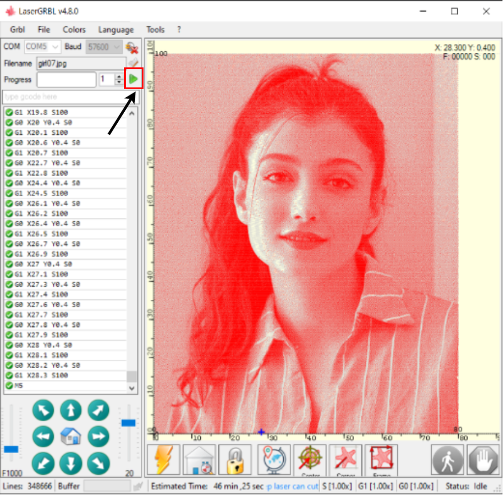
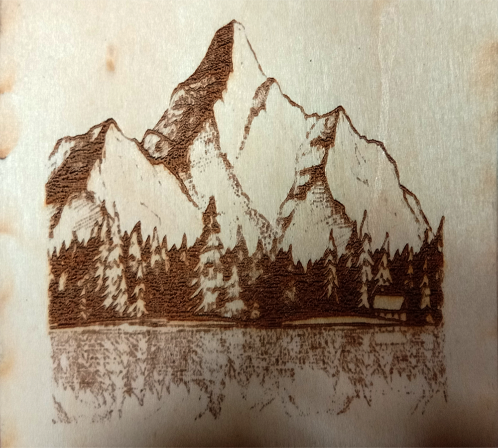

# 第三章——雕刻机控制软件

## 1. LaserGrbl 的使用

这里我已开源的 LaserGrbl 为例，介绍一下如何配置和控制雕刻机。

## 1.1 第一步，连接电源和电脑

使用 12V3A 的电源适配器给雕刻机供电，同时通过 USB 将电脑和雕刻机连接在一起。

## 1.2 第二步，连接设备

选择相应的端口以及波特率，一般是`115200`，但我设置了更小一点的波特率。

## 1.3 第三步，配置 Grbl

在使用之前你需要对你的机器做一些配置，打开 Grbl Configuration，然后按照前面介绍的进行配置对应的数值。

你们可以参照下面的默认值：

|    推荐值     |    推荐值     |
| :-----------: | :-----------: |
|     $0=10     |     $1=25     |
|     $2=0      |     $3=0      |
|     $4=0      |     $5=0      |
|     $6=0      |     $10=1     |
|   $11=0.010   |   $12=0.002   |
|     $13=0     |     $20=0     |
|     $21=0     |     $22=0     |
|     $23=0     |  $24=400.000  |
| $25=3000.000  |    $26=250    |
|   $27=2.000   |    $30=100    |
|     $31=0     |     $32=1     |
|    $100=80    |    $101=80    |
|    $102=80    | $110=3000.000 |
| $111=3000.000 | $112=3000.000 |
| $120=1000.000 | $121=1000.000 |
| $122=1000.000 | $130=300.000  |
| $131=300.000  | $132=300.000  |

## 1.4 第四步，LaserGrbl 功能分区

在启动连接设备之后，你可以通过左下方的移动箭头移动雕刻机，两侧的数字可以用来调节移动的速度和移动的距离。

软件下方是方便使用的一些快捷按钮。

- 第一个闪电的按钮用于紧急制动。
- 第二个房屋的按钮用于机器调零，只有在机器归零启动的情况下该图标才会出现，如果你的机器有限位开关的话可以考虑打开这个功能。
- 第三个锁的按钮用于当机器出现警报错误时，取消错误警报，重新启用机器。
- 第四个地球仪按钮用于设置工作原点。
- 第五个案例用于将机器移动至雕刻图案中心。
- 第六个图标用于将机器移动至雕刻图案左下角。
- 第七个图标用于让机器绕雕刻图案的最小矩形边框运动，同时发出微弱的激光用于校准位置。

## 1.5 第五步，处理图案

点击 Filename 旁的图标可以打开需要雕刻的文件，LaserGrbl 支持`G-Code`，`.svg`，`图片`等格式的文件。这里我们以图片为例。

打开图片后会跳出模式选择窗口：

我们选择平滑模式，下面的滑动条可以对图片做调整，比如对比度，亮度等等。

在雕刻图片，尤其是人像的时候，使用点阵雕刻可以实现图片的明暗层次的变化，如果你的激光头的功率不高的话这是很好的一个选择。接着就是模糊算法的选择，我们保持默认就好了。下面还有一个分辨率的选择，单位是每毫米有多少条线条，数值越大，雕刻的分辨率越高，但是时间也越长，建议默认值 10。

然后点击下一步：

在这里你可以选择雕刻时的参数，比如雕刻速度，建议默认值 1000，最下面可以选择雕刻图案的大小以及偏移量，一般不使用偏移量，但是可以大小很有用，这里我设置 80\*100mm。

最后点击创建就可以了。

## 1.6 开始雕刻

一切都准备好之后，点击开始雕刻就可以了。

## 2. 成品展示

我自己雕刻了一些图片，让大家感受一下欣赏雕刻机的乐趣。

|           卡通            |           山脉            |
| :-----------------------: | :-----------------------: |
|  |  |

|           长恨歌           |             龙             |
| :------------------------: | :------------------------: |
|  |  |
