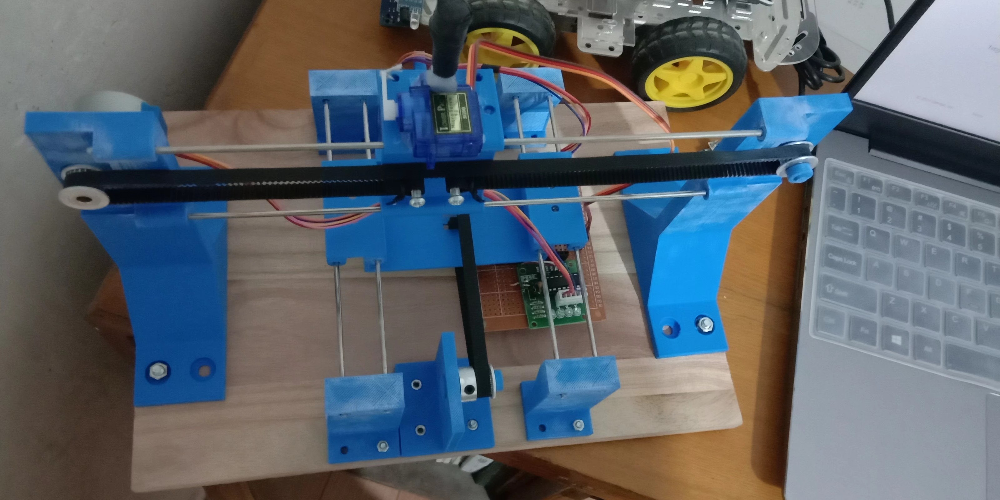
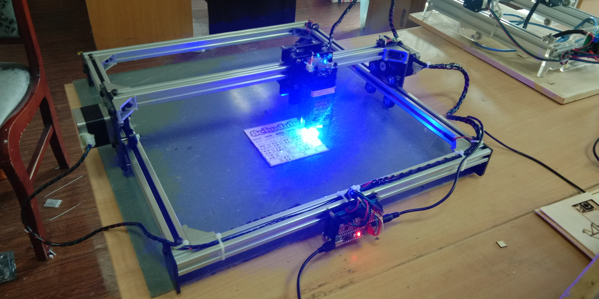
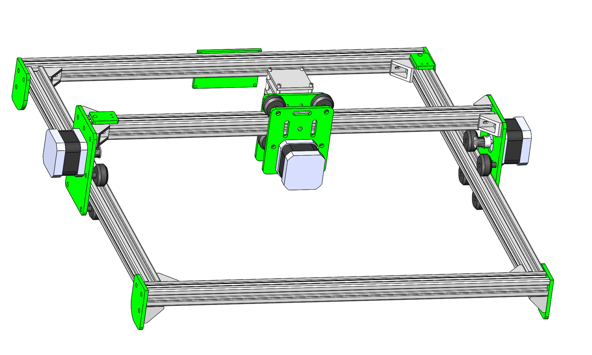

# 激光雕刻机

激光雕刻机应该说是很多 DIY 爱好者都喜欢做的一个项目，因为它确实很酷。我们技术部在之前也有这样一台大佬们买的 1.6W 的雕刻机。可见，虽然我们处在不同的时空，但是最终我们不约而同地还是走到了同一个地方。

其实我在大一学习了 Arduino 之后就知道了 Arduino 可以制作雕刻机，那个时候一直想做一个，但是毕竟那个时候能力不足，有心无力。后来经过一段时间的学习，我又回到了这个项目上。

我是先着手做了一台写字机，但显然没有成功。

后来我在我们办公室发现了这一台老前辈们玩过的雕刻机，我从那台雕刻机上受到了启发，完成了我们现在使用的雕刻机。

这个版本我画了 3D 模型，你们可以使用 CNC 机床铣出来，或者用 3D 打印机打印，绿色部分是需要定制的，其余的材料直接购买就可以了。

激光雕刻机在硬件上要求比较高，同时还需要掌握一些额外的知识，软件方面大部分直接使用预先写好的固件就可以了，也就是说你有一台机器的话就相当于完成了整个项目。
