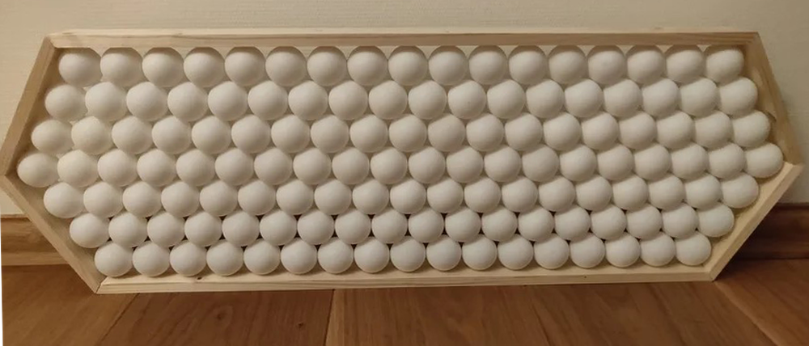
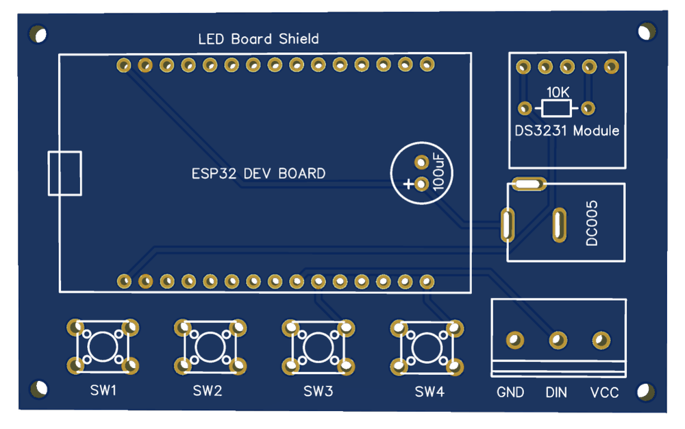

# 第一章——制作步骤

这个项目说难也不难，只是在制作过程中很考验耐心。我当时是有学姐作为帮手，另外还有郭鑫惺帮我焊接，所以总的来说还好，如果你们是自己做可能就要麻烦点了。

## 1. 制作框架

对于电子元器件，我们后面介绍。制作框架需要用到一块木板，木板的尺寸看你的分辨率。我前后做了两个版本，一个是 21x7 的，一个是 19x7 的。这里我以 21x7 为例，你大概需要 84x24.78cm 的木板以及 135 个乒乓球。

零件清单大概如下：

|      零件      |  数目  |
| :------------: | :----: |
|     轻木板     |  1 个  |
|     乒乓球     | 135 个 |
| 其他装饰性物品 |  N 个  |

准备好板子后，把板子按照如下尺寸进行切割：

## 2. 焊接灯条及乒乓球

切割好木板后，你可以按照上面的尺寸图对木板进行规划，把每一个灯条的位置标记好，接着就把剪下来的灯珠按照位置贴好，你可以通过导线把相邻的灯珠焊接在一起，或者用排针的针头，那样更好焊接一点。

然后把 135 个乒乓球底部切掉大概 1/4。

然后按照上面的位置把切好的乒乓球用热熔胶粘贴在每个灯珠上，留出三根导线就好了，你也可以对外观进行一些装饰。

最终的成品大概如下：

## 3. 原理图及 PCB

这里使用到的电子元器件主要有：

|      零件       | 数目 |
| :-------------: | :--: |
|   DC005 接头    | 1 个 |
| 5V3A 电源适配器 | 1 个 |
|      ESP32      | 1 个 |
|      按钮       | 4 个 |
|   DS3231 模块   | 1 个 |
|   100uF 电容    | 1 个 |
|    10K 电阻     | 1 个 |
|   3P 接线端子   | 1 个 |

你可以按照如下原理把各个零件焊接洞洞板上：

也可以到我的[GitHub 仓库](https://github.com/MR-Addict/WS2812-LED-Ping-Pong-Board.git)下载 Gerber 文件进行 PCB 打样。

下面是 PCB 的三维示意图：

