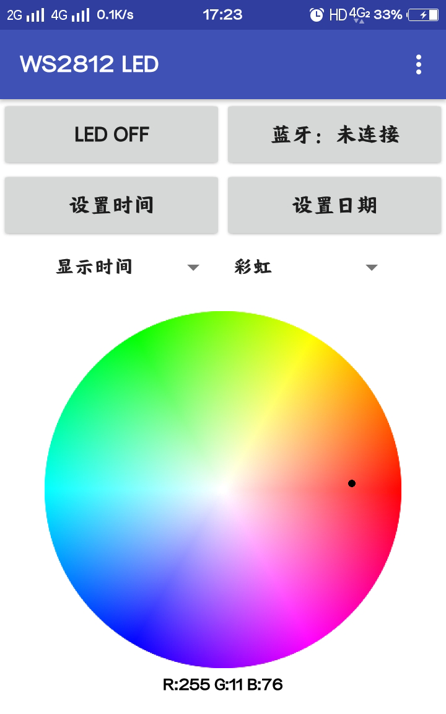
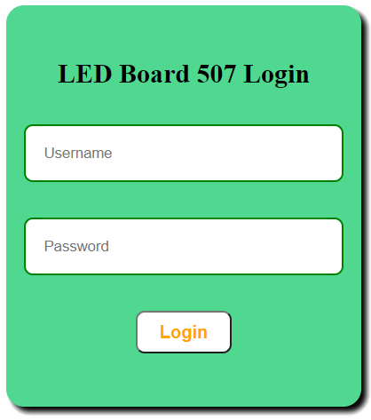

# 第二章——代码及使用

有关代码部分我也比较建议大家前往我的[GitHub仓库](https://github.com/MR-Addict/WS2812-LED-Ping-Pong-Board.git)下载使用，其中21x7版本的使用了WIFI，如果你不想使用WIFI，仅仅使用APP的话，可以使用19x7的版本。

## 1. 项目文件及代码

该项目的代码文件结构如下：

- HeaderConfig.h
- LEDBoard21x7.ino
- LEDFunction.h
- WIFI.h
- data
  - favicon.png
  - index.html
  - index.js
  - login.html
  - sytle.css

其中`HeaderConfig.h`主要包含了全局变量的声明，`LEDBoard21x7.ino`就是主程序了，`LEDFunction.h`主要是灯板的控制以及光效函数，`WIFI.h`包含了有关WIFI服务器和websocket的配置，`data`文件夹包含了有关网页的文件。

本项目同样有很大的难度，包括网页设计，WIFI服务器搭建，以及SPIFFS的使用，相关内容可参考上一个项目[NFC门禁卡](../NFC/Chapter2.md)。这里我不做详细介绍了，三言两语也讲不清楚，大家可以自行学习。

## 2. 灯板的使用

灯板内置了三种显示模式，包括：

- 显示时间
- 显示日期
- 显示灯效

灯板支持四种控制模式，包括：

- 按钮
- 手机APP
- WIFI
- 定时任务

后两种模式可以设置灯板的时间和日期，而按钮只能切换模式和背景，定时任务是用来定时开关灯板的。

下面我介绍每一种控制模式的使用方法。

### 2.1 按钮控制

|  按钮  |      功能      |
| :----: | :------------: |
| 按钮一 | 打开/关闭灯板  |
| 按钮二 |  设置背景模式  |
| 按钮三 | 上一个显示模式 |
| 按钮四 | 下一个显示模式 |

值得注意的是，因为我把板子内置了5种背景模式，有`彩虹模式`，`白云模式`，`海洋模式`，`岩浆模式`，`森林模式`。根据我的观察，显示时间和显示日期需要比较浅的背景，所以在这两种模式下一直都是白云模式，不能更换背景的。

## 2.2 手机APP

我使用了一个叫做[MIT APP Inventor](http://ai2.appinventor.mit.edu/?locale=en#5202799305818112)开源项目制作了这个手机APP，该软件只支持安卓系统。

你可以通过这个链接[下载](software/LED-Board.apk)安装使用。



在使用APP前，你需要先连接ESP32的蓝牙，我设置了蓝牙名称为`LED Board 507`，你可以通过更改`LEDBoard21x7.ino`文件中`setup`函数的下面一行更改设备蓝牙名称：

```cpp
// 设置蓝牙名称
SerialBT.begin("LED Board 507");
```

连接蓝牙后你就可以通过这个APP控制灯板，相信大家看了就会使用这个APP，挺简单的，这里我不做介绍了。

### 2.3 WIFI

这里WIFI的使用和NFC的WIFI开门是相似的，也需要先登录验证。在连接相同路由器的情况下，你可以通过ESP32的主机名进行访问，我设置的主机名是`ledboard-507`，即，你可以通过[http://ledboard-507](http://ledboard-507)访问。

你可以通过更改`WIFI.h`文件下的`WIFI_INIT`的以下几行更改ESP32的主机名：

```cpp
// change hostname to ledboard-507
String hostname = "ledboard-507";
WiFi.mode(WIFI_STA);
WiFi.config(INADDR_NONE, INADDR_NONE, INADDR_NONE, INADDR_NONE);
WiFi.setHostname(hostname.c_str());
```

登录后的需要身份验证，默认用户名是`admin`，默认密码是`dinghao666`：



登录后就可以控制灯板了：


相信大家看了这个UI应该也知道怎么用了，这里我也不做详细介绍了。

### 2.4 定时任务

DS3231拥有两个内置的闹钟，这非常适合用来作为定时器，但是为了提高效率，我加入了使用了DS3231的中断。因为DS3231在闹铃时会触发`三号中断引脚`，但是这个引脚在我买的DS3231模块上没有焊接出来，因此我需要自己焊接，同时添加一个10K的上拉电阻。

我同时使用了两个闹钟，一个闹钟用来在`晚上12:00关闭灯板`，另一个用来在`中午12:00开启灯板`，大家可以通过更改`LEDBoard21x7.ino`文件中`setup`函数的以下几行重新设置这个时间：

```cpp
attachInterrupt(digitalPinToInterrupt(INT_PIN), alarm_irq, FALLING);
rtc.setAlarm1(DateTime(2021, 12, 28, 0, 0, 0), DS3231_A1_Hour); // 每日凌晨12点关闭LED
rtc.setAlarm2(DateTime(2021, 12, 28, 8, 0, 0), DS3231_A2_Hour); // 每日早晨8点打开LED
```