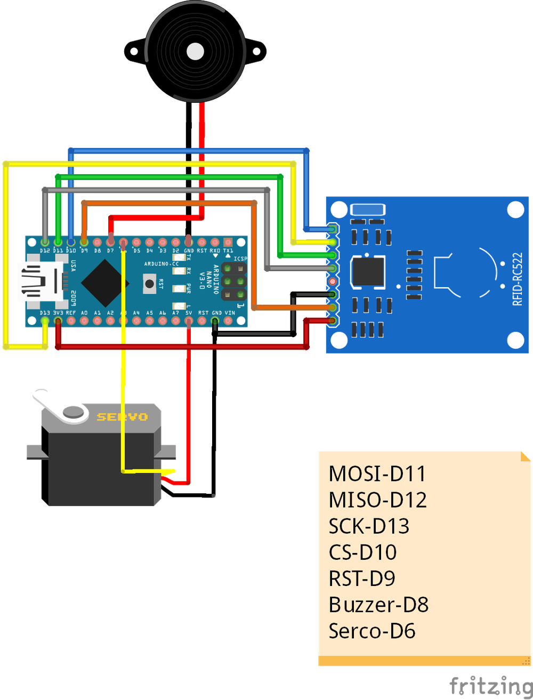

# 第一章——初代门禁版本

虽然说我们目前使用的我制作的最新版本，前代也有很多问题，但是我还是认为有必要让大家了解一下，这样也能开阔大家的思维。

## 1. 一代版本——继电器版

继电器这个版本是大佬们的做法，可能也是比较专业的做法，但是可能是我学识浅薄，有些问题解决不了，所以就放弃了。大家自己也可以尝试一下。

继电器版的接线图如下：


我使用的示例代码如下：

```cpp
#include <SPI.h>
#include <MFRC522.h>

const int SS_PIN = 10;
const int RST_PIN = 9;
const int Buzzer = 8;
const int Relay = 7;
const int UIDNUM = 50;

const String UID[UIDNUM] = {
    "F1 41 01 5F", "01 5E 95 2B", "1A FD A5 21", "E1 D8 FC 5E", "E1 E0 00 5F",
    "D1 7E FF 5E", "21 DE 01 5F", "D1 3A F6 5E", "31 AB FD 5E", "21 35 F7 5E",
    "0A 57 80 1C", "FA 5D 70 7F", "D2 AA 1C 3E", "15 4F B9 E5", "75 89 B6 E5",
    "0A 8C 36 B6", "00 69 0F 93", "75 89 B6 E5", "FA 50 35 B6", "EA B1 1C 3E",
    "60 DB 0D 93", "5A 32 34 B6", "72 B1 85 44", "A3 A4 1B 3E", "0C 3C 1A 3F",
    "72 B1 85 44", "50 DF D3 03", "A5 72 1B 3E", "A1 C2 53 74", "6C AE 73 17",
    "0A 46 95 1C", "47 25 38 E1", "DC 53 14 3E", "80 54 0C 93", "2A 76 64 21",
    "10 FD FC 2E", "19 F0 95 B4", "D7 FC 80 67", "60 B9 2A BE", "75 36 B5 E5",
    "87 90 91 5E", "69 E9 1F C5", "C9 DE 3B B4", "08 71 21 DC", "9C B3 BC 3E",
    "17 A4 91 5E", "F7 88 94 5E", "89 28 3A B4", "BC C3 87 43", "DC FB 0E 3F",
};

MFRC522 mfrc522(SS_PIN, RST_PIN);

void BuzzerRing(boolean Dur = false) {
    for (uint8_t i = 0; i < 2; i++) {
        tone(Buzzer, 300);
        if (Dur)delay(200);
        else delay(100);
        noTone(Buzzer);
        delay(100);
    }
}

boolean GetKey(String CONTECTED_UID) {
    for (uint8_t i = 0; i < UIDNUM; i++)
        if (CONTECTED_UID == UID[i])return true;
    return false;
}

void setup()
{
    Serial.begin(115200);
    SPI.begin();
    mfrc522.PCD_Init();
    pinMode(Relay, OUTPUT);
    pinMode(Buzzer, OUTPUT);
    BuzzerRing();
    Serial.print("System Started!\nBuilt in UID Num:");
    Serial.println(UIDNUM);
    delay(3000);
}

void loop()
{
    if ( ! mfrc522.PICC_IsNewCardPresent())return;
    if ( ! mfrc522.PICC_ReadCardSerial())return;

    String content = "";
    Serial.print("UID(");
    for (byte i = 0; i < mfrc522.uid.size; i++)
    {
        Serial.print(mfrc522.uid.uidByte[i] < 0x10 ? " 0" : " ");
        Serial.print(mfrc522.uid.uidByte[i], HEX);
        content.concat(String(mfrc522.uid.uidByte[i] < 0x10 ? " 0" : " "));
        content.concat(String(mfrc522.uid.uidByte[i], HEX));
    }
    content.toUpperCase();
    String CONTECTED_UID = content.substring(1);

    if (GetKey(CONTECTED_UID)) {
        Serial.println(" ):Access Accpeted!");
        BuzzerRing();
        digitalWrite(Relay, HIGH);
        delay(1000);
        digitalWrite(Relay, LOW);
    }
    else {
        Serial.println(" ):Access Denied!");
        BuzzerRing(true);
    }
}
```

## 2. 二代版本——舵机版

舵机版和继电器版几乎一致，只是将继电器换成舵机罢了。

舵机版接线图如下：



我使用的示例代码如下：

```cpp
#include <SPI.h>
#include <Servo.h>
#include <MFRC522.h>

const int SS_PIN = 10;
const int RST_PIN = 9;
const int Buzzer = 7;
const int UIDNUM = 50;

const String UID[UIDNUM] = {
  "F1 41 01 5F", "01 5E 95 2B", "1A FD A5 21", "E1 D8 FC 5E", "E1 E0 00 5F",
  "D1 7E FF 5E", "21 DE 01 5F", "D1 3A F6 5E", "31 AB FD 5E", "21 35 F7 5E",
  "0A 57 80 1C", "FA 5D 70 7F", "D2 AA 1C 3E", "15 4F B9 E5", "75 89 B6 E5",
  "0A 8C 36 B6", "00 69 0F 93", "75 89 B6 E5", "FA 50 35 B6", "EA B1 1C 3E",
  "60 DB 0D 93", "5A 32 34 B6", "72 B1 85 44", "A3 A4 1B 3E", "0C 3C 1A 3F",
  "72 B1 85 44", "50 DF D3 03", "A5 72 1B 3E", "A1 C2 53 74", "6C AE 73 17",
  "0A 46 95 1C", "47 25 38 E1", "DC 53 14 3E", "80 54 0C 93", "2A 76 64 21",
  "10 FD FC 2E", "19 F0 95 B4", "D7 FC 80 67", "60 B9 2A BE", "75 36 B5 E5",
  "87 90 91 5E", "69 E9 1F C5", "C9 DE 3B B4", "08 71 21 DC", "9C B3 BC 3E",
  "17 A4 91 5E", "F7 88 94 5E", "89 28 3A B4", "BC C3 87 43", "DC FB 0E 3F",
};

Servo myservo;
MFRC522 mfrc522(SS_PIN, RST_PIN);

void BuzzerRing(boolean Dur = false) {
  for (uint8_t i = 0; i < 2; i++) {
    tone(Buzzer, 300);
    if (Dur)delay(200);
    else delay(100);
    noTone(Buzzer);
    delay(100);
  }
}

boolean GetKey(String CONTECTED_UID) {
  for (uint8_t i = 0; i < UIDNUM; i++)
    if (CONTECTED_UID == UID[i])return true;
  return false;
}

void setup()
{
  Serial.begin(115200);
  SPI.begin();
  mfrc522.PCD_Init();
  myservo.attach(8);
  myservo.write(40);
  pinMode(Buzzer, OUTPUT);
  BuzzerRing();
  Serial.print("System Started!\nBuilt in UID Num:");
  Serial.println(UIDNUM);
  delay(3000);
}

void loop()
{
  if ( ! mfrc522.PICC_IsNewCardPresent())return;
  if ( ! mfrc522.PICC_ReadCardSerial())return;

  String content = "";
  Serial.print("UID(");
  for (byte i = 0; i < mfrc522.uid.size; i++)
  {
    Serial.print(mfrc522.uid.uidByte[i] < 0x10 ? " 0" : " ");
    Serial.print(mfrc522.uid.uidByte[i], HEX);
    content.concat(String(mfrc522.uid.uidByte[i] < 0x10 ? " 0" : " "));
    content.concat(String(mfrc522.uid.uidByte[i], HEX));
  }
  content.toUpperCase();
  String CONTECTED_UID = content.substring(1);

  if (GetKey(CONTECTED_UID)) {
    Serial.println(" ):Access Accpeted!");
    BuzzerRing();
    for (int pos = 40; pos <= 60; pos += 1) {
      myservo.write(pos);
      delay(5);
    }
    delay(1000);
    for (int pos = 60; pos >= 40; pos -= 1) {
      myservo.write(pos);
      delay(5);
    }
  }
  else {
    Serial.println(" ):Access Denied!");
    BuzzerRing(true);
  }
}
```

## 3. 三代版本——步进电机版

步进电机版和前面也是类似，只是将舵机换成步进电机，这里是使用28BYJ-48步进电机。

步进电机版接线图如下：


我使用的示例代码如下：

```cpp
#include <SPI.h>
#include <MFRC522.h>
#include <AccelStepper.h>

const uint8_t PinA = 2;
const uint8_t PinB = 3;
const uint8_t PinC = 4;
const uint8_t PinD = 5;
const uint8_t Buzzer = 8;
const uint8_t RST_PIN = 9;
const uint8_t SS_PIN = 10;
const uint16_t stepsPerRevolution = 400;
const uint8_t UIDNUM = 37;

const String UID[UIDNUM] = {
  "F1 41 01 5F", "01 5E 95 2B", "1A FD A5 21", "E1 D8 FC 5E", "E1 E0 00 5F",
  "D1 7E FF 5E", "21 DE 01 5F", "D1 3A F6 5E", "31 AB FD 5E", "21 35 F7 5E",
  "0A 57 80 1C", "FA 5D 70 7F", "D2 AA 1C 3E", "15 4F B9 E5", "75 89 B6 E5",
  "0A 8C 36 B6", "00 69 0F 93", "75 89 B6 E5", "FA 50 35 B6", "EA B1 1C 3E",
  "60 DB 0D 93", "5A 32 34 B6", "72 B1 85 44", "A3 A4 1B 3E", "0C 3C 1A 3F",
  "72 B1 85 44", "50 DF D3 03", "A5 72 1B 3E", "A1 C2 53 74", "6C AE 73 17",
  "0A 46 95 1C", "47 25 38 E1", "DC 53 14 3E", "80 54 0C 93", "2A 76 64 21",
  "DC FB 0E 3F", "5A 20 4C 2D",
};

MFRC522 mfrc522(SS_PIN, RST_PIN);
AccelStepper stepper(8, PinA, PinC, PinB, PinD);

void BuzzerRing(boolean Dur = false) {
  for (uint8_t i = 0; i < 2; i++) {
    digitalWrite(Buzzer, HIGH);
    if (Dur)delay(200);
    else delay(100);
    digitalWrite(Buzzer, LOW);
    delay(100);
  }
}

boolean GetKey(String CONTECTED_UID) {
  for (uint8_t i = 0; i < UIDNUM; i++)
    if (CONTECTED_UID == UID[i])return true;
  return false;
}

void setup()
{
  SPI.begin();
  Serial.begin(115200);
  mfrc522.PCD_Init();
  stepper.setMaxSpeed(500.0);
  stepper.setAcceleration(1000.0);
  stepper.runToNewPosition(0);
  pinMode(Buzzer, OUTPUT);
  BuzzerRing();
  Serial.print("System Started!\nBuilt in UID Num:");
  Serial.println(UIDNUM);
  delay(3000);
}

void loop()
{
  if ( ! mfrc522.PICC_IsNewCardPresent())return;
  if ( ! mfrc522.PICC_ReadCardSerial())return;

  String content = "";
  Serial.print("UID(");
  for (byte i = 0; i < mfrc522.uid.size; i++) {
    Serial.print(mfrc522.uid.uidByte[i] < 0x10 ? " 0" : " ");
    Serial.print(mfrc522.uid.uidByte[i], HEX);
    content.concat(String(mfrc522.uid.uidByte[i] < 0x10 ? " 0" : " "));
    content.concat(String(mfrc522.uid.uidByte[i], HEX));
  }
  content.toUpperCase();
  String CONTECTED_UID = content.substring(1);

  if (GetKey(CONTECTED_UID)) {
    Serial.println(" ):Access Accpeted!");
    BuzzerRing();
    stepper.runToNewPosition(stepsPerRevolution);
    delay(1000);
    stepper.runToNewPosition(0);
  }
  else {
    Serial.println(" ):Access Denied!");
    BuzzerRing(true);
  }
  delay(3000);
}
```
