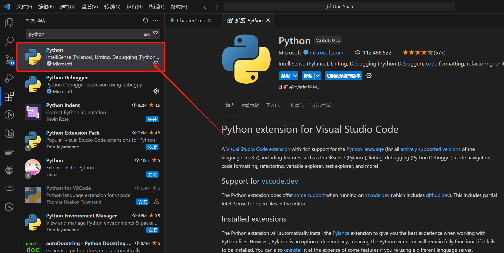

# 环境搭建

python环境的搭建可以说是非常简单的了。只需要去官网下载，再添加一下环境变量就可以了

如果你已经下载好了，可以在终端查看你的python版本。

```sh
python --version
```

## 下载python 3
Windows:[下载链接](https://www.python.org/ftp/python/3.11.8/python-3.11.8-amd64.exe)

Linux:[下载链接](https://www.python.org/downloads/source/)

Macos:[下载链接](https://www.python.org/ftp/python/3.11.8/python-3.11.8-macos11.pkg)

## 设置环境变量

Windows:在`终端`中输入

```sh
$env:Path += #<python address>
```

Linux:在 `bash shell` 输入

```sh
export PATH="$PATH:/usr/local/bin/python" 
```


## 运行python

- 在终端配置完后输入

```sh
python
```

既可以在交互式编辑器中开始编写python代码

- vscode 配置

安装 `VS Code Python` 扩展:



- 命令行运行

```sh
python.exe #<address>
```
