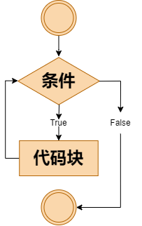
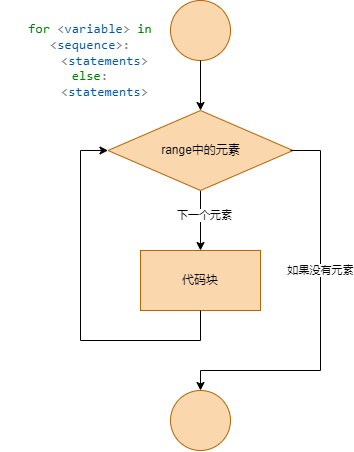
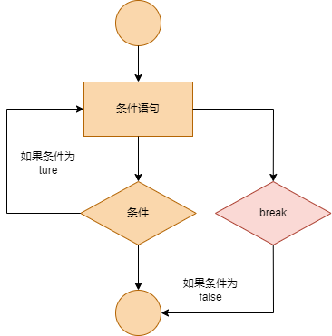
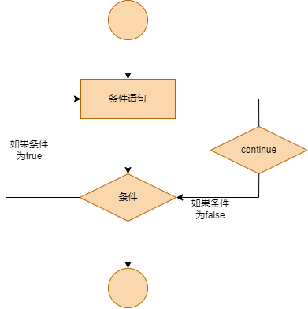

# 循环语句

## 1. While 循环语句

```py,norepl
while 判断条件(condition)：
    执行语句(statements)……
```

执行语句可以是单个语句或语句块。判断条件可以是任何表达式，任何非零、或非空（null）的值均为 true。当判断条件假 false 时，循环结束。

可以通过下图来简单了解循环句的执行过程:

<div style="text-align: center;">
    
</div>

示例：

```py
count = 0
while (count < 5):
   print ('The count is:', count)
   count = count + 1
print("Good bye!")
```

## 2. 跳过和退出循环

while 语句时还有另外两个重要的命令 continue，break 来跳过循环，continue 用于跳过该次循环，break 则是用于退出循环，此外"判断条件"还可以是个常值，表示循环必定成立，具体用法如下：

```py
i = 0
while i < 5:
    i += 1
    print(i)
    if i % 2 == 0:
        continue

j = 0
while j < 5:
    j += 1
    print(j)
    if j % 2 == 0:
        break
```

## 3. 无限循环

while 语句中如果 `条件`为 `true`的情况时，循环会无限的执行下去，下面是示例：

```py,norepl
# ！！不建议尝试运行
i = 0
while True:
    i += 1
    print(i)
```

## 4. while...else 语法

在 `while … else` 在循环条件为 `false` 时执行 `else` 语句块：

```py
count = 0
while count < 5:
  print (count,"小于5"),
  count += 1
else:
  print (count,"大于5"),
```

## 5. 简单 while 语句

假如你的 while 循环体只有一条语句的话，可以使用一行 while 语句来实现。

```py,norepl
# ！！不建议尝试运行
condition = True
while(condition):print ("Hello World!")
```

## 6. for 循环

## 6.1 for 循环的基本语法
python 中 for 循环可以遍历一个任何一个序列，例如一个字符串或者一个数组。

for 循环的语法格式如下:

```
for 变量 in 序列:
    语句块
```



尝试一下：

```py
fruits = ["apple", "banana", "cherry"]  
for x in fruits:  
    print(x)  
```
输出结果：apple banana cherry

同时整数范围值可以配合 range() 函数使用：

```py
for i in range(5):
    print(i)
```
输出结果：0 1 2 3 4

### 6.2 for...else 语法

在 Python 中，for...else 语句用于在循环结束后执行一段代码。

```py
for num in range(10, 20):
    if num % 2 == 0:
        print(num)
    else:
        print("Odd number")
else:
    print("Loop is over")
```

## 循环中的break和continue

`break`：用于跳出当前循环，直接执行循环后的语句。



在while中使用break语句：

```py
n = 5
while n > 0:
    n -= 1
    if n == 2:
        break
    print(n)
print('循环结束。')
```

`continue`：用于跳过当前循环，直接开始下一轮循环。



在while中使用continue语句：

```py
n = 5
while n > 0:
    n -= 1
    if n == 2:
        continue
    print(n)s
print('循环结束。')
```

从上面两个代码可以很明显的看出，`break`和`continue`的执行流程。

试一试：

1. 输出ptsfdtz的字母，到第二个t时停止输出。

```py
s = 'ptsfdtz'
for i in s:
    if i == 't':
        break
    print(i)
```

