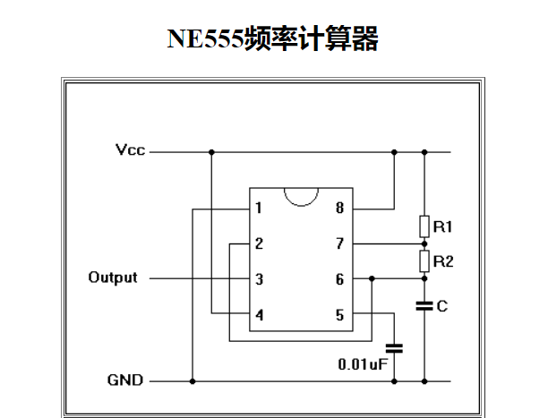

# EDA 入门——555 计时器

一般在设计 PCB 之前我们已经对所要设计的核心原件有了足够的认识了，一无所知就去设计 PCB 非常不明智。你最好是已经通过实物验证过了你的设计，然后再设计。本入门的例子使用的是 555 计时器，首先我们来了解一下 555 计时器。

## 1. 555 计时器

55 定时器是美国 Signetics 公司 1972 年研制的用于取代机械式定时器的中规模集成电路，因输入端设计有三个 5kΩ 的电阻而得名。此电路后来竟风靡世界。目前，流行的产品有 4 个：

- BJT
  - 555
  - 556(含有两个 555)
- CMOS
  - 7555
  - 7556(含有两个 7555)

## 2. 555 计时器工作原理

|                原理图                 |           波形           |
| :-----------------------------------: | :----------------------: |
|  |  |

### 3. 555 计时器计算公式

不同的 R1，R2，和 C 能够获得不同的频率和占空比，计算公式如下：

\\(T\_{high} = In(2)*(R_1+R_2)*C\\)

\\(T\_{low} = In(2)*{R_2}*C\\)

\\(F = \frac{1}{T*{high}+T*{low}}=\frac{1}{In(2)*(R1+2R2)*C}\\)

\\(W*{duty} = 100\*\frac{T*{high}}{T*{high}+T*{low}}=100\*\frac{R_1+R_2}{R1+2R2}\\)

因此加入我们使用 R1=1K，R2=470K，C=1uF，我们可以得到：

- \\(T\_{high} = 0.326\\)
- \\(T\_{low} = 0.325\\)
- \\(F = 1.530\\)
- \\(W\_{duty} = 50.053\\)

你可以通过一些写好的程序计算这个值，比如：

### 4. 555 计时器应用

555 计时器的应用主要有：

- 震荡器
- PWM 产生器

### 5. 555Timer BOM

|   BOM    | 数量 |    备注    |
| :------: | :--: | :--------: |
| 555Timer |  1   |   定时器   |
|   电源   |  1   |  4.5-18V   |
|   LED    |  1   |    红色    |
|   电容   |  1   |    1uF     |
|   电阻   |  3   | 1K,1K,470K |
