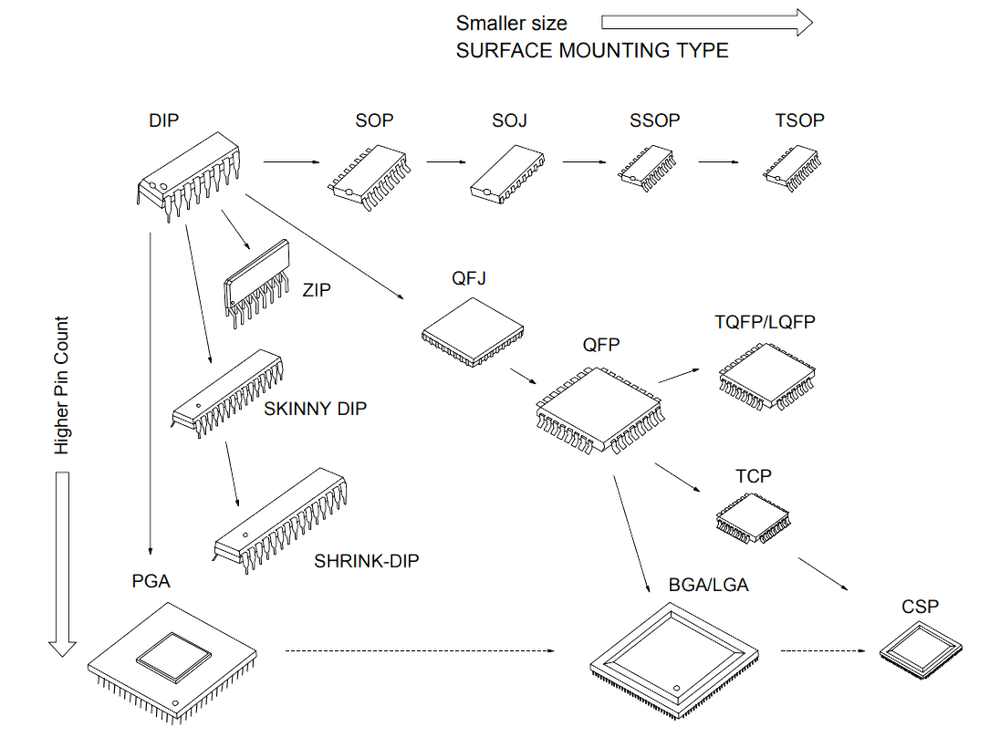

# EDA入门——绘制符号和封装

## 1. 绘制符号

- 唯一有物理作用的是**引脚**
- 引脚的顺序可以根据实际情况调整
- 做好标记和提示

## 2. 绘制封装

- 与符号有联系的是**引脚和焊盘**
- 标准元器件请按照相应的标准绘制
- 仔细检查封装的尺寸规格(非常重要)
- 做好标记和提示
- 给封装添加3D模型
- [NE555数据手册](PDF/NE555.pdf)
- [数据手册下载网址](https://datasheetspdf.com/)
- [3D模型下载网址](https://www.3dcontentcentral.com/default.aspx)

