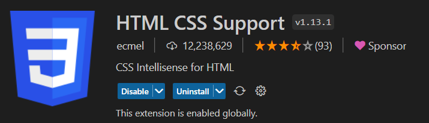
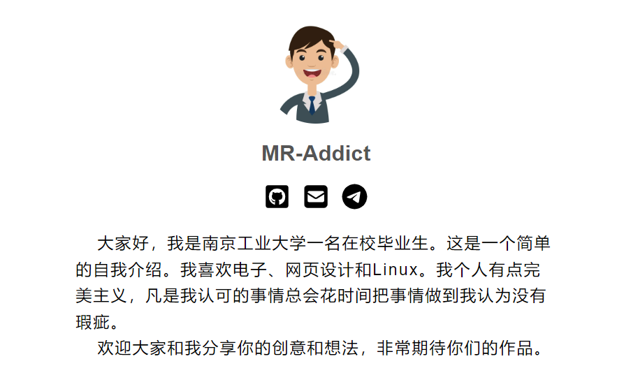

# 第四章——自我介绍

## 项目要求

- 使用HTML写一个自我介绍
- 要有图片和段落标签
- 自我介绍不少于100字
- 欢迎根据个人能力进行自我发挥
- 上传到分享网址

## 一、VSCode插件

安装VSCode插件`HTML CSS Support`，输入`!`后按下回车会自动生成基础模板。

## 二、相关链接

- 下载素材图片：[images](images.zip)。
- 上传分享网址：[https://azure.mraddict.top](https://azure.mraddict.top/)

## 三、示例图片

