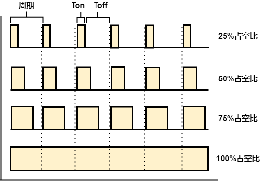

# 第六章——脉冲宽度调制PWM

## 1. 什么是PWM

PWM(Pulse Width Modulation)指的是**脉冲宽度调制**，它是一种可以用于控制LED亮度、直流电机速度控制、控制伺服电机或必须通过数字方式获得模拟输出的技术。

Arduino数字引脚只能输出5V（当变为高电平时）或 0V（当变为低电平时），并且输出是方波信号。因此，如果我们想调暗LED，我们无法从数字引脚获得0到5V之间的电压，但我们可以改变信号的ON和OFF时间。如果我们足够快地改变ON和OFF时间，那么LED的亮度就会改变。

下面是一些与 PWM 相关的术语:

- **\\(T_{on}\\)**：信号为高电平的时间
- **\\(T_{off}\\)**：是信号为低电平的时间
- **周期**：是开启时间和关闭时间的总和
- **占空比**：它是在一段时间内信号为高电平的时间百分比

因此，在50%占空比和1Hz频率下，LED将在半秒内保持高电平，另外半秒内保持低电平。如果我们将频率提高到50Hz（每秒开启和关闭 50 次），那么人眼将看到LED以一半亮度发光。

下面是PWM原理的示意图：



## 2. 使用PWM

在Arduino Uno开发板上，可以使用`analogWrite()`输出PWM。

语法：

```cpp
analogWrite(pin, value);
```

pin参数：你可以使用引脚号前**有~标记**的引脚作为PWM的输出引脚，也就是**3，5，6，9，10，11**六个引脚。其中，3，9，10，11号引脚默认的输出频率是**490Hz**，5，6号引脚的默认输出频率是**980Hz**。

value参数：Arduino默认所有模拟输出的分辨率是8位，也就是你可以输出0-255。某些单片机芯片支持更高的12位/16位分辨率，你可以通过`analogWriteResolution()`来改变PWM的分辨率。更多相关详细信息可以参考以下内容：[analogWriteResolution](https://www.arduino.cc/reference/en/language/functions/zero-due-mkr-family/analogwriteresolution/)。

下面是一个使用PWM实现呼吸灯的实例：

```cpp
int led = 3;

// 逐渐变亮
void fadedOn(unsigned int time, int increament) {
  for (byte value = 0 ; value < 255; value += increament) {
    analogWrite(led, value);
    delay(time / (255 / increament));
  }
}

//逐渐变暗
void fadedOff(unsigned int time, int decreament) {
  for (byte value = 255; value > 0; value -= decreament) {
    analogWrite(led, value);
    delay(time / (255 / increament));
  }
}

void setup() {
  pinMode(led, OUTPUT);
}

void loop() {
  fadedOn(1000, 5);
  fadedOff(1000, 5);
}
```

## 3. 调整PWM的频率

由于Arduino在3，9，10，11号引脚默认的输出频率是490Hz，5，6号引脚的默认输出频率是980Hz，尤其是通过电机驱动板调节电机速度的时候，电机会发出嗡嗡的声音，就是由于频率太低导致的，下面是可以使用的调整PWM频率的寄存器操作。

适用于3，11号引脚：

```cpp
TCCR2B = TCCR2B & B11111000 | B00000001; // for PWM frequency of 31372.55 Hz
TCCR2B = TCCR2B & B11111000 | B00000010; // for PWM frequency of 3921.16 Hz
TCCR2B = TCCR2B & B11111000 | B00000011; // for PWM frequency of 980.39 Hz
TCCR2B = TCCR2B & B11111000 | B00000100; // for PWM frequency of 490.20 Hz (The DEFAULT)
TCCR2B = TCCR2B & B11111000 | B00000101; // for PWM frequency of 245.10 Hz
TCCR2B = TCCR2B & B11111000 | B00000110; // for PWM frequency of 122.55 Hz
TCCR2B = TCCR2B & B11111000 | B00000111; // for PWM frequency of 30.64 Hz
```

适用于9，10号引脚：

```cpp
TCCR1B = TCCR1B & B11111000 | B00000001; // for PWM frequency of 31372.55 Hz
TCCR1B = TCCR1B & B11111000 | B00000010; // for PWM frequency of 3921.16 Hz
TCCR1B = TCCR1B & B11111000 | B00000011; // for PWM frequency of 490.20 Hz (The DEFAULT)
TCCR1B = TCCR1B & B11111000 | B00000100; // for PWM frequency of 122.55 Hz
TCCR1B = TCCR1B & B11111000 | B00000101; // for PWM frequency of 30.64 Hz
```

适用于5，6号引脚：

```cpp
TCCR0B = TCCR0B & B11111000 | B00000001; // for PWM frequency of 62500.00 Hz
TCCR0B = TCCR0B & B11111000 | B00000010; // for PWM frequency of 7812.50 Hz
TCCR0B = TCCR0B & B11111000 | B00000011; // for PWM frequency of 976.56 Hz (The DEFAULT)
TCCR0B = TCCR0B & B11111000 | B00000100; // for PWM frequency of 244.14 Hz
TCCR0B = TCCR0B & B11111000 | B00000101; // for PWM frequency of 61.04 Hz
```