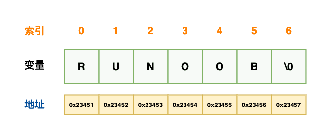

# 第十二章——字符串

## 1. 字符串

在 C 语言中，字符串实际上是使用空字符 \0 结尾的一维字符数组。因此，\0 是用于标记字符串的结束。

空字符（Null character）又称结束符，缩写 NUL，是一个数值为 0 的控制字符，\0 是转义字符，意思是告诉编译器，这不是字符 0，而是空字符。

下面的声明和初始化创建了一个 RUNOOB 字符串。由于在数组的末尾存储了空字符 \0，所以字符数组的大小比单词 RUNOOB 的字符数多一个：

```c
char site[7] = {'R', 'U', 'N', 'O', 'O', 'B', '\0'};
```

上面的初始化也可以写成如下格式：

```c
char site[] = "RUNOOB";
```

以下是 C/C++ 中定义的字符串的内存表示：



下面是使用字符串输出从终端输入的内容的程序：

```c
#include <stdio.h>

int main() {
    char string[50];
    puts("Input a string without space:");
    scanf("%s", string);
    puts(string);
    return 0;
}
```

## 2. 小测试

- **输出一段字符串，将其中字母全部大写。**
- **输入一段任意长度的字符串，通过排序将其按照A-Z，a-z重新排序。**