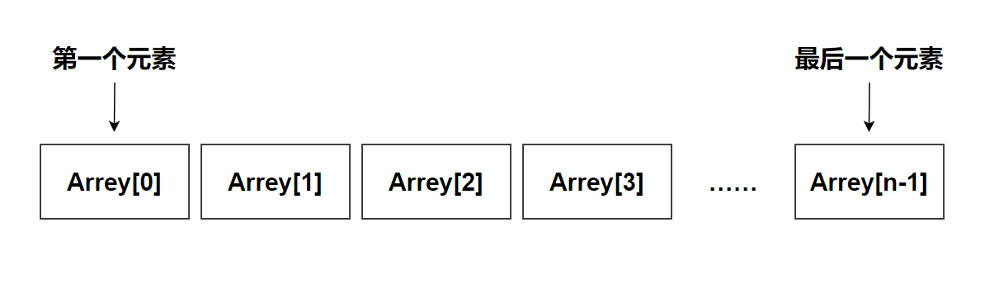
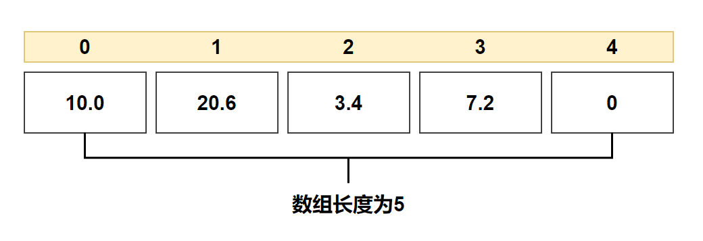
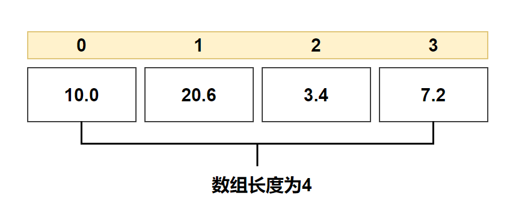

# 第十章——数组

## 1. 什么是数组

C 语言支持数组数据结构，它可以存储一个固定大小的相同类型元素的顺序集合。

所有的数组都是由连续的内存位置组成。最低的地址对应第一个元素，最高的地址对应最后一个元素。



数组中的特定元素可以通过索引访问，第一个索引值为 0。


## 2. 声明数组

在 C 中要声明一个数组，需要指定元素的**类型**和元素的**数量**，如下所示：

```c
type arrayName [ arraySize ];
```

这叫做一维数组。arraySize 必须是一个大于零的整数常量，type 可以是任意有效的 C 数据类型。例如，要声明一个类型为 double 的包含 10 个元素的数组 balance，声明语句如下：

```c
double balance[10];
```

## 3. 初始化数组

在 C 中，您可以逐个初始化数组，也可以使用一个初始化语句，如下所示：

```c
double balance[5] = {10.0, 20.6, 3.4, 7.2};
```

大括号 { } 之间的值的数目**不能大于**在数组声明时在方括号 [ ] 中指定的元素数目，未赋值的元素自动赋值为0。



如果省略了数组的大小，数组的大小则为初始化时元素的个数。

```c
double balance[] = {10.0, 20.6, 3.4, 7.2};
```



## 4. 访问数组元素

数组元素可以通过数组名称加索引进行访问。元素的索引是放在方括号内，跟在数组名称的后边。

例如：

```c
double balance[5] = {10.0, 20.6, 3.4, 7.2};
blance[4] = 50.6;
```

下面是一个将输入的5个值存储到数组中，显示输出并求和的一个程序：

```c
#include <stdio.h>

int main() {
    int num[5], sum = 0;
    for (int i = 0; i < 5; i++) {
        printf("Input a number:");
        // 将输入的元素存入数组当中
        scanf("%d", &num[i]);
    }
    printf("These numbers are .");
    for (int i = 0; i < 5; i++) {
        // 求出所有元素之和
        sum += num[i];
        printf("%d ", num[i]);
    }
    printf("\nThe sum of them is %d\n.", sum);
    return 0;
}
```

## 5. 冒泡排序

冒泡排序（Bubble Sort），是一种计算机科学领域的较简单的排序算法，是学习编程语言必不可少的以部分，它是循环和数组的结合，很适合初学者学习。

冒泡排序重复地走访过要排序的元素列，依次比较两个相邻的元素，如果顺序（如从大到小、首字母从Z到A）错误就把他们交换过来。走访元素的工作是重复地进行直到没有相邻元素需要交换，也就是说该元素列已经排序完成。

这个算法的名字由来是因为越小的元素会经由交换慢慢“浮”到数列的顶端（升序或降序排列），就如同碳酸饮料中二氧化碳的气泡最终会上浮到顶端一样，故名“冒泡排序”。

下面是一个可供参考的冒泡排序代码：

```c
#include <stdio.h>

#define LENGTH 10

int main() {
    int temp;
    int num[LENGTH] = {25, 20, 12, 36, 89, 65, 35, 45, 67, 34};
    // 外层循环为排序的趟数，次数为数组长度-1
    for (int i = 0; i < LENGTH - 1; i++) {
        //内层循环为比较相邻元素的次数，次数为需要比较元素个数-1
        for (int j = 0; j < LENGTH - i - 1; j++) {
            // 相邻元素比较，若逆序则交换（升序为左大于右，降序反之）
            if (num[j] > num[j + 1]) {
                temp = num[j];
                num[j] = num[j + 1];
                num[j + 1] = temp;
            }
        }
    }
    // 输出结果
    for (int i = 0; i < LENGTH; i++) {
        printf("%d ", num[i]);
    }
    return 0;
}
```

## 6. 选择排序

选择排序（Selection sort）是一种简单直观的排序算法。它的工作原理是：第一次从待排序的数据元素中选出最小（或最大）的一个元素，存放在序列的起始位置，然后再从剩余的未排序元素中寻找到最小（大）元素，然后放到已排序的序列的末尾。以此类推，直到全部待排序的数据元素的个数为零。

下面是一个可供参考的选择排序代码：

```c
#include <stdio.h>

#define LENGTH 10

int main() {
    int temp;
    int num[LENGTH] = {25, 20, 12, 36, 89, 65, 35, 45, 67, 34};
    // 外层循环为排序的趟数，次数为数组长度-1
    for (int i = 0; i < LENGTH - 1; i++) {
        //内层循环为找出元素中最小的元素，次数为需要比较元素个数-1
        int minPos = i;  // 先假设每次循环时，最小数的索引为i
        for (int j = i + 1; j < LENGTH; j++) {
            // 每一个元素都和剩下的未排序的元素比较
            if (num[minPos] > num[j]) {
                minPos = j;
            }
        }
        //经过一轮循环，就可以找出第一个最小值的索引，然后把最小值放到i的位置
        temp = num[minPos];
        num[minPos] = num[i];
        num[i] = temp;
    }
    // 输出结果
    for (int i = 0; i < LENGTH; i++) {
        printf("%d ", num[i]);
    }
    return 0;
}
```