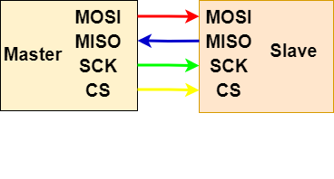
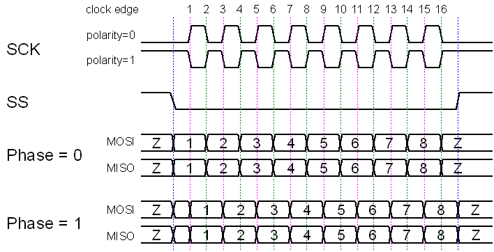
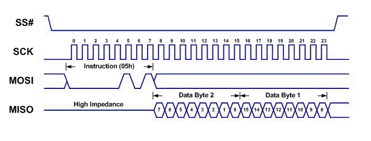

# 第一章——SPI通信原理

## 1. SPI引脚介绍

下面是典型的单主从机模式的SPI示意图：

- **MOSI(Master In Slave Out)**——用于主机向从机发送数据。
- **MISO(Master In Slave Out)**——用于从机向主机发送数据。
- **SCK(Serial Clock)**——用于同步主从机的通讯过程。
- **CS(Chip Select)**——也称SS(Slave Select)，用于主机选择需要通讯的从机。

## 2. CPOL和CPHA

前面讲到，SPI的通信协议有着灵活的变种，下面讲一讲其中的主要两个不同，一个是**CPOL(Clock Polarity)**，另一个是**CPHA(Clock Phase)**，也就是时钟极性和时钟相位。

CPOL简单来说，这些模式控制数据是否在数据时钟信号的上升沿或下降沿移入和移出。如果CPOL＝0，则先出现上升沿，再出现下降沿；反之，先出现下降沿，再出现上升沿。大部分设备和I2C相同，CPOL＝0。

CPHA简单来说，时钟在高电平或低电平时是否空闲。如果CPHA=0，MOSI和MISO在时钟线的的上升沿读取数据，下降沿改变数据；如果CPHA=1，MOSI和MISO在时钟线的下降沿读取数据，上升沿改变数据。大部分设备和I2C相同，CPHA＝0。

参考示意图如下：

由于CPOL和CPHA的存在，SPI通讯可以分为以下四类：

|模式|CPOL|CPHA|改变数据|读取数据|
|:--:|:--:|:--:|:--:|:--:|
|模式0|0|0|下降|上升|
|模式1|0|1|上升|下降|
|模式2|1|0|下降|上升|
|模式3|1|1|上升|下降|

通常情况下，SPI的通讯模式为**模式0**。

## 3. SPI的通讯过程

SPI虽然不像UART那样，没有开始位和结束位；但是和I2C相似，有开始信号和结束信号。

开始信号，主机发出时钟信号，然后拉低CS，表示通讯开始。

结束信号，主机拉高CS，停止时钟信号，表示通讯结束。

一般在通讯过程了中，MOSI和MISO可以不间断地传输数据，在这之间没有校验的信息位，通常都是**高位在前，低位在后**。

下面是标准的SPI通讯时域图：

## 4. SPI的优缺点

SPI通讯的优点：

- **没有开始位和结束位，可以连续发送数据**
- **没有复杂的设备地址，取而代之的是CS**
- **MOSI和MISO可以让设备同时发送数据**
- **传输速度快**

SPI通讯的缺点：

- **四根线，有的设备还有D/C线，RST线等等，接线相对复杂**
- **无ACK验证信息是否传输成功**
- **无校验信息**
- **只能有一个主机**

## 5. Arduino的SPI库

## 6. 适用于哪些设备