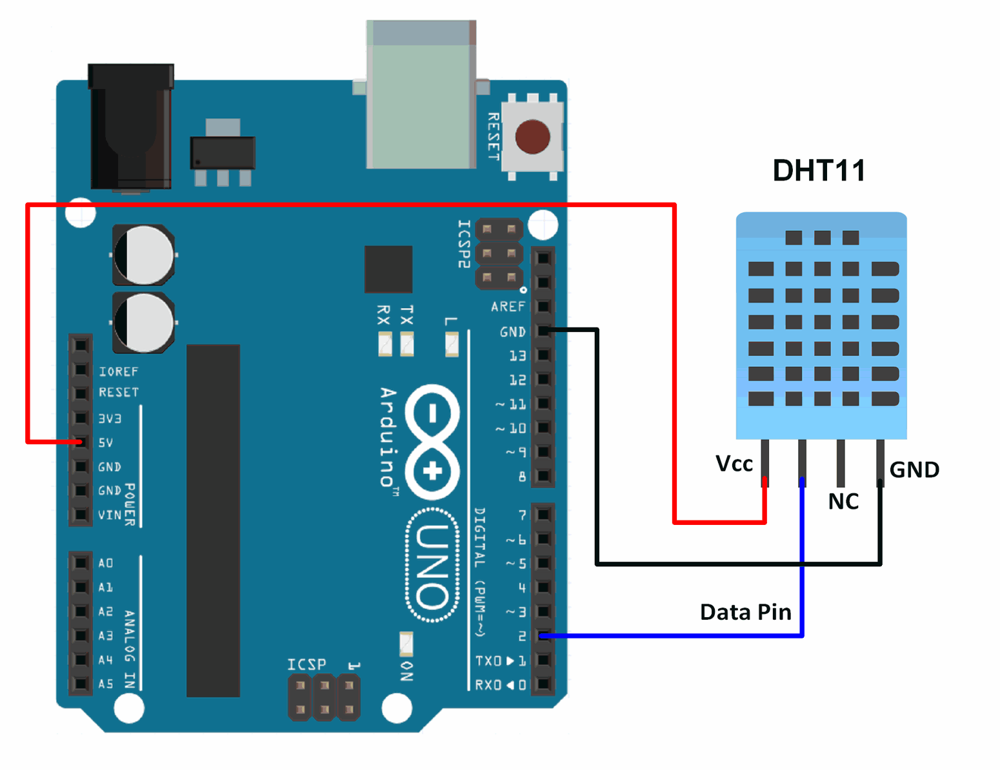
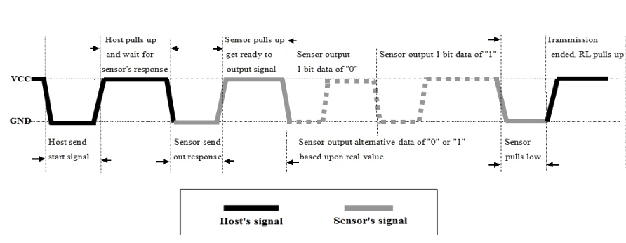

# 第二章——DHT11数据手册速览

## 1. DHT11的基本参数

|   参数   |   参数值    |
| :------: | :---------: |
| 供电电压 |  3.3V-5.5V  |
| 通信方式 |   单总线    |
| 湿度范围 | 20-90%±5%RH |
| 温度范围 |  0-50±2°C   |

## 2. DHT11引脚接线图

DHT11有四个引脚，其中一号引脚是电源接口（3.3-5.5V）；二号引脚是数据输入输出接口，数据手册中建议加一个上拉电阻；三号引脚悬空不接；四号引脚接地。

## 3. DHT11通信中的‘0’和‘1’

根据数据手册的介绍，我们可以总结出DHT11发送‘0’和‘1’的规律如下：

**50us低电平 + 26-28us的高电平 = ‘0’**

**50us的低电平 + 70us的高电平 = ‘1’**

## 4. DHT11返回的数据包

DHT11返回的数据包共有5个字节，40位的数据，其中包括16位的湿度信息，16位的温度信息以及8位的校验和信息；其中湿度和温度的第一个字节是整数位，第二个字节是小数位，每个字节都是高位在前，**校验和=湿度+温度**。

下面是DHT11返回的数据包示意图：

虽然数据手册上表示湿度和温度的小数位都是0，但是我在实际操作过程中发现湿度的小数位确实是0，而温度的小数位不是总是0，温度有小数位，精度为0.1。正因如此，导致我在验证校验和的时候通过**湿度整数位+温度整数位!=校验和**总是返回**DHT11_ERROR**。

所以说权威也有错误的时候，我们需要有一颗会怀疑的心，找办法去证明自己的想法。

## 5. DHT11和MCU的通信过程

第一步，信号线正常情况下处于被拉高状态，MCU需要拉低信号线至少18ms，再拉高至少20-40us，发送开始通信信号，然后等待DHT11应答。

第二步，DHT11接收到开始信号后会先拉低信号线80us，再拉高80us，表明DHT11准备好了，MCU可以开始准备接受数据了。

第三步，接着DHT11将按照前面所讲的发送40位数据包，发送完之后就再次把信号线拉高，通信结束。

值得注意的是，数据手册上特备说明了DHT11采集更新数据需要2秒钟，因此我建议每次和DHT11结束通信后至少**延时3秒钟**。

