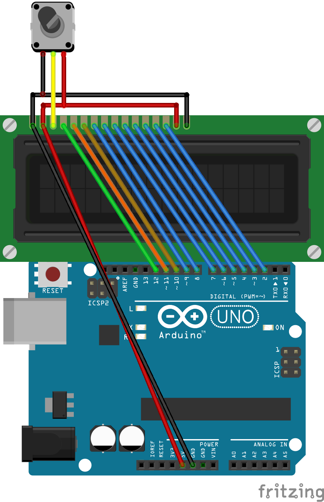
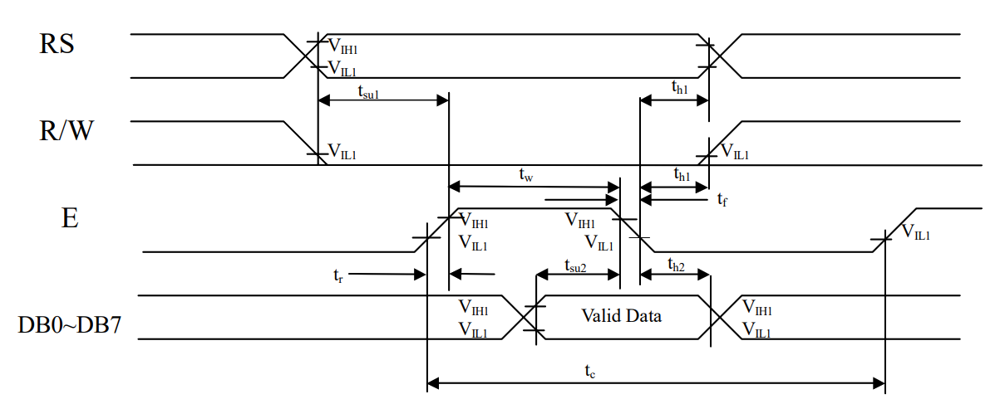
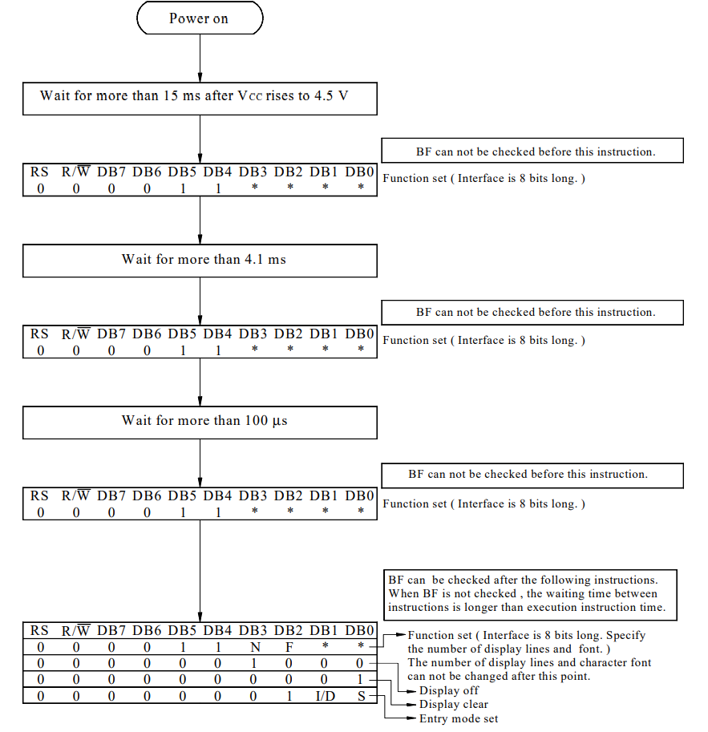

# 第二章

## 1. LCD1602基本参数

|    参数    |               参数值                |
| :--------: | :---------------------------------: |
|  供电电压  |              4.5V-5.5V              |
|  通信方式  |     并行通信，支持4总线和8总线      |
| 字符分辨率 |      支持5x8，或者5x8字符点阵       |
|   字符数   |   可显示字符16x2，可存储字符40x2    |
| 自定义字符 | 可自定义8个5x8字符，或者4个5x10字符 |
|    光标    |        支持光标以及光标闪烁         |
|  字符滚动  |          支持字符水平滚动           |

## 2. LCD引脚介绍

下面是LCD1602的16个引脚分布：

| 引脚序号 |   引脚编号   |                     介绍                      |
| :------: | :----------: | :-------------------------------------------: |
|    1     | \\(V_{SS}\\) |                   供电负极                    |
|    2     | \\(V_{DD}\\) |                   供电正极                    |
|    3     |      V0      |                对比度调节电压                 |
|    4     |      RS      | 数据/命令选择引脚，高电平：数据，低电平：命令 |
|    5     |      RW      |     读/写选择引脚，高电平：读，低电平：写     |
|    6     |      EN      |                 芯片使能引脚                  |
|    7     |     DB0      |                   数据引脚0                   |
|    8     |     DB1      |                   数据引脚1                   |
|    9     |     DB2      |                   数据引脚2                   |
|    10    |     DB3      |                   数据引脚3                   |
|    11    |     DB4      |                   数据引脚4                   |
|    12    |     DB5      |                   数据引脚5                   |
|    13    |     DB6      |                   数据引脚6                   |
|    14    |     DB7      |                   数据引脚7                   |
|    15    |      A       |                  背光灯正极                   |
|    16    |      K       |                  背光灯负极                   |

下面是LCD1602和Arduino Uno的接线图：

## 3. LCD1602的寄存器

LCD1602主要有三个寄存器，分别是DDRAM，CGROM，CGRAM。

下面我们对这三个寄存器做一些介绍。

### 3.1 DDRAM

**DDRAM**(Display Data RAM)是用来存储显示在屏幕上的字符的一个寄存器。

该寄存器一共可以存储40x2个字符，寄存器内部结构示意图如下：

### 3.2 CGROM

**CGROM**(Character Generator ROM)预先存储了一些字符，可以方便我们使用。

下面是LCD1602内置的一些字符：

### 3.3 CGRAM

**CGRAM**(Character Generator RAM)用于存储我们自定的字符。

在上面的CGROM的第一列中，我们可以发现，有八个CGRAM的地址，也就是，我们通过CGRAM定义的字符会指向CGROM的这8个地址。

我们可以通过CGROM的地址访问CGRAM的内容，然后显示在DDRAM中。

## 4. LCD1602的读写操作

LCD1602可以通过RS，RW选择不同的读写操作，大致如下：

|  RS   |  RW   |           介绍           |
| :---: | :---: | :----------------------: |
|   0   |   0   |          写命令          |
|   0   |   1   |  读取BUSY Flag及AC地址   |
|   1   |   0   | 向CGRAM或者DDRAM写入数据 |
|   1   |   1   | 向CGRAM或者DDRAM读取数据 |

通常情况下，我们都不会读取RAM中的数据，因此，我们使用的也就只有前三种。

在有的情况下，为了节省IO口的使用而选择放弃读取BUSY FLAG，从而就只需要写数据，让RW=0。

在这边我们会使用所有的引脚，但是不去读取RAM中的数据。

RS和RW是命令/数据的读/写选择端口，但是如何让LCD1602知道何时接收这些数据呢，那就是EN引脚的作用了。

结合EN引脚，我们可以将上面三种读写操作总结如下：

- 读Flag：RS=0，RW=1，EN高电平
- 写命令：RS=0，RW=0，EN高脉冲
- 写数据：RS=1，RW=0，EN高脉冲

可以发现，读取Falg和写数据/命令的EN条件不同，EN高电平比较好理解，**EN高脉冲**指的是EN的引脚要有一个从低到高的脉冲变化。

其实我们如果从数据手册上的时序图来看，LCD1602的读写时序图是一致的，都有一个EN的高峰，只是我们在写代码的时候会有这样的一个差异。

LCD1602写操作：

LCD1602读操作：

## 5. LCD1602指令表

在LCD1602数据手册中，将命令(Command)称为指令(Introduction)，其实是一样的。

同时**AC**(Address Counter)在LCD1602中指的是指向DDRAM或者CGRAM的地址计数器。

下面介绍一下每一条指令：

### 5.1 Clear Display

指令码：

| RS  | RW  | DB7 | DB6 | DB5 | DB4 | DB3 | DB2 | DB2 | DB1 | DB0 |
| --- | --- | --- | --- | --- | --- | --- | --- | --- | --- | --- |
| 0   | 0   | 0   | 0   | 0   | 0   | 0   | 0   | 0   | 0   | 1   |

解析时间：1.53ms

介绍：该指令会把DDRAM的数据全部写为0x00，同时让AC指向DDRAM的第一个地址0x00。

### 5.2 Return Home

指令码：

| RS  | RW  | DB7 | DB6 | DB5 | DB4 | DB3 | DB2 | DB1 | DB0 |
| --- | --- | --- | --- | --- | --- | --- | --- | --- | --- |
| 0   | 0   | 0   | 0   | 0   | 0   | 0   | 0   | 1   | *   |

解析时间：1.53ms

介绍：该指令会让AC指向DDRAM第一个0x00的地址，同时让光标回到0x00。

### 5.3 Entry Mode Set

指令码：

| RS  | RW  | DB7 | DB6 | DB5 | DB4 | DB3 | DB2 | DB1 | DB0 |
| --- | --- | --- | --- | --- | --- | --- | --- | --- | --- |
| 0   | 0   | 0   | 0   | 0   | 0   | 0   | 1   | I/D | SH  |

解析时间：39us

介绍：I/D用于控制结束读写操作后AC是自动递增还是递减。**如果I/D＝1，自动递增；如果I/D＝0，自动递减**。

### 5.4 Display ON/OFF Control

指令码：

| RS  | RW  | DB7 | DB6 | DB5 | DB4 | DB3 | DB2 | DB1 | DB0 |
| --- | --- | --- | --- | --- | --- | --- | --- | --- | --- |
| 0   | 0   | 0   | 0   | 0   | 0   | 1   | D   | C   | B   |

解析时间：39us

介绍：D用于控制是否显示屏幕。**如果D=1，屏幕开；如果D=0，屏幕关**。C用于控制是否显示光标。**如果C=1，光标开；如果C=0，光标关**。B用于控制是否闪烁光标，在闪烁开的情况下，将会以**409.6ms**的频率进行闪烁。**如果B=1，闪烁开；如果B=0，闪烁关**。

### 5.5 Cursor or Display Shift

指令码：

| RS  | RW  | DB7 | DB6 | DB5 | DB4 | DB3 | DB2 | DB1 | DB0 |
| --- | --- | --- | --- | --- | --- | --- | --- | --- | --- |
| 0   | 0   | 0   | 0   | 0   | 1   | S/C | R/L | *   | *   |

解析时间：39us

介绍：S/C用于控制光标的移动。**如果S/C=1，屏幕移动；如果S/C=0，光标移动**。R/L用于控制屏幕或者光标的移动反向。**如果R/L=1，屏幕或光标向右移动一列；如果R/L=0，屏幕或光标向左移动一列**。

将其列成表格如下：

|  S/C  |  R/L  |     结果     |
| :---: | :---: | :----------: |
|   0   |   0   | 光标向左移动 |
|   0   |   1   | 光标向右移动 |
|   1   |   0   | 屏幕向左移动 |
|   1   |   1   | 屏幕向右移动 |

### 5.6 Function Set

指令码：

| RS  | RW  | DB7 | DB6 | DB5 | DB4 | DB3 | DB2 | DB1 | DB0 |
| --- | --- | --- | --- | --- | --- | --- | --- | --- | --- |
| 0   | 0   | 0   | 0   | 1   | DL  | N   | F   | *   | *   |

解析时间：39us

介绍：DL用于控制通讯总线模式。**如果DL=1，8总线模式；如果DL=0，4总线模式**。N用于控制控制显示行数。**如果N=1，显示两行；如果N=0，显示1行**。F用于控制显示字体。**如果F=1，5x10字体；如果F=0，5x8字体**。

### 5.7 Set CGRAM Address

指令码：

| RS  | RW  | DB7 | DB6 | DB5 | DB4 | DB3 | DB2 | DB1 | DB0 |
| --- | --- | --- | --- | --- | --- | --- | --- | --- | --- |
| 0   | 0   | 0   | 1   | AC5 | AC4 | AC3 | AC2 | AC1 | AC0 |

解析时间：39us

介绍：该指令用于设置AC指向CGRAM的地址。当我们需要自定义字体的时候需要用到。

### 5.8 Set DDRAM Addresss

指令码：

| RS  | RW  | DB7 | DB6 | DB5 | DB4 | DB3 | DB2 | DB1 | DB0 |
| --- | --- | --- | --- | --- | --- | --- | --- | --- | --- |
| 0   | 0   | 1   | AC6 | AC5 | AC4 | AC3 | AC2 | AC1 | AC0 |

解析时间：39us

介绍：该指令用于设置AC指向DDRAM的地址。当我们需要设置光标位置的时候需要用到。

### 5.9 Read Busy Flag and Address

指令码：

| RS  | RW  | DB7 | DB6 | DB5 | DB4 | DB3 | DB2 | DB1 | DB0 |
| --- | --- | --- | --- | --- | --- | --- | --- | --- | --- |
| 0   | 1   | BF  | AC6 | AC5 | AC4 | AC3 | AC2 | AC1 | AC0 |

解析时间：0us

介绍：该指令用于读取LCD1602的忙碌状态和AC地址。

### 5.10 Write Data to RAM

指令码：

| RS  | RW  | DB7 | DB6 | DB5 | DB4 | DB3 | DB2 | DB1 | DB0 |
| --- | --- | --- | --- | --- | --- | --- | --- | --- | --- |
| 1   | 0   | D7  | D6  | D5  | D4  | D3  | D2  | D1  | D0  |

解析时间：43us

介绍：该指令用于向DDRAM或者CGRAM写入数据，具体写到哪一个RAM取决于AC的指向。

### 5.11 Read Data from RAM

指令码：

| RS  | RW  | DB7 | DB6 | DB5 | DB4 | DB3 | DB2 | DB1 | DB0 |
| --- | --- | --- | --- | --- | --- | --- | --- | --- | --- |
| 1   | 1   | D7  | D6  | D5  | D4  | D3  | D2  | D1  | D0  |

解析时间：43us

介绍：该指令用于向DDRAM或者CGRAM读取数据，具体读取哪一个RAM取决于AC的指向。

### 6. LCD1602的初始化

LCD有8总线和4总线模式。

根据数据手册的介绍，8总线的初始化如下：

相似地，4总线的初始化如下：

下一章我们将学习如何驱动LCD1602.