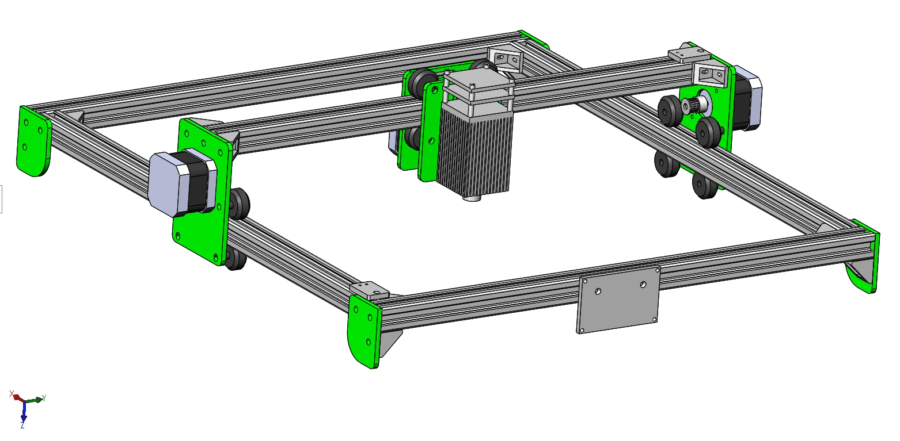

# 介绍——激光雕刻机

激光雕刻机应该说是很多DIY爱好者都喜欢做的一个项目，因为它确实很酷。咱们技术部在很久之前也有这样一台雕刻机，可能是买的一的套件，只有1.6W。所以说虽然我们处在不同的时空，但是我们最终还是会渐渐走到同一个地方。

其实我在大一学习了Arduino之后就知道了Arduino可以制作雕刻机，那个时候一直想做一个，但是毕竟那个时候能力不足，还做不出来。后来又经过一段时间的学习，我又回到了这个项目上。

我是先制作了一个写字机，但显然没有成功。

后来我在我们办公室看见了一台老前辈们的雕刻机，我发现那样的结构确实是又简单、又高效还省钱。于是我着手制作了一台。

这个版本我画了3D模型，你们可以使用CNC机床铣出来，或者用3D打印机打印，绿色部分是需要定制的，其余的材料都是需要购买的。

激光雕刻机在硬件上要求比较高，需要掌握一些特别的知识就可以了，软件方面大部分直接使用预先写好的固件就可以了，所以大家不需要担心。