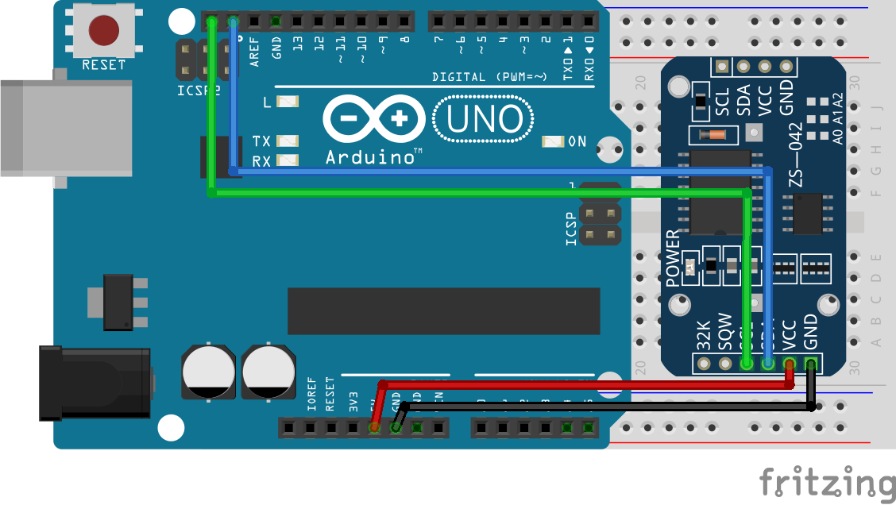
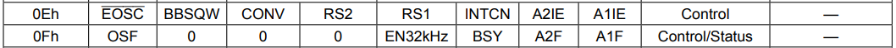
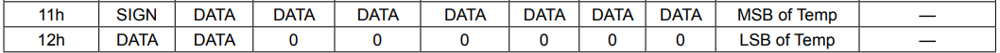
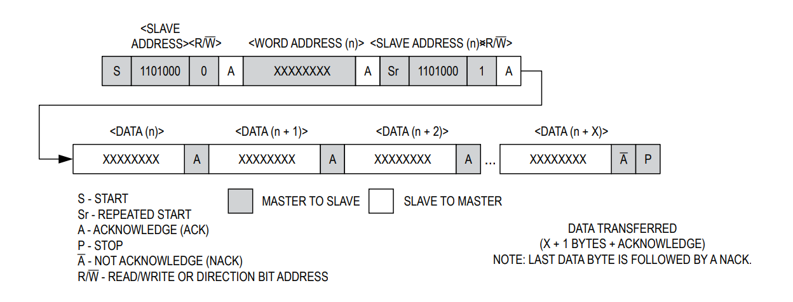

# 第二章——DS3231数据手册速览

## 1. DS3231基本参数

|      参数      |             参数值             |
| :------------: | :----------------------------: |
|    供电电压    |           2.3V-5.5V            |
|    通信方式    |              I2C               |
|    日期格式    |  秒,分,时,日,月,年(2000-2100)  |
|    时间精度    |            ±2分/年             |
|    温度精度    |      ±3°，一分钟更新一次       |
|      闹钟      |         支持两个天闹钟         |
| 支持的通信速度 | 100KHz标准模式，400KHz快速模式 |

## 2. DS3231接线图

DS3231和Arduino Uno接线图如下：

## 3. DS3231的寄存器列表

下面时DS3231的寄存器列表，我们仅对寄存器做简单讲解，更多详细内容请自行参考数据手册：

### 3.1 0x00-0x06时间寄存器

这七个寄存器储存了DS3231的时间信息，我们可以通过这七个寄存器读取和写入时间的信息，在晶振使能位开启的情况下，时间寄存器中的信息会自动更新。

唯一需要注意的是，0x03这个寄存器用于存储星期，值从1-7共7个值，这个寄存器24H后自动更新+1，至于某个数字对应哪个星期，自己约定就好了。

可以发现，DS3231存储时间数据的时候，采用**BCD编码**方式而不是HEX编码，因此在后面我们读取和写入数据的时候，要对数据进行相应的转换。

### 3.2 0x07-0x0D闹钟寄存器

DS3231的闹钟寄存器和时间寄存几乎相同，只是每个闹钟只有4个寄存器，存储秒，分，时，天(星期)。其中0x0A和0x0D寄存器的**DY/DT**用于设置闹钟是以天位单位闹铃，还是以星期位单位进行闹铃，0对应天，1对应星期。

在闹铃模式开启的情况下，当当前时间对应了闹铃时间后，对应的闹铃状态位会被写为1，我们可以通过这个闹铃状态位读取闹铃信息。

闹钟寄存器的最高位是闹钟响应模式掩码，你可以通过掩码设置闹铃模式，掩码信息如下：

### 3.3 0x0E-0x0F控制/状态寄存器

下面是DS3231控制/状态寄存器列表，这里我们只对其中部分位做介绍，其余为在使用过程中，保持默认即可：

#### 3.3.1 EOSC#晶振使能位

该位用于控制DS3231的晶振是否使能，该位只能用于在DS3231处于备用电源供电情况下控制晶振是否使能，VCC供电该位无效。当该位为0时，晶振有效，为1时，晶振不使能，寄存器数据将处于静止状态，及时间将不更新。

#### 3.3.2 INTCN中断选择控制位

这一位用于控制INT/SQW引脚的功能，如果该位是0，则该引脚用作输出方波（SQW），如果该位是1，则该引脚用于闹钟闹铃中断。默认用于闹钟闹铃中断。

#### 3.3.3 A2IE/A1IE闹铃2中断使能位

该位用于决定闹钟是否在闹铃时触发，INT/SQW引脚。当该位是0时，不触发，为1时触发。默认不触发。

#### 3.3.4 OSF晶振状态位

该位用于显示晶振是否使能，1表示未使能，0表示使能。

#### 3.3.5 A2F/A1F闹钟状态为

该位用于显示DS3231两个闹钟是否触发，该位为0时，表示未触发，为1时表示触发。该位只能写入0。

### 3.4 0x11-0x12温度寄存器

该寄存器用于存储温度数据，它是一个10位的数据，前8位为有符号整数位，后一个字节的前两位是小数位，精度为0.25。由于DS3231的温度精度本来就很低，这个小数位读与不读没什么区别。

## 4. DS3231的I2C通信

由数据手册可知，DS3231支持标准的I2C通讯，标准速度为100KHz，快速模式为400KHz，可以进行连续的数据读写。

DS3231数据写：

DS3231数据读：

DS3231数据读/写：

因此，这里我们不再对DS3231的I2C通讯过程进行介绍了，下一张我们将直接学习如何使用DS3231。