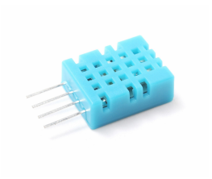
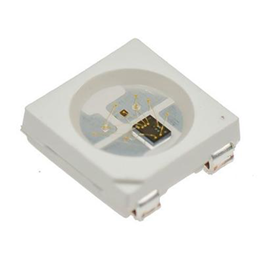

# 第一章——One-Wire通信原理

## 1. 通信机制
由于不同的设备单总线通信机制大部分都不同，因此我们不做理论上的介绍，在后面我们再具体问题具体分析。

不过单总线的基本的通讯方式还是通过电平的高低来发送‘0’和‘1’，通过起始位和终止位来开始和结束通信。

## 2. 适用于哪些设备
常见的设备有一下几个

|                              DHT11                               |                              WS2812                               |                              IR Receiver                               |
| :--------------------------------------------------------------: | :---------------------------------------------------------------: | :--------------------------------------------------------------------: |
|  |  |  |

下面我们将具体学习DHT11的单总线通信方式，有兴趣的可以自行学习其他种类的元器件。